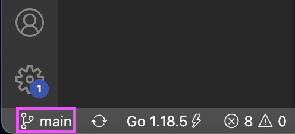
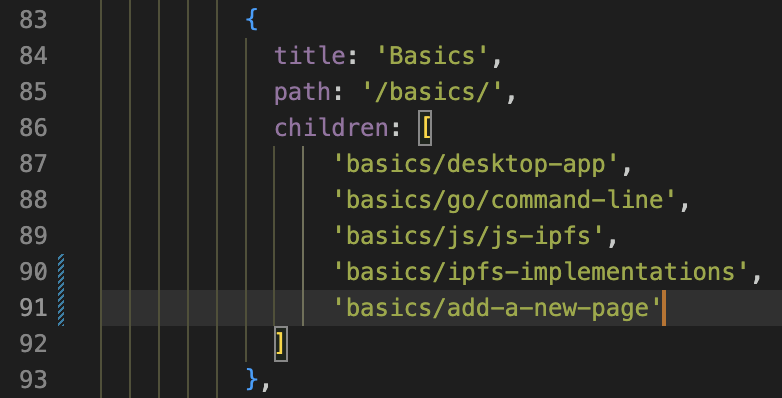
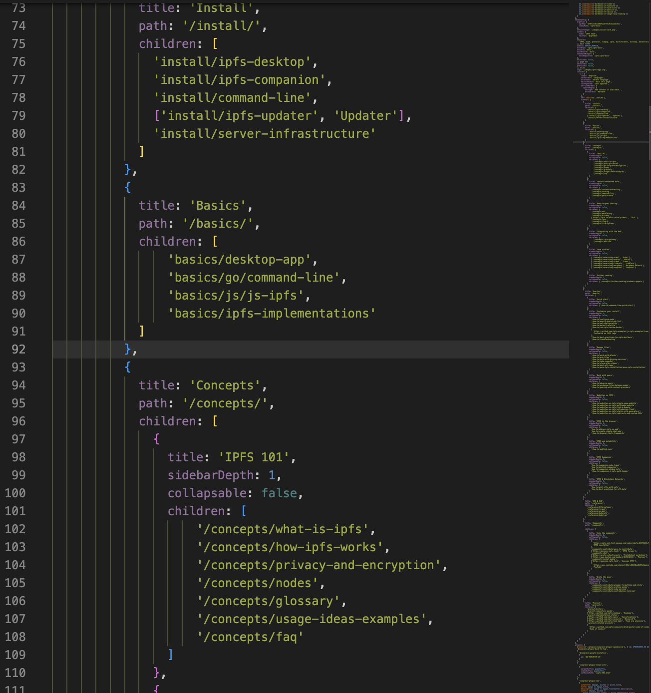
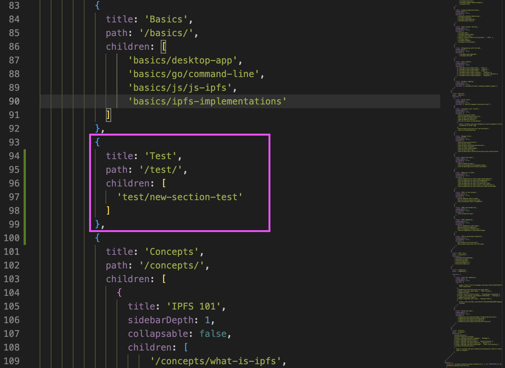
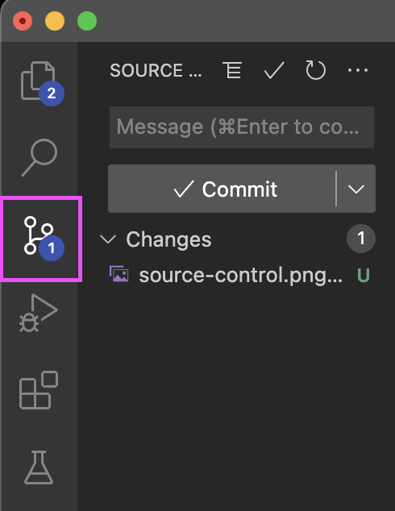

# Contribution guidelines

This article serves as the guideline for contributing to the [IPFS Docs](https://github.com/ipfs/ipfs-docs) repository. This guide is only concerned with documentation within this repository and does not contain any information regarding changes to VuePress or the HTML of the site. It also includes some general tips, tools, and workflows for creating helpful docs.

## Writing content

By following these guidelines, you're helping to keep the IPFS docs consistent.

### Grammar and spelling

- Address readers in the second person by using _you_ to address them. Stay away from words like _I_, _we_, _our_, or _one_.

  > **You** can install the virtual machine.

- Follow each list of three or more items with a comma, also known as the [_Oxford_ Comma](https://en.wikipedia.org/wiki/Serial_comma).

  | Use                           | Don't Use                    |
  | ----------------------------- | ---------------------------- |
  | One, two, three, and four.    | One, two, three and four.    |
  | Henry, Elizabeth, and George. | Henry, Elizabeth and George. |

- Write clearly and concisely. Sentences should be shorter than 25 words. Any longer and things tend to get a little _blurry_.
- Don’t use formal or complex words when easy or short ones work fine.

  | Use   | Don't Use     |
  | ----- | ------------- |
  | Get   | Acquire        |
  | Help  | Assist        |
  | About | Approximately |

- Use consistent terminology when writing general documentation. Writing standard docs isn't creative writing. You don't need to describe the same thing differently every time you mention it. However, for conceptual or theoretical topics, feel free to write more creatively.
- Use American English spelling.
- Try not to use acronyms. If you _absolutely_ have to use acronyms, spell the full phrase first and include the acronym in parentheses `()` the first time you use them in each document.

  > Decentralized Application (Dapp), Decentralized Web (DWeb)

- Avoid using specific version numbers whenever possible.

### Formatting

Write everything in using the [GitHub Flavored Markdown](https://github.github.com/gfm/) syntax. Here are a few guidelines that help to keep everything nice and tidy.

- Write file names, folders, addresses, and variables between code tags.

  > Copy `example.json` to `~/var/www/html`.

- Things that the user must click on, or look out for, should be in **bold**.

  > Click **Log out** to end your session.
  > Enter your file name in the **File Name** field.

- Multi-line code blocks should have the language supplied in line with the markdown. Doing this helps the syntax highlighter know which language classes to use. To select a particular language in markdown, add the language name to the end of the first code tag:

  ```javascript
  const contribution_guidelines = ['hello', 'world']
  console.log(contribution_guidelines[0])
  ```

- Keep titles in sentence-case (only capitalize the first letter, and any names):

  > Types of contribution
  >
  > Dealing with the James Harden effect

### Project specific titles

When referring to projects by name, use proper noun capitalization: Kubo (GO-IPFS) and JS-IPFS.

Cases inside code blocks refer to commands and are not capitalized: `kubo` (`go-ipfs`) or `js-ipfs`.

### Style and tone

When writing content to explain a particular workflow, function, or service, keep your tone clean and straightforward. While it doesn't have to be formal, technical writing is not creative writing. You're just explaining to the reader how to _do_ something.

When you're writing conceptual explanations or overviews, you can be more creative. Creative writing is especially useful when you're describing a typically boring or hard-to-follow topic. The more exciting you can make the piece to the reader, the better.

## How to contribute

There are lots of ways you can contribute to the docs project! It all depends on how much time you have and your knowledge of the topic.

### Types of contribution

The IPFS project can only really work when the community steps up and helps out, so any contributions you can make it welcome. There are a few different types of contributions you can make to the project.

#### Fixes

Sometimes small mistakes fall through the cracks. So if you see an error in the documentation, the best way to fix it is to edit the file on GitHub and create a pull request.

#### New articles or pages

Have an idea for a new page or article, or even a series of articles? The first step is to create an issue with your suggestions. The article you are suggesting may have been discussed before, or somebody else could already be working on it.

Once an issue has been created, it can be discussed by the community and IPFS project leads. Once approved, you are free to start writing and implementing your documentation into the repository. Internal IPFS project leads from Protocol Labs review all pull-requests.

### File an issue

Follow these steps to learn how to file an issue with the IPFS project.

1. Go to the [Issues](https://github.com/ipfs/ipfs-docs/issues/) tab in the [`ipfs/ipfs-docs`](https://github.com/ipfs/ipfs-docs) repository.
2. Search for the issue you want to raise. It may already exist. Make sure to also search _closed_ issues by including `is:closed` in your search query.
3. If the issue doesn't already exist, click **New issue**.
4. Select either the **Content request** or **Documentation issue** issue template. These templates auto-fill some of the issues for you, and direct you to fill out the required information.
5. Answer the questions listed in the issue form. Issues are created using GitHub Flavoured Markdown.
6. Once you have finished describing your issue, click **Submit new issue**.

Shortly after your issue is submitted, an internal project lead from the IPFS project evaluates your issue. Further questions or requests-for-comment may be asked within the issue.

### Create a pull request

If you have created some changes to a post, article, or entire section, you can submit a pull request to have it merged into the `ipfs/ipfs-docs` repository.

If you only need to change a single file, the easiest way to create a pull request is to edit the file directly within the GitHub editor. Within each markdown file in the `ipfs/ipfs-docs` repository is a pencil icon. When you click on that icon, the GitHub editor will open, and you'll be able to change the file. Once you have finished your edits, you can create a new branch for this commit and start a pull request.

You can learn more about [pull requests on GitHub](https://help.github.com/en/github/collaborating-with-issues-and-pull-requests/about-pull-requests).

### Discuss

You can also contribute to the project without specifically writing content for the site. Many discussions are happening all around the project. Protocol Labs, and by extension, IPFS, is a collaborative company that relies heavily on the community. We need your opinions and input! If you have an idea about a topic or want to weigh in on a discussion, feel free to have your say on either [GitHub](https://github.com/ipfs/ipfs-docs/issues) or on the [IPFS forums](https://discuss.ipfs.tech/).

## Create a new page

Sometimes, you will need to make a whole new page for content to live. The process to do this is outlined below.

These steps were performed in Visual Studio Code (VSCode).

It's important to know what kind of content you are creating. The questions below will help you decide where your new content should live. For example, you wouldn't want to put a page written for experienced users between the already existing **Install** and **Basics** sections.

- What type of content am I creating?
- Who is my intended audience?
- Does this content require a new page or can it be added to an existing page?
- If a new page or section must be added, how will it fit into the existing structure and flow of the docs?

When you've answered the questions outlined above and you know where the new content will live, continue with the steps below.

### Fork, clone, and branch

You can't just make changes to the main repository directly, first you need to:

1. Fork the repo.
2. Clone the repo to your local storage.

Follow [this guide](https://docs.ipfs.tech/community/contribute/contribution-tutorial/#creating-a-fix) to do the steps listed above.

Once you have the repo forked and cloned, the next step is to make a branch to commit all of your changes to. This will help keep your work organized, and will help you avoid committing undesired changes to your main branch. Here are the steps to do this in VSCode:

1. Ensure that you are in the `ipfs-docs` directory on VSCode.
2. Click the branch icon in the bottom left corner of the VSCode window. A text field will open at the top of the window.
 
3. Type the desired name of your new branch. Preferably, the name of the branch reflects the work that you will be doing on the branch.
4. Once you have the name figured out, click **+Create new branch**.

Make sure that any changes you make are done in this new branch. You can verify which branch you are working on by checking the current branch in the bottom left corner of the window.

### Adding a single page

Adding a single page to an already existing section is as simple as adding one line to the `config.js` file.

When adding the new line, be sure to follow the exact same format and syntax as the other lines that are already present.

1. Open `config.js` in VSCode.
2. Find the section you want to add a new page to. For this example, a page titled **Add a new page** will be added to the **Basics** section.
 
3. Add the new line to the desired section.
  ```javascript
  'title-of-section/title-of-new-page'
  ```
4. With the page now added to `config.js`, you can move onto the [**commit your changes** section](#commit-your-changes).

### Adding a new section

Adding a new section to the sidebar of the docs is a little more in-depth. For this example, a new section titled **Test** will be added between the **Basics** and **Concepts** sections.

When adding a new section, be sure you have the opening and closing curly brackets (`{` `}`) in the correct column. The easiest way to do this is to follow the same positioning and format as the other sections that are already in the file.

1. Open `config.js` in VSCode.
2. Find the spot that you wish to add a new section. Again, for this example, the spot is between the **Basics** and **Concepts** sections.
 
3. Once you have found the right spot, add in the following lines, replacing any variables with your own content.
 

### Commit your changes

Now that you have made the changes to `config.js`, you can commit them to your branch and make a pull request.

1. Save the changes you have made to the `config.js` file.
2. Click the **source control** button in the VSCode sidebar.
 
3. In the **source control** menu, mouseover the changes you made and click the **+** button to stage those changes.
4. Now, click the **Commit** button to commit your changes to your branch.
5. Click the **Sync changes** button to push the changes back to GitHub.

The changes you made are now synced with your fork on GitHub. Now, you need to make a pull request in the `ipfs-docs` repo on GitHub. You can [follow these steps to create a pull request](https://docs.ipfs.tech/community/contribute/contribution-tutorial/#creating-a-fix).

The branch, pull request, and new pages or sections are now ready. The next step is to add the actual content of the new pages or sections to the pull request. Any changes you commit to the branch you just created will be added to that pull request.

## Tools

The following tools are used by the IPFS docs team to help create documentation.

### Visual Studio Code

While you can use any text editor you want to create content, there are a few add-ons available for [Microsoft's Visual Studio Code](https://code.visualstudio.com/) (VSCode) that make writing docs a lot easier. Here are a few extensions and add-ons that we use:

#### [Markdown lint](https://github.com/DavidAnson/vscode-markdownlint), _David Anson_

If you're only going to install one extension from this list, make it this one. This add-on points out the issues and inconsistencies within your writing and can warn you about any problems before you push your changes. This extension is handy as it keeps everyone on the same page in terms of styling and layout.

#### [Markdown all in one](https://github.com/yzhang-gh/vscode-markdown), _Yu Zhang_

While not essential, this extension contains a bunch of _quality of life_ improvements that make writing docs a bit easier.

### [Grammarly](https://app.grammarly.com/)

It might not be the most elegant or robust application available, but Grammarly can help fix some of the complex or easy to miss mistakes in your docs. The free version is more than enough to get you by. The paid-for version comes with some _quality of life_ improvements like adjusting the tone of your document or suggesting more optimal words, but it's not 100% necessary.

### [Hemingway](http://www.hemingwayapp.com/)

This app helps to simplify your writing. It's easy to ramble on while writing, while not realizing your content has become difficult to read or unwieldy. Hemmingway stops that by telling you when your sentences are too long or complicated.

## Just Ask

After all that, if you're still not sure how to contribute to this project just post a question on the [IPFS forum](https://discuss.ipfs.tech/), or join us on IRC at `#ipfs`.
