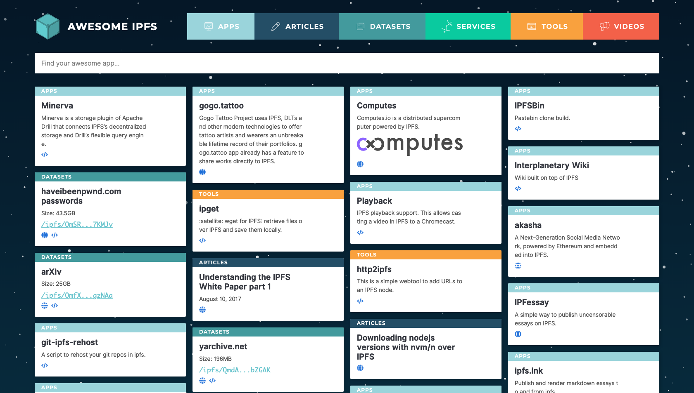
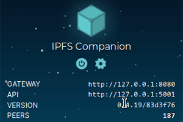
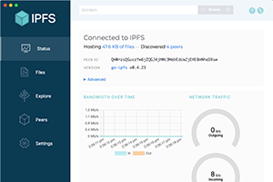
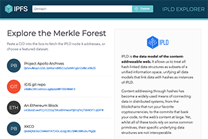

# Learn how to build the future of the internet

Whether you're a tiny startup or a huge multinational company, you need to learn how to protect yourself and your users from the dangers of a centralized internet. This website contains everything you need to start using the InterPlanetary File System and help future-proof yourself.

## Host a static website on IPFS

Protect yourself from single-point-of-failure risks and benefit from decentralized infrastructure by hosting your static website using IPFS. If you're new to IPFS, this is an excellent place to start learning how to build on the decentralized web. 

[Start the tutorial →](/how-to/host-single-page-site/)

## See what others are building

Are you looking for inspiration? You can find a huge collection of awesome community projects over at Awesome IPFS. [Go there now →](https://awesome.ipfs.io/)

## Useful tools

Build your apps and services quicker with some help from these tools built for IPFS.

| [Browser Companion](https://github.com/ipfs-shipyard/ipfs-companion)   | [IPFS Desktop](https://github.com/ipfs-shipyard/ipfs-desktop)| [IPLD Explorer](https://explore.ipld.io/) |
| --- | --- | --- |
|  |  |  |

## Learn about the decentralized web

Want to know more about the decentralized web (Dweb) and how it's changing the internet? These resources will give you a clearer understanding of the Web movement, and how it's improving the world:

- [What is IPFS](/concepts/what-is-ipfs/)
- [Peer-to-peer sharing](/concepts/dht/)
- [Content-addressed data](/concepts/content-addressing/)

[See more guides in the Concepts section →](/concepts/)

## Be part of the IPFS community

IPFS has a bustling community of designers, developers, writers, and activists who are all helping to improve the project. You can join in by attending a local meetup, helping out at a conference, chatting online through the `#ipfs` [IRC channel](/community/irc), or joining a discussion in [the IPFS forum](https://discuss.ipfs.io/).

[Find out more in the Community section →](/community/)
