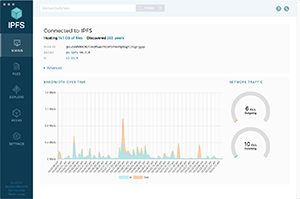

# Welcome to the IPFS docs

The InterPlanetary File System (IPFS) is a set of composable, peer-to-peer protocols for addressing, routing, and transferring [content-addressed](concepts/glossary.md#content-addressing) data in a decentralized file system. Popular Web3 projects like [Filecoin](https://filecoin.io), and many others, are built on top of IPFS.

While IPFS is a file system, it is _not_ a storage system. Instead, IPFS can be thought of as both the protocol implementations of IPFS (such as [Kubo](concepts/glossary.md#kubo)) and as the decentralized network comprised of the individual [nodes](concepts/glossary.md#node) that are running protocol implementations. 

## Get started

Check out these docs to get started with IPFS:

- [What is IPFS?](concepts/what-is-ipfs.md#what-is-ipfs)
- [Key concepts](concepts/README.md)
- [Case studies](concepts/README.md#examples-and-case-studies)
- [How-to guides](how-to/README.md)
- [API and CLI references](reference/README.md)
- [Install IPFS](install/README.md)

<abbr title="too long; didn't read">TL;DR</abbr>? [Glossary](concepts/glossary.md) provides short definitions of IPFS terms and concepts.

## Download IPFS tools

These tools can help you use and build on IPFS more quickly and efficiently — give them a try today!

| [Browser Companion](https://github.com/ipfs-shipyard/ipfs-companion)            | [IPFS Desktop](https://github.com/ipfs-shipyard/ipfs-desktop)                                          | [IPLD Explorer](https://explore.ipld.io/)                           |
| ------------------------------------------------------------------------------- | ------------------------------------------------------------------------------------------------------ | ------------------------------------------------------------------- |
|  |  |  |

## Host your website on IPFS

Protect yourself from single-point-of-failure risks and benefit from decentralized infrastructure by hosting your static website using IPFS. If you're new to IPFS, this is an excellent place to start learning how to build on the decentralized web.

[Start the tutorial →](how-to/websites-on-ipfs/single-page-website.md)

## Learn about the decentralized web

Want to know more about the decentralized web (DWeb) and how it's changing the internet? These resources will give you a clearer understanding of the DWeb movement, and how it's improving the world:

- [What is IPFS](concepts/what-is-ipfs.md)
- [Peer-to-peer sharing](concepts/dht.md)
- [Content-addressed data](concepts/content-addressing.md)

[See more guides in the Concepts section →](concepts/README.md)

::: callout
ProtoSchool's self-guided [interactive tutorials](https://proto.school/tutorials) are designed to introduce you to decentralized web concepts, protocols, and tools. Explore JS-IPFS APIs by completing browser-based coding challenges in ProtoSchool's [IPFS course](https://proto.school/course/ipfs), or explore code-free intros to essential DWeb concepts and related projects in the IPFS ecosystem.
:::

## See what others are building

Are you looking for inspiration? You can find a huge collection of awesome community projects over at Awesome IPFS.

[Check out Awesome IPFS now →](https://awesome.ipfs.tech/)

## Be part of the IPFS community

IPFS has a bustling community of designers, developers, writers, and activists who are all helping to improve the project. You can join in by attending a local meetup, helping out at a conference, chatting online through [Discord](https://discord.com/invite/KKucsCpZmY), or joining a discussion in [the IPFS forum](https://discuss.ipfs.tech/).

[Find out more in the Community section →](community/README.md)