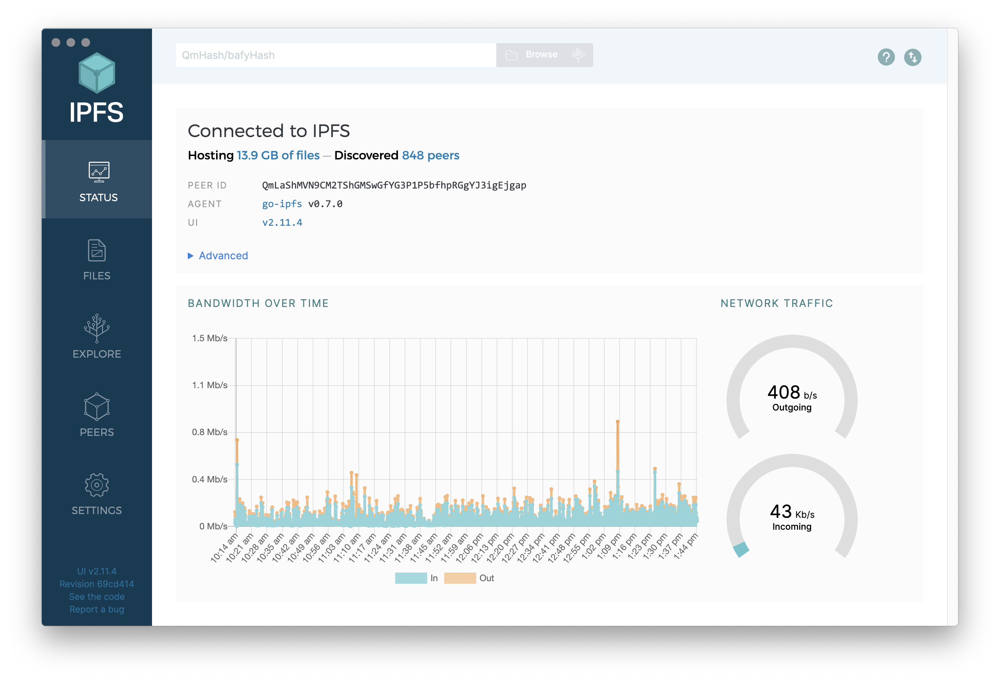
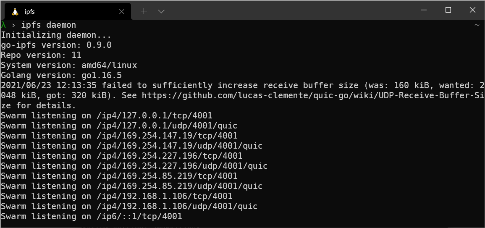

# Basics

In this section we'll cover the basic operations and configurations that new users need when starting out with IPFS. You can find guides for the basics of running the IPFS Desktop app and interacting with IPFS through the command-line!

## Desktop app

Have an idea of what IPFS is but haven't really used it before? You should start here. [The IPFS Desktop app is a really simple way to interact with the IPFS network, and manage your local and remote files →](./desktop-app.md)

## Command-line

If you're a bit more serious about IPFS and want to start poking around the command-line interface (CLI), then this section is for you. No buttons or images here; [just good-old-fashioned CLI interfaces and pipeable commands →](../install/command-line.md)

## Other implementations

There are many other IPFS implementations than the on-ramps discussed above.  [Check them out here!](./ipfs-implementations.md)