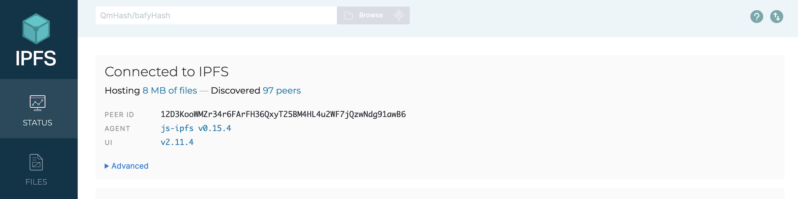
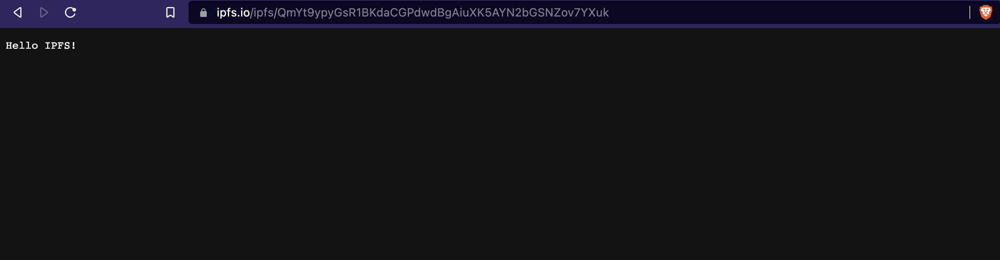

# JS-IPFS Basics

This guide aims to walk you through the basics of using IPFS with JavaScript. JS-IPFS is one of multiple [IPFS implementations](../ipfs-implementations.md).

You will learn how install and spawn a node using the available libraries, as well as add, retrieve, 
read, and remove files. If you are unsure about the meaning of some terms, check out the [glossary](../concepts/glossary.md).

::: tip Environment

All instructions and examples shown here were performed and tested on an M1 Mac. However, the IPFS commands are the same on Linux, macOS, and Windows. You will need to know how to navigate your computer's directories from within the CLI. If you're unsure how to use the CLI, we recommend learning how before continuing with this guide.

:::

There are two main JavaScript libraries for working with IPFS, learn about each library in the [reference section](../reference/js/api).

## Install JS-IPFS

:::: tabs

::: tab ipfs-cli

### JS-IPFS module

To use the CLI on your machine, globally install the `ipfs` Node.js package:

  ```bash
  npm i --location=global ipfs
  ```

### Build from source

To build from source, clone the [source packages](https://github.com/ipfs/js-ipfs) and follow the build instructions.

:::

::: tab ipfs-core

### IPFS core API

To use the IPFS core API, install the `ipfs-core` Node.js package:

  ```bash
  npm i ipfs-core
  ```

### Build from source

To build from source, clone the [source packages](https://github.com/ipfs/js-ipfs) and follow the build instructions.

:::

::: tab ipfs-http-client

### HTTP client module

To use the client on your machine, install the `ipfs-http-client` Node.js package:

  ```bash
  npm i ipfs-http-client
  ```

### Build from source

To build from source, clone the [source package](https://github.com/ipfs/js-ipfs/tree/master/packages/ipfs-http-client) and follow the build instructions.

:::

::: tab ipfs-client

### HTTP client module

To use the client on your machine, install the `ipfs-client` Node.js package:

  ```bash
  npm i ipfs-client
  ```

### Build from source

To build from source, clone the [source package](https://github.com/ipfs/js-ipfs/tree/master/packages/ipfs-http-client) and follow the build instructions.

:::

::::

## Spawn a node

:::: tabs

::: tab ipfs-cli

To spawn a node using the CLI, simply start the daemon:

  ```bash
  jsipfs daemon
  ``` 

You should see an output similar to:

  ```shell
  Initializing IPFS daemon...
  System version: arm64/darwin
  Node.js version: 16.16.0
  Swarm listening on /ip4/127.0.0.1/tcp/4002/p2p/12D3KooWMZr34r6FArFH36QxyT25BM4HL4u2WF7jQzwNdg91awB6
  Swarm listening on /ip4/10.0.0.25/tcp/4002/p2p/12D3KooWMZr34r6FArFH36QxyT25BM4HL4u2WF7jQzwNdg91awB6
  Swarm listening on /ip4/10.2.0.2/tcp/4002/p2p/12D3KooWMZr34r6FArFH36QxyT25BM4HL4u2WF7jQzwNdg91awB6
  Swarm listening on /ip4/127.0.0.1/tcp/4003/ws/p2p/12D3KooWMZr34r6FArFH36QxyT25BM4HL4u2WF7jQzwNdg91awB6
  js-ipfs version: 0.15.4
  HTTP API listening on /ip4/127.0.0.1/tcp/5002/http
  gRPC listening on /ip4/127.0.0.1/tcp/5003/ws
  Gateway (read only) listening on /ip4/127.0.0.1/tcp/9090/http
  Web UI available at http://127.0.0.1:5002/webui
  Daemon is ready
  ```

You should be able to point to the [webpage](http://127.0.0.1:5002/webui):



If you are unable to connect to the API, ensure [cross-origin (CORS)](https://developer.mozilla.org/en-US/docs/Web/HTTP/CORS) requests are configured:

```bash
jsipfs config --json API.HTTPHeaders.Access-Control-Allow-Origin '["http://127.0.0.1:5002", "http://localhost:3000", "http://127.0.0.1:5001", "https://webui.ipfs.io"]'
jsipfs config --json API.HTTPHeaders.Access-Control-Allow-Methods '["PUT", "POST"]'
```

:::

::: tab ipfs-core

Create a simple Node.js application to host the logic that will allow you to use the RPC API. You'll also use this Node.js application later on to add and remove files.

Start by initiating a new project:

  ```bash
  npm init -y
  ```

If you have not already installed `ipfs-core`, add the `ipfs-core` module to your project:

  ```bash
  npm i ipfs-core
  ```

Create an `index.js` file for the application logic:

  ```bash
  touch index.js
  ```

Now, populate the `index.js` file by initiating an `async` function:

  ```js
  const main = async () => {
    // "await" logic to spawn a node
  }

  main()
  ```

To create an IPFS node, add:

  ```js{1,4}
  import * as IPFS from 'ipfs-core';

  async function main() {
    const node = await IPFS.create();
  }

  main();
  ```

This imports IPFS as a dependency and uses the `create()` function to create a node instance. 

To spawn the node, run the application:

  ```bash
  node index.js
  ```

You should see an output similar to:

  ```shell
  Swarm listening on /ip4/127.0.0.1/tcp/4002/p2p/12D3KooWMZr34r6FArFH36QxyT25BM4HL4u2WF7jQzwNdg91awB6
  Swarm listening on /ip4/10.0.0.25/tcp/4002/p2p/12D3KooWMZr34r6FArFH36QxyT25BM4HL4u2WF7jQzwNdg91awB6
  Swarm listening on /ip4/127.0.0.1/tcp/4003/ws/p2p/12D3KooWMZr34r6FArFH36QxyT25BM4HL4u2WF7jQzwNdg91awB6
  ```

:::

::::

### Connect to IPFS

The JS-IPFS implementation is split into several Node.js modules. The following section shows examples of how you can use the HTTP client to connect to IPFS. For more information on the different modules, examine the [API Packages table](../../reference/js/api.md##packages)

:::: tabs

::: tab ipfs-http-client

If you have not already installed the client library, add the `ipfs-http-client` module to your project:

  ```bash
  npm i ipfs-http-client
  ```

Populate your `index.js` file with the following to create an instance of the HTTP API client:

  ```js{1,3}
  import { create } from 'ipfs-http-client'

  const client = create() // the default API address http://localhost:5001
  ```

This imports the client library and uses the `create()` function to connect to an IPFS API server. 

To connect to the API, run the application:

:::

::: tab ipfs-client

If you have not already installed the client library, add the `ipfs-http-client` module to your project:

Populate your `index.js` file with the following to create an instance of the HTTP API client:

  ```js{1,3-5}
  import { create } from 'ipfs-client'

  const client = create({
    grpc: '/ipv4/127.0.0.1/tcp/5003/ws',
    http: '/ipv4/127.0.0.1/tcp/5002/http'
  })

  const id = await client.id()
  ```

This imports the client library and uses the `create()` function to define the server endpoints.

To connect to the endpoints, run the application:

:::

::::

## Add a file

Now you can start to add files using JS-IPFS to the IPFS network.

::: warning Section changes coming soon

As the JS-IPFS implementation goes through changes, the steps to add a 
file are likely to change. Please reference the 
[source packages](https://github.com/ipfs/js-ipfs) for the latest updates.

:::

:::: tabs

::: tab ipfs-cli

Navigate to the directory you wish to add a file from. You can also specify the file path when using the cli to add a file.

The daemon uses an `ADD` method to request data from IPFS; `jsipfs add`. We will use a test file called `test.txt` to add through the jsipfs daemon.

  ```bash
  jsipfs add ./test.txt
  ```

You should obtain a result that verifies the file was added and returns the CID:

  ```shell
  added QmWcYcWY5vdDzBcAoLo3rYXQ2tLkjzu57vEePCvyhuwZRi test.txt
  ```

The file has been added to the IPFS network and has given the file a CID.
You can share this CID with anyone, and they can use it on their IPFS node to 
obtain the content you uploaded.

::: tab ipfs-core

To add a file using `ipfs-core`, you can create a test `.txt` file in 
your project directory or point to a local file on your machine that you would
like to upload to IPFS.

Then, using `node.add`, add an `await` operator that includes a `path` 
and `content` field and an output message in the project's `index.js` file:

  ```js{6-9,11}
  import * as IPFS from 'ipfs-core';

  async function main() {
    const node = await IPFS.create();

    const fileAdded = await node.add({
      path: "test.txt",
      content: "Hello IPFS!",
    });

    console.log("Added file:", fileAdded.path, fileAdded.cid);
  }

  main();
  ```

You should obtain an output similar to:

  ```shell
  Added file: test.txt CID(QmYt9ypyGsR1BKdaCGPdwdBgAiuXK5AYN2bGSNZov7YXuk)
  ```

The file has been added to the IPFS network and has given the file a CID.
You can share this CID with anyone, and they can use it on their IPFS node to obtain
the content you uploaded.

If you take the CID and load it on the gateway, you will see the content:
> e.g. https://ipfs.io/ipfs/QmYt9ypyGsR1BKdaCGPdwdBgAiuXK5AYN2bGSNZov7YXuk



:::

::::

## Retrieve a file 

::::tabs

::: tab ipfs-cli

Navigate to the directory where you wish to save the folder. IPFS will save the folder to whichever directory you are in. Here, we're going to save the file in the ~/Desktop directory:

  ```bash
  cd ~/Desktop
  ```

We must specify the CID to the jsipfs daemon to retrieve our desired content. The daemon uses a `GET` method to request data from IPFS; `jsipfs get`. We will use the CID from the previous section when we added the `test.txt` file:

  ```bash
  jsipfs get QmWcYcWY5vdDzBcAoLo3rYXQ2tLkjzu57vEePCvyhuwZRi
  ```

You should see an output similar to:

  ```bash
  Saving file(s) to QmWcYcWY5vdDzBcAoLo3rYXQ2tLkjzu57vEePCvyhuwZRi
  ```

You will notice a new file in your project directory that is labelled as the CID of the retrieved content.

:::

::: tab ipfs-core

Continuing with the same Node.js application, retrieving a file from IPFS can be done by using 
a `cat` call. We will use the CID from the previous section when we added the `test.txt` file by passing `fileAdded.cid` as an argument to `node.cat`:
> However, you can use the same setup to retrieve any file by defining the CID.

  ```js{13-16,18}
  import * as IPFS from 'ipfs-core';

  async function main() {
    const node = await IPFS.create();

    const fileAdded = await node.add({
      path: "hello.txt",
      content: "Hello World 101",
    });

    console.log("Added file:", fileAdded.path, fileAdded.cid);

    const chunks = [];
    for await (const chunk of node.cat(fileAdded.cid)) {
      chunks.push(chunk);
    }

    console.log("Retrieved file contents:", chunks.toString());
  }

  main();
  ```

You should retrieve the file contents:

  ```shell
  Retrieved file contents: Hello IPFS!
  ```

::::

### Pin a file

Pinning a file will save the file data save to the local IPFS node and ensure data is not lost.

Using the `pin add` method on the daemon, you can pin a file by running:

  ```bash
  jsipfs pin add QmWcYcWY5vdDzBcAoLo3rYXQ2tLkjzu57vEePCvyhuwZRi
  ```

The result should be something like:

  ```shell
  pinned QmWcYcWY5vdDzBcAoLo3rYXQ2tLkjzu57vEePCvyhuwZRi
  ```

By default, objects that you retrieve over IPFS are not pinned to your node. If you wish to prevent the files from being garbage collected, you need to pin them. You will notice that the pin you just added is a recursive pin, meaning it is a directory containing other objects. Check out the [pinning content](../concepts/persistence/##pinning-in-context) to learn more about pinning.

## Remove a file

Simply removing the content pin will remove a file from IPFS. In this section, we will remove the pinned `test.txt` file we pinned earlier.

:::: tabs

::: tab ipfs-cli

If you would like to remove a different piece of content, you can run `jsipfs pin ls` to view a list of pinned content on the local IPFS node:

  ```shell
  QmRaaUwTNfwgFZpeUy8qrZwrp2dY4kCKmmB5xEqvH3vtD1 recursive
  QmUNLLsPACCz1vLxQVkXqqLX5R1X345qqfHbsf67hvA3Nn recursive
  QmWcYcWY5vdDzBcAoLo3rYXQ2tLkjzu57vEePCvyhuwZRi recursive
  QmXgZAUWd8yo4tvjBETqzUy3wLx5YRzuDwUQnBwRGrAmAo recursive
  QmYt9ypyGsR1BKdaCGPdwdBgAiuXK5AYN2bGSNZov7YXuk recursive
  QmSVcZ3G5SFZMMk9egqHBaMch4aKYpaaCnxBAJCQR25Am4 indirect
  QmYCvbfNbCwFR45HiNP45rwJgvatpiW38D961L5qAhUM5Y indirect
  QmegvLXxpVKiZ4b57Xs1syfBVRd8CbucVHAp7KpLQdGieC indirect
  QmQN88TEidd3RY2u3dpib49fERTDfKtDpvxnvczATNsfKT indirect
  QmY5heUM5qgRubMDD1og9fhCPA6QdkMp3QCwd4s7gJsyE7 indirect
  QmdncfsVm2h5Kqq9hPmU7oAVX2zTSVP3L869tgTbPYnsha indirect
  QmPZ9gcCEpqKTo6aq61g2nXGUhM4iCL3ewB6LDXZCtioEB indirect
  QmQ5vhrL7uv6tuoN9KeVBwd4PwfQkXdVVmDLUZuTNxqgvm indirect
  QmV4KrV1DBzTaA5xJWTYNx852YjRsrcTGGsaSR5a7gBzbr indirect
  QmYE7xo6NxbHEVEHej1yzxijYaNY51BaeKxjXxn6Ssa6Bs indirect
  ```

Using the daemon's `pin rm` method, unpin the file:

  ```bash
  jsipfs pin rm QmWcYcWY5vdDzBcAoLo3rYXQ2tLkjzu57vEePCvyhuwZRi
  ```

This will output something like:

  ```shell
  unpinned QmWcYcWY5vdDzBcAoLo3rYXQ2tLkjzu57vEePCvyhuwZRi
  ```

`test.txt` file is now unpinned, but it has not been removed from our node completely. To remove it completely, we need to run the [garbage collection](../../concepts/persistence##garbage-collection). The command will remove everything from your node that does not have a pin:

  ```shell
  jsipfs repo gc
  ```

This will output something like:

  ```shell
  removed bafybeif2ewg3nqa33mjokpxii36jj2ywfqjpy3urdh7v6vqyfjoocvgy3a
  removed bafkreieceevgg2auxo4u3rjgeiqfr4ccxh6ylkgxt2ss6k2leuad5xckxe
  removed bafkreiblcvcr7letdbp2k2thkbjyunznrwq3y6pyoylzaq4epawqcca2my
  [...]
  ```

The target file has now been fully removed from your IPFS node and any other files that we did not pin. If the content that was just garbage collected was saved to your computer's local storage, it is still there. If you wish to remove the content from your computer's local storage, you will need to find where it is saved and delete it using the normal deletion method.

:::

::: tab ipfs-core

:::

::::
