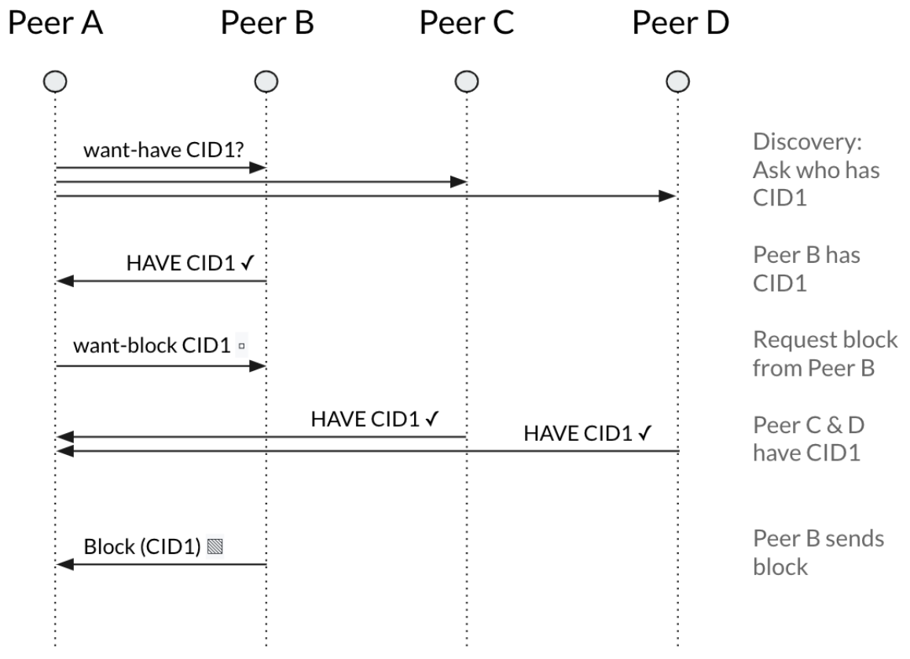

# Bitswap

Bitswap is a core module of IPFS for exchanging blocks of data. It directs the requesting and sending of blocks to and from other peers in the network. Bitswap is a _message-based protocol_ where all messages contain [want-lists](#want-list) or blocks. Bitswap has a [Go implementation](https://github.com/ipfs/go-bitswap) and a [JavaScript implementation](https://github.com/ipfs/js-ipfs-bitswap).

Bitswap has two main jobs:

- Acquire blocks requested by the client from the network.
- Send blocks in its possession to other peers who want them.

## How Bitswap works

IPFS breaks up files into chunks of data called _blocks_. These blocks are identified by a [content identifier (CID)](/content/content-addressing). When nodes running the Bitswap protocol want to fetch a file, they send out `want-lists` to other peers. A `want-list` is a list of CIDs for blocks a peer wants to receive. Each node remembers which blocks its peers want. Each time a node receives a block, it checks if any of its peers want the block, and sends it to them if they do.

Here is a simplifed version of a `want-list`:

```javascript
Want-list {
  QmZtmD2qt6fJot32nabSP3CUjicnypEBz7bHVDhPQt9aAy, WANT,
  QmTudJSaoKxtbEnTddJ9vh8hbN84ZLVvD5pNpUaSbxwGoa, WANT,
  ...
}
```

To find out which peers have the blocks that make up a file, a node running the Bitswap protocol first sends a request called a `want-have` to all the peers it is connected to. This _want-have-request_ contains CID of the root-block of data that makes up the larger chunk of data that makes up a file. If the peers don't have the block, the node queries the Distributed Hash Table (DHT) to ask who has can provide root-block. Any peers that have that root-block send a _have_ response, and are added to a session. Peers do not sent the root-block yet, they just indicate that they have it. Once peers have been added into a session, the origial requesting node sends a _want_ request. Peers with the block will now send the root-block. So that the network isn't flooded with _want-requests_, Bitswap only sends `want-requests` to peers in the session.

The node sends out a `want` for each CID to several peers in the session in parallel, because not all peers have all blocks. If the node starts receiving many duplicate blocks, it sends a `want` for each CID to fewer peers. If the node gets timeouts waiting for blocks, it sends a `want` for each CID to more peers. In this way, the node tries to maintain a high download speed without too many duplicate blocks.

Initially, a node wants to know peers have the root-block, but the node doesn't want to receive the block itself. This discovery _want_ is sent to many peers, and if they all responded with the block, then the node would end up with lots of duplicate blocks, wasting energy and bandwidth. Instead, when Bitswap sends a _want-request_, it can ask for a _have-response_.



Once a node has added peers to the session, it can also use these _have-response_ messages to figure out which of the session peers have the rest of the blocks it needs. This process is relatively cheap because we don't have to worry about duplicate blocks. At this stage, the node also wants the peer to say if it doesn't have the block, so a _dont-have-response_ is available.

With these changes, a node can cheaply work out how blocks are distributed amongst its peers and can direct the requests for blocks more accurately, increasing overall download speed and reducing the number of duplicate blocks. The node can also quickly recognize when all the peers in a session don't have a block it needs and go out to the DHT to find out who has the desired block.

### Additional references

- [February 2020: New improvements to IPFS Bitswap](https://blog.ipfs.io/2020-02-14-improved-bitswap-for-container-distribution/)
- [Technical overview of the Go implementation of Bitswap](https://docs.google.com/presentation/d/1mbFFGIIKNvboHyLn-k26egOSWkt9nXjlNbxpmCEQfqQ/edit#slide=id.p)
- [Article: Swapping bits and distributing hashes on the decentralized web (Textile)](https://medium.com/textileio/swapping-bits-and-distributing-hashes-on-the-decentralized-web-5da98a3507)
- "About Bitswap" Go implementation poster from the IPFS developer summit in Berlin in July 2018:
  
