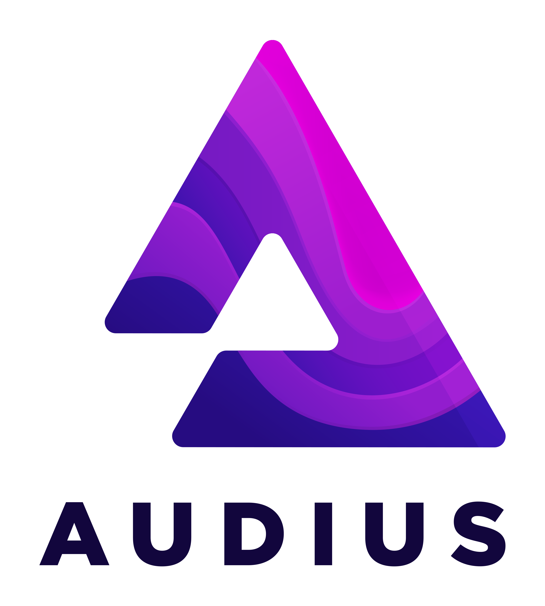

# Case study: Audius

::: callout
**"IPFS and blockchains like Ethereum can be combined to form consensus around large blobs of data in a decentralized, immutable way. Combining the content addressability of IPFS, the immutability of a blockchain, and a network of nodes pinning content to IPFS like the Audius creator nodes, you get the tools necessary to build decentralized systems."**

_&mdash; Dheeraj Manjunath, Head of Engineering, Audius_

**"I don’t know if Audius would exist without IPFS."**

_&mdash; Hareesh Nagaraj, Senior Engineer, Audius_
:::

## Overview

**[Audius](https://audius.co/)** is a music and audio sharing platform designed to provide artists a direct link with their listeners. Using decentralized technology, Audius is able to ensure artists’ rights to and control of their own music, and provide a censorship-resistant platform for expression and distribution of artistic works and compositions. To create a user-owned and operated platform, it was key to have a distributed cloud storage network as the basis for the system. Audius uses IPFS as the core decentralized storage component in their mission to give everyone the freedom to share, monetize and listen to any audio.

In 2018, when Audius was looking into decentralized storage, they needed a system that would enable routing and addressing of large amounts of content in a decentralized way for their content streaming network. At the time, IPFS had the only system that fit their needs for decentralization, with no immediate lock-in or payment up front. Now, after two years on the network, Audius has found that IPFS has consistently performed and provided the flexibility and resilience needed for their network. "The lack of surprises is an advantage," says Hareesh Nagaraj, senior engineer at Audius. It’s been reliable the whole time."

### Audius by the numbers

  

    
5M

    
content identifiers

  

  

    
3.5

    
terabytes of data

  

  

    
12

    
independent discovery and creator node providers

  

  

    
40k

    
registered users

  

## The story

When Audius set out to make a blockchain-based, decentralized alternative to SoundCloud and similar services, their most important consideration was to choose a tech stack that allowed them to maintain their commitment to decentralization as a means to maintain the resilience, variety, and peer-to-peer nature of the network. "We had evaluated some other options and they were not sufficiently decentralized for us," says Nagaraj. "IPFS, even when we started looking, was very far along, in terms of support for multiple environments."

The Audius network and protocol are open-source frameworks that allow anyone to run a service and gain rewards in the network. Most of the people using the network today are artists and listeners who use the Audius client. Musicians and other audio content creators can upload their work, and subscribers can listen according to the terms set by the content creators. As a streaming network, the network latency for read and write is another major area where IPFS has provided the basic infrastructure.

Over the course of Audius' work with IPFS, issues that have come up were always resolved together with the Protocol Labs team, or by supplementing with other technologies. As a distributed platform, Audius uses a stack that has failovers for every layer, including the content servers, and working with IPFS has made integration with multiple solutions simple. "Part of being decentralized is having appropriate failovers for all layers. We try to use IPFS as heavily as we can, but in certain cases we do also have backups," says Manjunath.

Nagaraj notes that the learning curve for building on IPFS was accessible: "In terms of development, it was very easy to grasp everything. We actually got that very quickly, which is definitely a value-add, and since then it’s only gotten easier," he says, citing development tools that have come online over the course of their experience with IPFS. As their usage of IPFS has grown, he adds, "we’re one of the bigger hot-read operators on IPFS" &mdash; explaining that the "hot read" requirements relate to the need for streaming services to get real-time or near-real-time reading operations. Unlike file download services, the listeners to the Audius network would notice if there were any gaps in the streaming of the music.

::: callout
"IPFS and the Protocol Labs team have been great in terms of supporting us and giving us the resources we need. Choosing a dependency on such a novel tech isn’t necessarily the standard way of doing things, but I’m really glad we did. The extensibility that it gives us is huge. Overall, it’s been a game changer for us."

_&mdash; Hareesh Nagaraj, Senior Engineer, Audius_
:::

Regarding Audius' use of the blockchain, the network uses two sets of smart contracts on Ethereum and POA Network to manage content. Audius' L1 layer is used for coordinating and forming consensus on IPFS blocks &mdash; e.g., who uploaded what and when. The "what" &mdash; all content and medtadata &mdash; lives off-chain and is addressed via IPFS. No content is ever uploaded to any blockchain.

Users control their own Ethereum private keys, which permission control of their content on-chain. Under this scheme, Audius doesn’t own the music of the content producers; Audius provides the means for streaming, and the interface, but they don’t have command over the content itself. The technology behind the control of one's own keys restores ownership to the artists while also allowing consumers of the streams to be in charge of their own personal data.

One other key ingredient in Audius' decision to initially adopt IPFS was its separation from Filecoin. The Audius team was able to get started using IPFS and hosting on a network of community-operated nodes, without concern for hosting costs. Over time, they are looking forward to having Filecoin-supported nodes so that they can separate their core content business from the hosting aspects of the business. Meanwhile, their current network of community-operated creator nodes does offer a high level of flexibility in terms of customization. "The node itself is very customizable," Nagaraj says. "We’ve taken advantage of that. I think we’ve used the node in every way possible."

As a large user of the IPFS network, Audius has taken advantage of the [official IPFS forums](https://discuss.ipfs.io), as well as support provided directly from the core Protocol Labs team. They are particularly impressed with the level of support and third-party tools that are available on IPFS.

"We think about the IPFS and Filecoin community as a great role model for what we are doing with the community around Audius, in terms of activity and robustness," says Nagaraj. "There are a lot of developers who are constantly contributing to IPFS. A few post on websites like [simpleaswater.com](http://www.simpleaswater.com) with tons of examples of what you can do with IPFS, how to actually implement it, breaking down all the details. We would aim for something like that. It would be incredible for us if we could reach that level of community participation." Nagaraj also calls out as particularly helpful blog posts and other content created by third-party contributors to the codebase, as well as the ecosystem that is developing around IPFS collaborators such as Textile and Pinata. Having such an active community around an open-source project adds to the momentum and progress of IPFS as a whole.

## IPFS benefits

In terms of concrete benefits, the Audius team cites the following as key wins of using IPFS:

- Fully decentralized storage
- Content-based addressing system
- Tech stack fit with blockchain
- Easy-to-understand implementation
- Multiple implementations (JavaScript, Go, Python)
- Separation of hosting costs and tech stack use
- Large, active, supportive community
- Node flexibility and customizability
- Support from Protocol Labs
- Extensive documentation
- Third-party extensions and support

In particular, IPFS' strengths and capabilities in content addressing and easy-to-implement decentralized storage were game-changers for the Audius team.

### Content addressing

Content addressing in decentralized systems can be a major challenge, and the Audius team cites IPFS content addressing as providing a number of benefits. The content addressing system not only allows identification of content and blobs, but also includes a unique identification fingerprint that eliminates unnecessary duplication and saves storage space.

Native addressing of every piece of content makes the storage easy to use. Under the IPFS schema, every segment of content is guaranteed to be unique.

"The benefits of content addressing are much more than initially meets the eye," explains Manjunath. "Let’s say you upload a track to Audius that you have uploaded previously. Since IPFS is content-addressed, it doesn’t take twice the storage capacity to store the two tracks. We save on storage, since all we have to do is associate the underlying content ID with the newly uploaded track. Same with retrieval. Since any changes to the track in the form of a remix would cause the content address to change, this makes it a complete unique fingerprint that allows full transparency around the state of a track at a given point in time." This fingerprinting mechanism ensures that users can’t change content later on, or make false claims about what happened to any records on the system.

"If we didn’t have IPFS content addressing, we would have to sync our content metadata," Nagaraj says. "To sync a given file and what it’s called in a decentralized way consistently is really difficult. That’s something we didn’t have to even think about with IPFS. When we spin up a new node, it just knows, given these multihashes and content addressing, that it corresponds to a specific file."

### Unique fit for decentralized storage

IPFS has provided Audius the full benefits of decentralized storage with no hassle. The addressing capabilities have made it simple for Audius to manage millions of unique pieces of content with the ease of established commercial solutions.

## How Audius uses IPFS

All files and metadata on Audius are _shared_ using IPFS by creator node services, _registered_ on Audius smart contracts, _indexed_ by discovery services, and _served_ through the client to end users. Audius runs nodes internally to test new changes, and there are a dozen public hosts running nodes for specific services and geographies. However, content creators and listeners don’t need to know anything about the back end; they use the Audius client and client libraries to upload and stream audio. Each IPFS node within the Audius network is currently a [`go-ipfs`](https://github.com/ipfs/go-ipfs) container co-located with service logic. Audius implements the services interface with `go-ipfs` using [`py-ipfs-api`](https://github.com/ipfs-shipyard/py-ipfs-http-client) or [`ipfs-http-client`](https://github.com/ipfs/js-ipfs/tree/master/packages/ipfs-http-client) (JavaScript) to perform read and write operations.

### The tooling

Audius uses the following IPFS implementations with no modification:

- **IPFS core**
- [`go-ipfs`](https://github.com/ipfs/go-ipfs)
  - _All individual nodes are `go-ipfs` containers_
- [`py-ipfs-api`](https://github.com/ipfs-shipyard/py-ipfs-http-client)
  - _Discovery provider is a Python application_
  - _Python application uses a Flask server + Celery worker queue + PostgreSQL database_
- [`ipfs-http-client`](https://github.com/ipfs/js-ipfs/tree/master/packages/ipfs-http-client)
  - _Creator node is a Node.js-based service and heavily uses this client to interact with dedicated IPFS nodes_

For streaming, the Audius team uses HTTP Livestreaming (HLS) on top of the IPFS core implementation. The client pre-fetches the segments as the listener streams them using HLS.

## Audius + IPFS: the future

Audius is looking forward to an upcoming version release with additional metrics, as well as increasing scalability overall. Most importantly, however, the Audius team is excited about the potential for third parties to leverage Filecoin with the IPFS network to create independent hosting networks.

"If we get to a point where we don’t have to store content ourselves, that would be incredible," says Nagaraj. "Our business model is to serve people audio. We aren’t in the business of storage, so we look forward to that."

Other longer-term plans include creating multiple storage locations for faster streaming of content, as well as decreasing latency. Content encryption is also on the roadmap.

_Note: Metrics and other details in this case study are current as of July 2019. Details may change in the interim._
