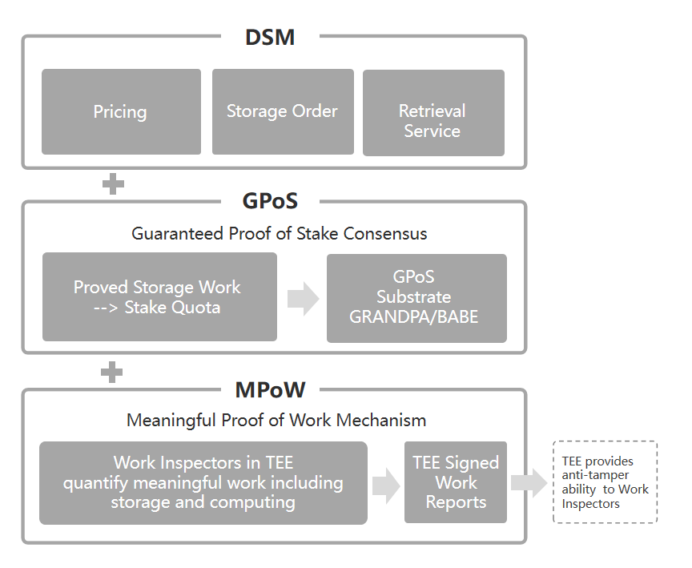

# Case study: Crust Network

## Overview

::: right

:::

[Crust](https://crust.network) is a peer-to-peer network that stores files in a decentralized way, with a blockchain-based incentive layer ensuring the high availability and reliability of files.
Crust provides a decentralized storage network of Web3.0 ecosystem. It supports IPFS as a file layer protocol, and connects storage interfaces to the application layer. As such, it is designed to build a decentralized cloud ecosystem that values data privacy and ownership.

### Crust by the numbers

<NumberBlock :items="[
  {value: '3000+', text:'storage nodes'},
  {value: '500+PB', text: 'total capacity'},
  {value: '98', text: 'average replicas of each file'},
  {value: '99.999999999%', text: 'file availability'}
]" />

## The story

IPFS allows users to store and transfer verifiable, content-addressed data in a peer-to-peer network. IPFS users tend to have the data they want on their own IPFS nodes. This is called pinning. Sometimes the data may be pinned using a third-party pinning service or through groups of individual IPFS users (like IPFS Collaborative Clusters).
The data exists in the network as long as it is stored by a user, who can also provide it to others upon request.
IPFS alone does not have a built-in mechanism to incentivize the storage of data for others. This is also an issue to be solved by Crust Network: to incentivize nodes to provide stable IPFS services.

### The Solution

In order to address the issue mentioned above, Crust splits it into 3 easy-to-tackle problems:

How does an IPFS node prove the work it provides?
How to properly reward IPFS nodes that provide services?
How to make it easier for users to use the IPFS services provided by nodes?

In response to the above problems, Crust has devised an architecture with the following 3 layers:

MPoW (Meaningful Proof of Work) - The low-trust/zero-trust storage proof layer to inspect and prove storage work of miners.
[GPoS](https://wiki.crust.network/docs/en/GPoS) (Guaranteed Proof of Stake) - The PoS-derived consensus layer that requires nodes to provide storage proof to get staking quota. 
[DSM](https://wiki.crust.network/docs/en/DSM) (Decentralized Storage Market) - It enables users to place storage orders on the chain, to get their data stored and distributed on Crust Network.

The 3-layer architecture guarantees that nodes that provide IPFS services can obtain fair rewards. Meanwhile, it also ensures that the services provided by these nodes can be accessible to all IPFS users.

### The use cases

#### Uniswap

[Uniswap](https://app.uniswap.org) has enabled decentralized deployment of its frontend interface by integrating Crust Network into its release workflow. Integration with Crust enables the full decentralization of storage and distribution, disengaging from the dependence of centralized pinning services. For details, please see Decentralized Uniswap Interface Hosting on IPFS.

#### Polkadot

Polkadot also integrates Crust, the [Polkadot.js](https://dotapps.io/) is now hosted on Crust Network in a decentralized manner.

## IPFS benefits

Crust chose IPFS because it decentralizes two of the core aspects of the internet: file storage and data transfer. Coupled with the inherent advantages of IPFS as a fundamental technology in Crust, this brings forth the following benefits:
Efficient distributed storage: IPFS provides a reliable, proven solution for distributed storage out of the box, backed by active core development and an engaged international user and developer community.

* Data integrity: Thanks to its inherent use of content addressing, IPFS generates a unique content identifier (CID) for every artifact stored on IPFS — meaning that if an item is modified, its CID changes, too.
* Free-riding prevention: The BitSwap protocol in IPFS stack limits the data that nodes can retrieve through the data shared by nodes, effectively enabling Crust Network to prevent free riding from happening.

Additionally, IPFS's vibrant and active community of developers means that the protocol is constantly evolving to better serve its users and builders.

## How Crust uses IPFS

### Data storage and distribution

Crust DSM (Decentralized Storage Market) is using IPFS as a fundamental data storage and distribution protocol. With DSM integrated, users can follow 3 simple steps to upload, store and distribute files:

* Add file/folder to IPFS network.
* Place corresponding storage order with the file CID on Crust Chain.
* After the storage order status turns to be successful, the file can be then accessed via standard IPFS interface and gateway from anywhere.

### Credit system

As a data storage system, apart from the storage market, DSM also takes the responsibility of incentivizing the nodes to provide retrieval service. Therefore, DSM includes another layer of incentives to encourage nodes to support data retrieval:

* The data retrieval mechanism in Crust Network follows the IPFS [BitSwap](https://docs.ipfs.io/concepts/bitswap/) Protocol. By such, data can be shared and exchanged among the nodes of the entire IPFS Network.
* Crust Network provides a highly efficient retrieval pointing mechanism. Enabled by the BitSwap protocol and using a “credit” mechanism, nodes can resist those “free-riding” nodes that only seek to pull data without providing retrieval services. Building on the BitSwap credit mechanism, Crust Network makes the access to trusted on-chain information available for nodes, further boosting the Crust Network credit mechanism.
* Crust Network nodes provide reliable retrieval services. The initial earning of Crust Network nodes comes from Network Staking——GPoS, and storing more user files can translate into increased effective stake limits for nodes. Driven by such a bonus and coupled with Crust Network credit mechanism, nodes offer to provide corresponding retrieval services so as to receive more user files.

## Crust + IPFS: the future

Crust brings thousands of nodes to IPFS, which provide stable storage and retrieval services. In addition to the scenario of **website hosting** that has been implemented already, Crust can be used in a wide range of scenarios, including:

* **General off-chain data storage**. Some blockchain-based decentralized applications, such as NFT and decentralized social platforms, involve a large amount of user data, far beyond the on-chain storage capacity. Based on Crust + IPFS, developers can provide general off-chain data storage services for these applications.

* **Accelerated content delivery**. Developers are able to build P2P content delivery network (CDN) services with Crust + IPFS. Crust Network incentivizes the nodes to spontaneously distribute CDN data and play the role of CDN edge nodes to accelerate the data transmission for CDN users.
Secured cloud storage

Developers are able to build Cloud storage applications with Crust + IPFS Network. Without maintaining storage clusters, developers only need to integrate the SDK of Crust into applications to provide users with stable storage services.

Moreover, in order to effectively expand the decentralized storage ecosystem, Crust Grants Program was launched in early 2021. Crust Grants Program aims to fund development and research projects that drive user experience, business potential and technical innovation for IPFS and Crust ecosystem.
