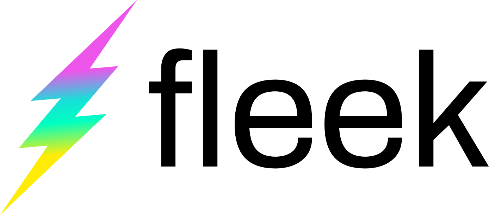

# Case study: Fleek

::: callout
**"Using IPFS nodes and encryption and database tools on IPFS, we can build apps and websites with the highest standard of data privacy and autonomy to date."**

_&mdash; Brett Shear, COO, Fleek_
:::

## Overview

::: right

:::

[Fleek](https://fleek.co/) is an easy-to-use service for hosting websites, storing and delivering files, and developing apps for the decentralized web (DWeb). As the next generation of the internet, the DWeb offers massive strides forward in terms of data autonomy, disaster and censorship resilience, performance, and speed — but for those who aren't yet familiar with it, using or building for the decentralized web can be time-consuming or difficult. Fleek's mission is to speed adoption of the DWeb by making it easier for everyone from dedicated developers to everyday internet users to create apps and store files in a decentralized paradigm, positioning them on the vanguard of a "low-code/no-code" movement of platforms, services, and development tools for users at all levels of coding experience.

Fleek's product and service portfolio is built on the Fleek Stack of IPFS, [Textile](https://textile.io/), and [Filecoin](https://filecoin.io/), and deployed via Fleek Edge — infrastructure that combines the distributed peer-to-peer data sharing protocol of IPFS with edge computing to create an exceptionally fast and reliable distributed network. On Fleek Edge, data and information are processed and stored at edge locations geographically close to users' requests, reducing latency for real-time data applications and improving the performance and speed of peer-to-peer interactions.

Fleek's service offerings — hosting, storage, and their new Space Daemon suite of developer tools — all utilize Fleek Edge, and can be used on their own or together as needed to put the power of IPFS's decentralized storage architecture into the hands of everyone from everyday internet users looking for file storage to more experienced developers who need low-friction tools for building on IPFS. With Fleek, anyone and everyone can use IPFS to join the decentralized web. For the Fleek team, it's IPFS that makes the DWeb possible, and Fleek wants to make IPFS easier, faster, and more streamlined for everyone.

### Fleek by the numbers

<NumberBlock :items="[
  {value: '&gt;8K', text:'IPFS site deployments'},
  {value: '&gt;8K', text: 'Fleek URLs and DNSLink records'},
  {value: '99.99%', text: 'guaranteed uptime on Fleek Edge'},
  {value: '150+', text: 'global Fleek Edge locations'}
]" />

## The story

Fleek started life as Terminal.co with a simple mission: Build tools that make using the Dweb easier for everyone in order to fuel a faster, more seamless transition from the centralized web of today to the decentralized web of the future. To that end, the team originally launched with a focus on user-friendly tools for building decentralized apps (dapps) interacting with smart contracts on the Ethereum blockchain.

But Fleek soon realized that starting with dapps was putting the cart before the horse. Not only is building for dapps and smart contracts a specialized market, but these products themselves are only ever as decentralized as the storage architecture upon which they rely. To truly guide the web's transition to a decentralized future, the team needed a broader approach. That's when Fleek turned to IPFS as the technology that would help them make their vision a reality.

::: callout
**"We saw that the fastest, simplest, and most direct way to advance the decentralized web is to equip ordinary web users with the tools they need to access and build on IPFS. IPFS offers the data integrity, privacy, and security that we think matter most for the future of the DWeb. And with the right tools, we knew we could give a full hosting experience and seamless workflow — making IPFS as easy to use as a standard website today."**

_&mdash; Brett Shear, COO, Fleek_
:::

The Fleek team decided to pursue a new company direction, with a product roadmap geared toward boosting the accessibility of IPFS-based hosting, storage, and database management. That decision spurred development of an entirely new platform — the Fleek Stack of IPFS, Textile, and (after mainnet launch) Filecoin — with a debut in early 2020.

Fleek currently offers three products built on the Fleek Stack, each intended to enhance and streamline the workflow around common DWeb use cases:

- **Fleek Hosting:** Tools for hosting sites and apps on IPFS, including industry-familiar continuous integration and deployment tooling via GitHub.
- **Fleek Storage:** A service for importing, storing, pinning, and fetching files via IPFS that includes a friendly UI in addition to API and CLI interfaces.
- **Space Daemon:** A developer toolset for building peer-to-peer encrypted apps that packages IPFS, Textile Threads and Buckets, and Filecoin into a single JavaScript interface.

Each of these products is designed to facilitate IPFS use and integration in as streamlined a manner as possible. Space Daemon, for example, makes it simple for users to leverage IPFS for encrypted database storage and serverless app development. Fleek's hosting and storage offerings automatically handle the IPFS-specific details by auto-updating references to content identifiers (CIDs), TXT values in DNS records, and more.

In creating this streamlined workflow for using, building upon, and deploying to IPFS, Fleek empowers developers to integrate the protocol's key benefits — such as peer-to-peer functionality, serverless interactions, and autonomy from centralized hosting — into their sites, products, and apps. What's more, the Fleek Edge network provides significant performance and efficiency boosts that anyone from DWeb newcomers to IPFS veterans can benefit from.

In short, Fleek's portfolio offers wide-ranging functionality and a bridge between the legacy web and the DWeb, facilitating many valuable use cases across the end-user and developer space. "One of the biggest barriers to adoption of IPFS by the broader web community is unfamiliarity with the manual work involved in hosting or building on IPFS," says Shear. "Fleek takes care of that work on its own, which ensures that anyone who wants the benefits of hosting their website on IPFS can get them easily and quickly. But even experienced devs can benefit from the ease of use and faster speeds they get with Fleek products deployed on Fleek Edge."

## IPFS benefits

Fleek chose IPFS because it decentralizes two of the core aspects of the internet: file storage and data transfer. Combined with the inherent advantages of IPFS content addressing and IPFS's position as a fundamental technology in Filecoin, this opens up a host of benefits not available elsewhere:

- **Data integrity in a peer-to-peer world:** Fleek uses IPFS in combination with encryption tools like Textile's, enabling them to offer a best-of-both-worlds paradigm where users get the benefits of client-side encryption (through user-owned keys) as well as the ability to share data directly without touching any third-party servers. Because the transport is encrypted by default, external watchers can't view it in transit, and IPFS's [content addressing](/concepts/content-addressing/) also ensures that the data a user receives when they make a request is cryptographically verified as the data they asked for.
- **Censorship and disaster reslilience:** IPFS content addressing allows for multiple copies of the same content-addressed resource to exist as equivalent items in multiple locations worldwide. This can offer the potential for a degree of resilience against physical disaster or censorship unavailable on the legacy web.
- **Integrated access to future storage and retrieval markets:** Because IPFS and Filecoin are so tightly integrated, building on IPFS will facilitate the ability to offer Fleek users a seamless way to access the Filecoin marketplace for their storage needs.

Additionally, IPFS's vibrant and active community of developers means that the protocol is constantly evolving to better meet the needs of its users and builders.

## How Fleek uses IPFS

Fleek creates a simple, streamlined workflow for anyone looking to host, share, or build content on the decentralized web. Fleek provides its own public IPFS gateway, which means that developers don't need to build their own in order to serve their users. The gateway allows even IPFS-ignorant legacy web browsers and apps to access content provided via IPFS.

Fleek also automates the process of building and deploying on IPFS. Developers who use Fleek for site and app deployments don't need to do anything except link Fleek with a GitHub repo, and Fleek will automatically build and deploy their code via IPFS.

So, what does that look like in action? Since IPFS uses content addressing, every piece of content on IPFS needs its own unique content identifier (CID). This CID is updated with every change to the content with which it is associated. For developers, keeping up with these updates can be a hassle, since it would normally involve manually updating CID pointers or implementing other downstream changes to match a new CID.

Fleek handles all that manual work on its own. In the case of a website, Fleek automatically takes the CID generated by IPFS for the site content and points it to a Fleek subdomain URL, using a TXT record added to the DNS settings Fleek creates for the site. Whenever anyone visits that Fleek URL, the most recently associated CIDs are delivered to the user via Fleek's HTTP IPFS gateway — meaning that a request that starts with an HTTP request (such as a legacy web browser) remains HTTP throughout. And any time site content changes, Fleek automatically detects the new hash and re-associates the TXT record accordingly.

In short, a developer on Fleek can use familiar tools and workflows without worrying about the manual work that might normally go into using IPFS — while still taking advantage of the benefits provided by the decentralized web.

### The tooling

At the core of all of Fleek's offerings are [`go-ipfs`](https://github.com/ipfs/go-ipfs) and [`ipfs-http-client`](https://github.com/ipfs/js-ipfs), used out of the box. Nodes on `go-ipfs` appear throughout the Fleek ecosystem, including:

- Pinning nodes used by Fleek Hosting and Fleek Storage
- Nodes for encrypted backups
- Space Daemon-specific nodes (behind Textile Hub)

Platform-wide, Fleek utilizes `ipfs-http-client` whenever services need to interact with an IPFS node, for example:

- When a user deploys a site, Fleek's site builder component uses the client to import to IPFS
- When a user adds a file to Fleek Storage, the client is used to make the import via HTTP, as well as to make sure the mutable hash of the file bucket gets updated all the way to the root hash

Additionally, Fleek relies upon building blocks from [Textile](https://textile.io/), [Ceramic](https://www.ceramic.network/), and others to help create its service offering. This breaks down by product as follows:

#### Fleek Hosting

- Fleek Hosting deploys built sites onto `go-ipfs` nodes directly, and also replicates on at least one additional node.
- Additionally, the service augments these nodes with a traditional HTTP CDN in order to improve performance on secondary fetching. Says Shear: "Websites these days are used to 20ms times for fetching sites past the first load, so we want to offer at least that."
- This CDN's cache is cleared, at minimum, for each new Git commit and its resulting Fleek Hosting auto-deployment.
- Whenever the CDN's cache is cleared, content is re-fetched from IPFS (with all requests made to Fleek's gateway) in the same manner in which it was originally fetched — e.g. from the TXT record of an IPFS hash added to a user's DNS, via [DNSLink](https://dnslink.io/), or via [Ethereum Name Service (ENS)](https://ens.domains/) domains.

#### Fleek Storage

- Fleek Storage uses `go-ipfs` nodes in combination with [MinIO](https://min.io/) S3-equivalent APIs; the S3-like APIs give full compatibility with any AWS tooling and a familiar bucket structure to files.
- Fleek-built handlers create a root bucket hash, as well as folder hashes that Fleek Storage files live within.
- Any change to files or folders updates all the way back up to the root bucket hash.

#### Space Daemon

- The Space Daemon developer toolset code combines a `go-ipfs` IPFS node with offerings from Textile (particularly its [Threads](http://docs.textile.io/threads) multi-party database architecture) and a key management tool in a single, easy-to-install Go daemon.
- Third-party integrations for enhanced functionality include — but aren't limited to — Filecoin (via [Textile Powergate](https://docs.textile.io/powergate/)) for encrypted backups, [Ceramic](https://www.ceramic.network/) for identity management, and [Handshake](https://handshake.org/) for naming and domain functionality.
- The Space Daemon JavaScript library acts as an abstraction layer to the [gRPC](https://grpc.io/docs/) methods of the Go daemon, providing developers with a convenient JavaScript interface that they can install locally in their applications.

#### Fleek Gateway

- While not a Fleek "product" per se, Fleek extensively uses its own HTTP gateway (ipfs.fleek.co) created from their `go-ipfs` node infrastructure.
- When gateway-based delivery is needed — for example, for verification and other links in Fleek product GUIs — links to CIDs of hosting or storage content use this gateway, but can also be fetched using any other IPFS gateway.

## Fleek + IPFS: the future

Fleek already helps bridge the legacy web and the DWeb through easy-to-use tools for IPFS-based hosting, file storage, and development. But as IPFS continues to evolve, Fleek intends to evolve alongside it; for example, while Fleek Hosting currently augments IPFS storage with a traditional CDN, the team looks forward to going IPFS-only as soon as solutions for optimizing fetch time exist within the ecosystem.

::: callout
**"The future of Fleek is very closely tied to the future of IPFS. Fleek products are already delivering cutting-edge performance on IPFS. Every step forward on the IPFS development roadmap will give us more tools to improve on that performance further.**

_&mdash; Brett Shear, COO, Fleek_
:::

Fleek is also looking forward to the implementation of IPFS in-browser connectivity in order to bring full IPFS superpowers to anyone running or using a Fleek-deployed app — not just end users who are running their own local IPFS nodes.

Finally, Fleek is currently working on integrating Filecoin payment options and storage on the Filecoin network into the Space Daemon, unlocking a world of possibility for Space Daemon developers wanting to use Filecoin to solve their storage needs.

_Note: Metrics and other details in this case study are current as of September 2020. Details may change in the interim._
