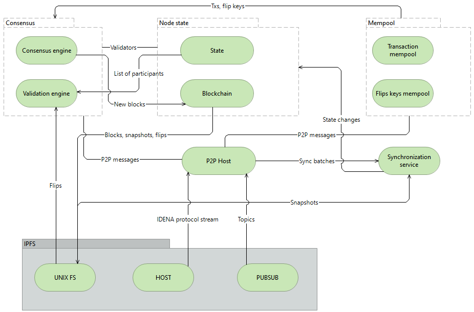
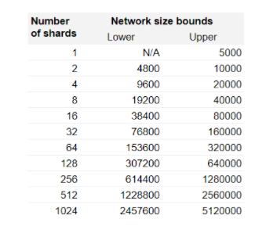

# Case study: Idena Proof-of-Person Blockchain

::: callout

**"Idena and IPFS is a perfect match. IPFS enables a decentralized network of nodes. Idena makes them equal."**

_&mdash; Andrew Edi, co-founder, Idena_
:::

## Overview

::: right

:::

[Idena](https://idena.io) is a decentralized sybil-resistant network of people connected by Proof-of-Person blockchain. Every node of the network is linked to a cryptoidentity – one single person with equal voting power and mining income.

Idena is a unique Proof-of-Person blockchain built from scratch. It is not a fork of any existing blockchain. Idena is built on top of IPFS which serves as both a distributed blockchain database and as a communication layer across the nodes of the network.

Idena blockchain has a Proof-of-Person consensus mechanism: every network validator is a verified unique human. To verify uniqueness and humanness of each network participant, Idena employs a validation ceremony that ensures personhood while preserving anonymity. The validation ceremony is a very traffic intense process because it requires simultaneously transferring of large amounts of data (Idena CAPTCHAs, which are called flips) across all network participants strictly within a short and fixed time window of the validation.

The flips are created by verified participants of the network, easy to solve for a human and hard to solve for AI. If a participant is not able to solve the flips within the set time, they are not validated and lose their previous status. To prevent bad actors from solving the flips in advance, all flips are encrypted before the beginning of the validation. The keys are sent only when the validation starts. To optimize the traffic load during the validation ceremony and ensure horizontal scaling of the network, Idena employs sharding.

### Idena by the numbers

<NumberBlock :items="[
  {value: '~2K', text:'Nodes'},
  {value: '14K+', text: 'Unique users'},
  {value: '4', text: 'Shards'},
  {value: '775K', text: 'Flips'},
  {value: '3.9M', text: 'Blocks'}
]" />

## The story

Idena was designed as the most decentralized blockchain based on democratic principles: one human = one node. To become a validator, neither mining rig nor stake is required. It is enough to prove that you are a human instead. The potential number of mining nodes is limited only by the amount of people who have passed the validation. Currently, it’s 14K humans. About 2K humans are running their nodes 24/7, and around 5K humans start their nodes for every validation ceremony.

::: callout
**"It is important to emphasize that Idena participants are common people. Many of them run Idena nodes on their home computers behind NAT. Common users usually don’t open the ports on their routers to connect to other nodes. At the same time, peer discovery is critical for the consistency of the network. After considering different solutions, we have chosen IPFS connections as the most efficient technology for peer discovery."**

_&mdash; Andrew Edi, co-founder, Idena_
:::

## Idena IPFS storage

Every Idena node includes an IPFS node. Idena IPFS nodes do not connect to the IPFS public DHT, they form a private Idena IPFS network that is a public storage for the Idena blockchain data.

What kind of data is stored by Idena IPFS nodes?

**1. Flips**

Idena flip tests are CAPTCHAs created by Idena users for the validation ceremony. The flips are encrypted and stored by the network until the validation. Each flip has two sets of pictures, each set telling a story. To solve the test, you need to decide which story makes sense, and which is senseless.
Here is an example:

::: callout

**Can you identify which side contains the logical story? Left or right?**

**The correct answer is left:**

- **The man is bored**
- **He got an idea**
- **He will take a gaming VR set to play in virtual reality**
- **He is playing**

**If we try to connect the story on the right:**

- **A man is playing**
- **He's bored**
- **Virtual reality game set**
- **He got an idea**

**This story on the right makes much less sense than the one on the left. Man's ability to recognize a logical story in this way puts him at a great advantage over a robot or artificial intelligence that cannot connect images into a logical story. With this ability, you prove that you are a human being, and gain the right to be a member of the Idena network, and you are rewarded with Idena coins.**

_&mdash; Andrew Edi, co-founder, Idena_

:::

You can find more flip examples and read how validation works on [Idena.site](https://idena.site/idena-validation), a community-driven resource about Idena.

Flip availability is critical for the validation protocol. Meanwhile, the flips are not stored on the Idena blockchain. Every flip has a unique CID that is stored on the blockchain instead, and the flip itself is stored on IPFS.

For instance: [bafkreidn35trnkdkacsmreldar3kdfheh7lqg66dsfjpfjgelzdczl6mt4](https://scan.idena.io/flip/bafkreidn35trnkdkacsmreldar3kdfheh7lqg66dsfjpfjgelzdczl6mt4)

To prevent overloading of the nodes of home users with excessive storage of all the flips in the network, each flip is stored/pinned only on 30% of the network nodes.

**2. Blocks and snapshots**

Idena IPFS stores not only flips, but also the body of every block of the blockchain as unique CIDs. This way, the history of the blockchain is available and transparent. At the same time, Idena optimizes blockchain storage on the home nodes by randomizing the numbers of the blocks stored on each particular node.

Every 15 minutes each node makes a snapshot of the states of all network addresses. This snapshot is used by newly connected nodes for fast synchronization. The snapshot can be loaded from any peer, because each node calculates the snapshot the same way with the same CID.

**3. Advertisement network**

Idena is a great platform for advertising, because it is by design a sybil-resistant network of validated and unique humans. Paid ads which are shown to the network participants are stored on IPFS. The ad content is hosted on Idena nodes as long as the advertiser keeps burning iDNA coins.

**4. Custom content**

The Idena protocol can store and distribute custom content over Idena’s IPFS network. To do that, there is a special StoreToIpfsTx transaction that receives the CID of the uploaded content and distributes this content to randomly selected 20% of the network nodes. To run the transaction, the user needs to pay a fee proportional to the size of the uploaded data.

## IDENA IPFS sharding

The most traffic intensive part of the Idena protocol is the validation ceremony. To pass the validation successfully, each user has to distribute their answers throughout the network, to every node. When all network participants simultaneously send their answers, each user addressing all other nodes, it leads to the exponential growth of traffic.

To deal with the congestion of the network during the validation ceremony, Idena uses horizontal sharding. The network is split into shards, and the validation is held in each shard independently. As the network grows, the protocol allocates more shards, depending on the number of network users. For the current size of the network which is 14K users, 4 shards are allocated.

Every participant is assigned a shard number. To prioritize the connections between the nodes inside the same shard, Idena uses IPFS pubsub. To find peers, Idena Node subscribes to the pubsub topic corresponding to its own shard. As specified in [go-ipfs 0.5.0 release notes](https://github.com/ipfs/go-ipfs/releases/tag/v0.5.0), IPFS pubsub makes the node find and connect to other peers subscribed to the same topic more aggressively, so this allows the Idena node to find and connect to peers from the same shard faster.

Once the connection between two peers is established, Idena nodes exchange their shard numbers. Idena Node broadcasts the messages addressed to the members of the shard only to the peers with the same shard number. The messages addressed to the peers in other shards are transferred with low priority.

## IPFS benefits

Idena developers name the following as the key advantages of the IPFS for the Idena protocol:

- Fully decentralized data storage with each node corresponding to one anonymous identity;
- A truly scalable network that gets even faster as more people join;
- Support from and ongoing collaboration with the IPFS core team.

## Idena + IPFS: the future

In the [Idena roadmap](https://docs.idena.io/docs/wp/roadmap) there are many products and solutions which already have implementations in the IPFS ecosystem:

- [Decentralized messenger](https://docs.ipfs.io/concepts/usage-ideas-examples/#exchange-messages);
- Content [hosting](https://docs.ipfs.io/concepts/usage-ideas-examples/#ipfs-hosting-with-textile), [publishing](https://docs.ipfs.io/concepts/usage-ideas-examples/#deploy-your-website-on-ipfs), and [delivery](https://docs.ipfs.io/concepts/usage-ideas-examples/#content-delivery-networks);
- [dApps](https://docs.ipfs.io/concepts/usage-ideas-examples/#build-a-dapp) running on Idena smart contracts

Also, Idena offers any project built on IPFS a network of ~2K IPFS independent nodes that can be used for any applications. At the same time, Idena already has a working economic system powered by the iDNA native coin which can be used to monetize the product unrolled on Idena IPFS or to give the users a financial incentive to store data on their nodes.

::: callout
**"We see the future of Idena as a community-driven ecosystem evolving and growing on decentralized and open-source principles. We support independent developers and teams who want to contribute to the core protocol and build solutions on Idena. And using cutting-edge technology standards such as IPFS for data storage and transfer is a big part of making the protocol developer-friendly. IPFS has a very strong developers community, that is why we are so excited about the partnership between Idena and IPFS and feel massive potential for mutually beneficial projects and initiatives."**

_&mdash; Andrew Edi, co-founder, Idena_
:::

_Note: Metrics and other details in this case study are current as of March 2022. Details may change in the interim._
