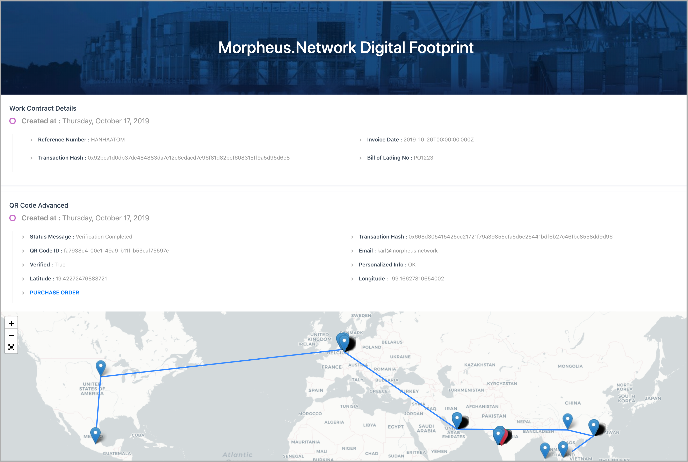

# Case study: Morpheus.Network

::: callout
**"It's a simple, elegant use case. Everyone accessing a document has complete assurance they are viewing the official version, so you don't need any additional verification."**

_&mdash; Noam Eppel, COO and co-founder, Morpheus.Network_
:::

## Overview

::: right

:::

[Morpheus.Network](https://morpheus.network/) is a supply chain software-as-a-service (SaaS) platform that uses IPFS for reliable, distributed, verifiable storage and retrieval of international customs and shipping documentation. For shipping of goods across borders, it's critical — both functionally and legally — to have verifiable, consistently accessible documentation for every shipment. Morpheus.Network's usage of IPFS is a live, enterprise-level example of how IPFS can store and deliver documentation that stands up to the stringent requirements of international customs authorities.

Morpheus.Network uses a private network of IPFS document storage nodes, combined with event logging on the Ethereum blockchain, to ensure that shippers, authorities, and recipients can consistently retrieve shipment data, and to be assured that documents used in shipping transactions are verified, tamper-free originals. Since all goods shipped using Morpheus.Network's platform can be easily associated with the proper documentation, users can move shipments across borders with less friction and greater speed. And because all documentation is stored using IPFS, there's no central data clearinghouse holding (or potentially making vulnerable) sensitive shipping details, including financial info or other personally identifiable information.

### Morpheus.Network by the numbers

<NumberBlock :items="[
  {value: '12+', text: 'months using IPFS in platform'},
  {value: '&gt;1K', text:'successful cross-border shipments using IPFS'},
  {value: '&gt;90%', text: 'potential reduction in client email volume'},
  {value: '&gt;95%', text: 'potential reduction in client manual errors'}
]" />

## The story

Morpheus.Network unlocks potential in a previously underserved area of logistics by empowering a wide range of entities along the international supply chain to interoperate seamlessly. Securely storing and distributing the documentation required to move international shipments across borders is a tricky problem: Multiple parties, each using their own software and tools, must successfully interact in order to create, verify, and present documentation for export and import. Morpheus.Network CEO Dan Weinberger summarizes the problem space as follows: "In supply chain, there are a lot of these parts and pieces that don't speak to each other properly. We have shipping companies — whether it's ocean shipping or transport trucks — customs brokers, the various customs or border protection [agencies], and the actual shipper, seller, and buyer. All of them need to interact with each other in a seamless fashion. Right now, that's just not the case."

Without the IPFS-backed document management system that Morpheus.Network offers, parties involved in international shipping are forced to resort to a patchwork of emails, chat transcripts, and data moved between various players' custom platforms — all tedious, complicated, and prone to errors or tampering. Morpheus.Network's integrated solution enables everyone involved in a shipment to access its official, verifiable documents — such as bills of lading, invoices, or tax documentation — not only with less friction, but also with the confidence that documents are verified as tamper-free originals. Morpheus.Network calls this a shipment's Digital Footprint: its documentation library and log of transport and import/export events, collected into a single source of truth. In an industry that's long been a holdout of old-fashioned paper tracking processes, this gives players moving to fully-digital shipment tracking an additional means for leapfrogging the competition. Says Weinberger: "There's no reason to digitize if you're not futureproofing as well."

Every [Digital Footprint](https://gateway.ipfs.io/ipfs/QmPZ3Feqy9KkfA7Yjct8Nd73y6rbGaUCHExZP47SNArPjB) is a cross-referenced, clickable timeline depicting a shipment's progress and linking to documentation or validation for every associated event. As a shipment progresses, every event along the way — everything from issuance of a new document, to a recorded temperature deviation recorded by an IoT device in a shipping container, to a receipt for final delivery — is recorded on the Ethereum blockchain, and if an event results in a document being added, those files are encrypted and stored using IPFS. This provides two layers of assurance: Apart from the access control afforded by encryption (only authorized users on the platform can view documents), IPFS' use of [content addressing](https://docs.ipfs.tech/concepts/content-addressing/) offers inherent tamper protection, solving a too-real problem in the global shipping industry. Because importing a file to IPFS associates it with a unique content identifier (CID) that changes if file content changes, every party in a shipment can be assured the documents they work with are unmodified originals. Every transaction is recorded on a private sidechain, with a consolidated transaction recorded on the Ethereum blockchain; this methodology enables Morpheus.Network to reduce Ethereum transaction fees from potentially millions of dollars per day down to a fraction of that.

From the perspective of the user, all of this is transparent. Shippers and others logged in to the Digital Footprint simply see a regular web interface, although they can also drill down to see individual transactions' blockchain events if they wish. Pragmatically speaking, the process isn't much different for shippers, recipients, and customs authorities — just substantially easier because there's no need to verify authenticity or maintain multiple accounts on multiple tracking services. Below is an example Morpheus.Network workflow (or see this [video version](https://www.youtube.com/watch?v=rZ6zYK6ULV8)):

1. The shipper adds their shipment's purchase order to a new Digital Footprint using the warehousing and distribution software of their choice, or even simply uploading the PDF attachment on an originating email. As with all document imports, it is encrypted and given a unique CID.
2. The shipper selects a logistics provider (in the case of the [example Digital Footprint](https://gateway.ipfs.io/ipfs/QmPZ3Feqy9KkfA7Yjct8Nd73y6rbGaUCHExZP47SNArPjB), Hamburg Sud or Flexport), as well as a certificate of origin and any necessary additional documents (in the case of the example, phytosanitary documentation).
3. The shipper and/or carrier add compliance documents appropriate to that shipment (such as C-TPAT, ISO 22000, or HACCP). If a shipment includes transfer by truck, the shipper and/or carrier also add license, VIN, and insurance info. These are critical documents for national customs and border patrol agencies, so it's particularly important these are tamper-proof.
4. The Morpheus.Network platform automatically generates a digital bill of lading — no manual intervention needed — as well as a QR code that can be scanned along the shipment's journey to validate a shipment, serve as proof of presence, or be used to add documents or images to the Digital Footprint. Relevant parties along the way can simply scan the QR code to generate the appropriate events, meaning that a port worker or truck driver can contribute to a Digital Footprint without needing full access.
5. When a shipment is in transit, additional information can be automatically added to its Digital Footprint by any linked onboard IoT device; common use cases include recording location, temperature, humidity, light exposure, or more. Morpheus.Network integrates with a number of industry-standard IoT devices, including ones offered by [Hanhaa ParcelLive](https://hanhaa.com/morpheus-network-and-hanhaa-help-companies-understand-the-opportunities-for-usmca-cross-border-trade-and-compliance-challenges/), Geotab, DigitalMatter, and AT&T. Any information collected is automatically added to the blockchain as a matter of record.
6. At any point along the way, authorized users can track a shipment's progress by logging in (via username/password) to the Morpheus.Network web app and viewing the Digital Footprint. Linked documents are retrieved from the Morpheus.Network nodes, decrypted at the app level, and displayed to the user in-app.
7. Once the shipment clears customs and reaches its final destination, the recipient simply scans the QR code to confirm receipt and record this proof of delivery on the Digital Footprint.

## IPFS benefits

The decision to use IPFS was an easy one for the Morpheus.Network team. Not only was their integration of out-of-the-box [`kubo`](https://github.com/ipfs/kubo) and [`ipfs-http-client`](https://github.com/ipfs/js-ipfs/tree/master/packages/ipfs-http-client) a straightforward process that didn't require additional customization, but many of the benefits provided by IPFS were critical to the success of the platform:

- Proof of data integrity (or, if appropriate, revision) via IPFS content addressing
- Middleman-free architecture enabling multiple parties to access official documents without a central data broker
- Ability to store documents, even in perpetuity, without having to rely on a centralized cloud storage platform
- Ability to run as a private network without compromising any functionality
- Ease of integration with the Ethereum blockchain
- Proven success stories and a track record of trust by corporations and organizations worldwide
- A highly engaged global developer community and growing documentation
- The ability to create a no-trust-required framework for adding and verifying shipping events and documents

That last item is particularly important, notes Weinberger. Trust is a traditional sticking point for the shipping industry, and IPFS is critical to Morpheus.Network's building a platform in which trust in a data broker or other centralized source isn't required. For example, when a party adds a document to a shipment's Digital Footprint, they themselves are importing a file directly to IPFS — not using Morpheus as an intermediary. When another organization reads that document, again, they are using Morpheus.Network as an interface to an IPFS node, but they are viewing a document proven to have originated directly from its source without modification.

::: callout
**"It's not that clients need to trust us, Morpheus.Network. They're trusting the cryptographic proof that a file's hash has remained the same, so they know with certainty that the file has not been edited or tampered with. From a business perspective, that really is one of the key benefits."**

_&mdash; Noam Eppel, COO and co-founder, Morpheus.Network_
:::

## How Morpheus.Network uses IPFS

As noted above, Morpheus.Network's integration of IPFS was extremely straightforward. With the help of IPFS [documentation](../README.md) and an extensive [developer community](../community/README.md), the team was able to use standard IPFS tooling without any need for additional customization.

The Morpheus.Network team chose to run their own private IPFS nodes for two primary reasons:

- Shipment data files tend to be small, and even in aggregate don't require vast amounts of storage
- A private node network can be set up to persist files indefinitely by default (in the case of Morpheus.Network, via pinning necessary files)

### The tooling

- [`kubo`](https://github.com/ipfs/kubo) core
- [`ipfs-http-client`](https://github.com/ipfs/js-ipfs/tree/master/packages/ipfs-http-client) for integrating with the Digital Footprint web app
- Private nodes for document storage

## Morpheus.Network + IPFS: the future

Building their platform on IPFS has unlocked a number of advantages for Morpheus.Network, and enabling their vision for the future is foremost among them. "As technology moves forward, and as businesses go forward, our view is that centralized systems — or even having these centralized bodies between peer-to-peer networks — is just not going to work in the long run," says Weinberger. "We're working to use decentralized technology that allows companies to work directly with one another."

One area for future development is encryption; currently, documents are stored on Morpheus.Network's private nodes in encrypted form, and decrypted at the application level when viewed by users with password-protected accounts. However, the team is working on adding symmetric encryption directly at the IPFS level for even greater security.

The success Morpheus.Network has encountered thus far is a clear indicator that the global shipping industry is ripe for the disruption posed by replacing trust-dependent paper tracking or centralized digital platforms with a truly decentralized, trust-independent, peer-to-peer system of record.

::: callout
**"It's about trust. One of the reasons why the international supply chain industry is so inefficient is because you have organizations who need to work together, but don't necessarily want to share their data because there's not a lot of trust amongst all these organizations. There have been a lot of solutions attempted over the years, but all of those solutions required a central entity in the middle. Our supply chain platform, which takes a more decentralized approach through technologies such as IPFS, enables more organizations to collaborate."**

_&mdash; Noam Eppel, COO and co-founder, Morpheus.Network_
:::

_Note: Metrics and other details in this case study are current as of September 2020. Details may change in the interim._
