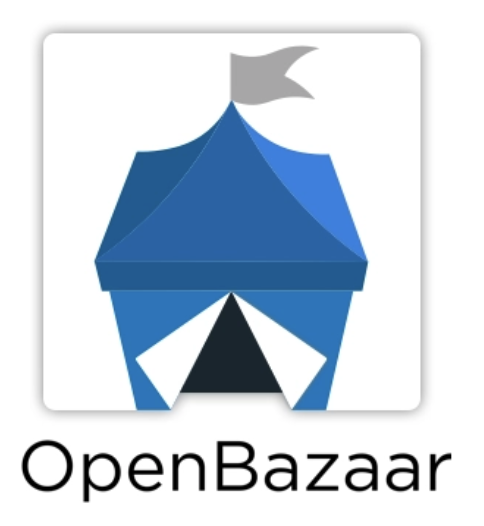

# Case study: OpenBazaar

::: callout
**"There is no inherent token as part of the whole network. You can just use it ... Part of our philosophy is that we don’t want anyone to have to pay anything initially just to get started on the network."**

_&mdash; Brian Hoffman, CEO of OB1_
:::

## Overview

::: right

:::

[OpenBazaar](https://openbazaar.org/) is a peer-to-peer e-commerce platform where buyers and sellers can participate anonymously and privately without data collection by vendors or any other central authority. The OpenBazaar platform is developed by [OB1](https://ob1.io/), whose projects also include [Haven](https://gethaven.app/), a mobile version of OpenBazaar that offers shopping, chat, and the ability to send cryptocurrencies privately. (The products' codebases are similar, but due to the requirements of some mobile app stores, OB1 needed to bifurcate the two via a separate brand and some code tweaks.)

IPFS serves as the content storage network for both OpenBazaar and Haven. On the network, merchants and buyers can each run storage nodes, eliminating the need for any central server. By using IPFS to create this collaborative network, OpenBazaar enables buyers and sellers to trade without the risks of centralized data collection or the threat of having their personal information hacked.

OB1 has been building successfully on IPFS since 2015. The peer-to-peer network that IPFS enables allows the team to provide a platform where individuals freely trade goods with no interference from a middleman &mdash; as well as enabling OB1 to be a technology provider only, not a seller of products, the "owner" of the network, or a party in business affairs between peers.

Even though OpenBazaar is not yet a mainstream shopping platform, it has already proven to be particularly helpful in cases where some products are difficult to come by in the global market. For example, at times Bitcoin mining equipment has been freely available on OpenBazaar when it was difficult to obtain elsewhere. During the COVID-19 pandemic, OpenBazaar was able to get personal protective equipment into people’s hands when other platforms couldn't; N95 masks were at times more widely available on OpenBazaar than via other platforms, and at prices that self-equalized due to the platform's lack of centralized control. Furthermore, this decentralization meant supply and demand dictated price and availability, rather than being subject to an overseeing party determining price or enforcing geographical distribution.

### OpenBazaar by the numbers

<NumberBlock :items="[
  {value: '100K', text:'total nodes'},
  {value: '250K', text: 'desktop app installs'},
  {value: '150K', text: 'mobile app installs'},
  {value: '&gt;20K', text: 'daily listings'}
]" />

## The story

OpenBazaar was founded in 2014 with the goal of creating a peer-to-peer marketplace for people to freely buy and sell from one another online without being subject to corporate tracking of their purchasing behavior. More than a year into the project, with work already underway, one of the team's developers stumbled upon IPFS.

"Back then, none of this tech actually existed," explains Brian Hoffman, CEO of OB1. "We spent about a year creating our own back end and peer-to-peer network, and then the encryption and all the messaging and all the modules that we needed to build a marketplace ... but we wanted to follow the classic rule of 'don't do something yourself if somebody else does it better'." Using IPFS enabled the team to deprecate more than 30% of their original custom codebase because the functionality was built into IPFS itself. This empowered the OB1 team to focus on the marketplace aspects of OpenBazaar, not the details of the storage network.

"We really liked IPFS and it worked really well, and we’ve been using it ever since," says Hoffman.

During this early phase, the OB1 team had also evaluated other open-source projects, such as BitTorrent and some early cryptocurrency-based storage protocols. At that time, using BitTorrent would have required too much development effort, and alternatives like Storj and Sia required the use of their dedicated tokens for storage. But even as the landscape has evolved, IPFS continues to be the clear best choice. The OpenBazaar model relies on the participants (merchants and buyers) in the network to support one another by running nodes and hosting data in the network, which means they don’t have to pay for storage &mdash; just join together as a community to support one another by running nodes.

"We have a very altruistic business model where merchants and buyers are incentivized to keep storage on the network &mdash; merchants want their storefronts to be available, and buyers want to be able to retrieve their orders and messages on the network," says Hoffman. "It’s a community approach to storage of data. If we asked buyers to immediately start paying a fee, or merchants to pay to list something, that would be an impediment to our growth. Part of our philosophy is that we don't want anyone to have to pay anything initially just to get started on the network."

By having participants in the network host their own data as well as their neighbors' data via IPFS, OpenBazaar creates a truly decentralized storage network that doesn’t depend on OB1 infrastructure or on any particular hosting provider. The system is resilient &mdash; meaning there is no central server to attack or take down. Furthermore, this architecture preserves privacy because user data isn't centrally stored. One of the persistently nagging problems of e-commerce is frequent database hacks and the resulting compromise of private user data. With no central database, there simply is no such vulnerability in the OpenBazaar network.

::: callout
**Protocol Labs is always there when we need them, but we don’t need them very often.**

_&mdash; Brian Hoffman, CEO of OB1_
:::

Building such a radically new e-commerce model didn't happen without its hiccups, but the OB1 team felt supported all the way. With their migration to IPFS in late 2015, OB1 was one of the first companies to successfully launch a large-scale, fully Web3 platform. "We went through struggles at the start, but working with Protocol Labs was a collaborative effort," says Hoffman. "We worked pretty closely with the core team. The first year or two were challenging, but now things have solidified and we really don’t need much from them." As both IPFS and OpenBazaar have evolved, the consideration remains mutual: At one point, an upgrade to the IPFS protocol was incompatible with OB1's implementation, and the IPFS team rolled back the change in order to allow the two teams to work together on a solution. This willingness to collaborate for the greater good of everyone involved is one of the key reasons OB1 continues to be confident that IPFS is a great choice for OpenBazaar's continued success.

## IPFS benefits

In terms of concrete benefits, the OpenBazaar team cites the following as key wins of using IPFS:

- Fully decentralized, anonymity-enabled storage
- A truly scalable network that gets even faster as more people join
- An altruistic framework that enables individual nodes to contribute to the speed and resilience of the network as a whole
- Free to use, with no token or up-front payment involved
- Flexibility and customizability &mdash; a standard IPFS node can be customized or extended to meet many individual needs
- Extensibility &mdash; including the ability to store encrypted information on top of the base IPFS network, add anonymity for end users with TOR or users behind firewalls, enable asynchronous messaging between merchants and sellers, and more
- With Filecoin, the ability to incentivize nodes for long-term storage
- A robust enough solution to enable the team to focus on product development, not infrastructure development
- Support from and ongoing collaboration with the IPFS core team

## How OpenBazaar uses IPFS

OpenBazaar's implementation is built upon a fork of the [`go-ipfs`](https://github.com/ipfs/go-ipfs) reference implementation, customized for their specific needs:

- Persistent storage of at least a week (to remember buyers' shopping carts and allow for merchants who may not be online 24/7)
- Support for Bitcoin wallets
- A customized search engine that crawls the IPFS network to update shop content (the crawler maintains the inventory for OpenBazaar's and Haven's front end)
- Circuit relay capabilities for working around firewalls and mobile iOS networks
- The use of `go-ipfs` without IPNS, to optimize for OpenBazaar's extremely large number of product images
- The use of [`libp2p`](https://libp2p.io/), but with its original addressing scheme

### The architecture

OpenBazaar's high-level architecture can be summed up in this diagram:

**{{DIAGRAM TO GO HERE from [this design-shop issue](https://github.com/protocol/design-shop/issues/343&sa=D&ust=1595884969218000&usg=AFQjCNEeMPUuhiAoI1MtgQD1XlX3zbUPYQ)}}**

The network is made out of many nodes &mdash; desktop, laptop, and mobile. Each node is either a merchant or a seller, with a few exceptions; OB1 does run some gateway nodes and caching nodes themselves. Every node has either the OpenBazaar or Haven app installed, and "inside" is a complete IPFS node.

### Customizing &amp; extending

As mentioned above, OB1 implemented a variety of customizations and extensions to get the most out of their use of IPFS. One extension is an asynchronous messaging layer. By building this additional storage layer with IPFS, the OB1 team created a system in which messages could be retained when users are offline, and sent or received later.

Another use-case-specific customization was a customized search crawler to comb the network for new content. As merchants add new merchandise, the network needs to display that to the buyers in a timely fashion. OB1's custom crawler searches the network for new content and keeps track of new items in the system so buyers can see and purchase the latest merchandise.

Additionally, OB1 created a TOR router for IPFS, as well as a circuit-relay workaround for firewalls for Haven users on iOS. The ability to create these types of modular add-ins represents a valuable flexibility inherent in IPFS.

## OpenBazaar + IPFS: the future

As OpenBazaar and Haven continue to grow, OB1 is looking at potentially integrating serverless, distributed peer-to-peer database OrbitDB in its IPFS implementation. OpenBazaar and Haven currently use flat files in a directory, which is a bit unusual for a marketplace. Building an e-commerce network on top of flat files isn’t ideal, so an OrbitDB implementation may be a near-term boost.

IPFS serves the present-day, short-term storage needs for the OpenBazaar marketplace, but when it comes to longer-term storage, the team is looking forward to also utilizing Filecoin to allow nodes to be compensated for long-term storage. For customers with large storefronts or big customer bases, but who aren’t online all the time, having the potential to offer a third-party storage layer builds a new advantage of the OpenBazaar marketplace into OB1's business model.

Because of the open source-nature of the project, Hoffman can foresee a future where additional services could be also enabled though Filecoin. For example, third parties could offer nodes for redundancy, resilience, backups, and recovery. In short, as both IPFS and Filecoin continue to develop, the OB1 team looks forward to leveraging this evolution.

"We wanted to create OpenBazaar in parallel with where IPFS and Filecoin are moving, and take advantage of that as it evolves," says Hoffman.

_Note: Metrics and other details in this case study are current as of August 2020. Details may change in the interim._
