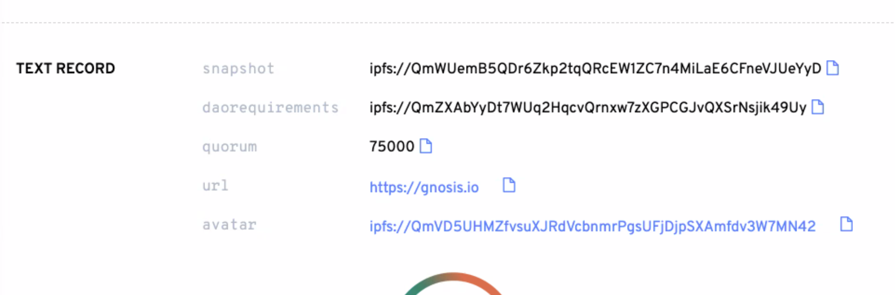
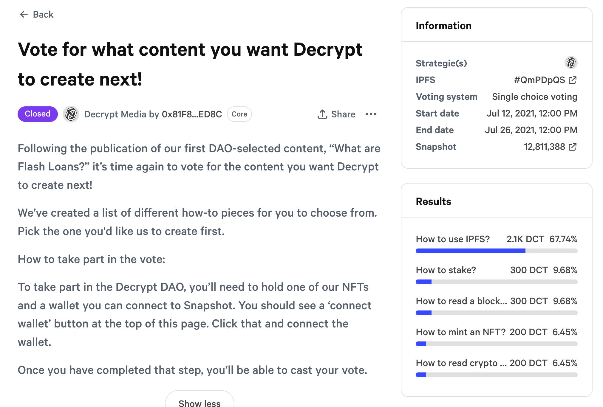
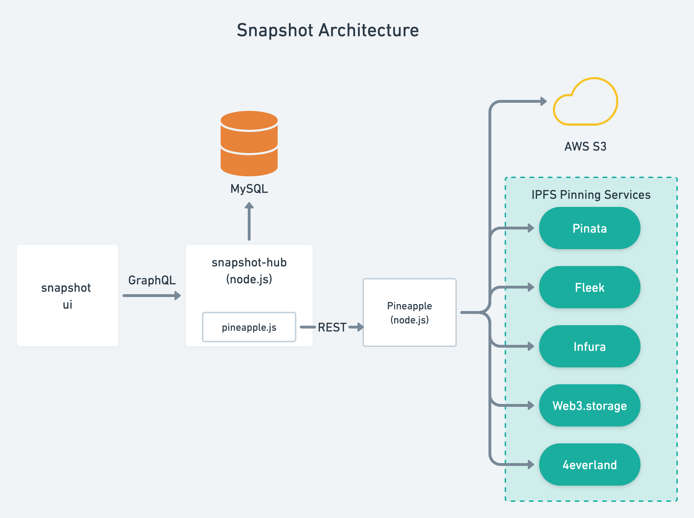

# Case study: Snapshot

::: callout
**"IPFS is the standard for storing data in a verifiable and fully transparent way, thereby allowing us to build openly auditable governance systems"**

_&mdash; [Fabien](https://twitter.com/bonustrack87), Founder and CEO, Snapshot Labs_
:::

## Overview

In this case study, you'll learn how [Snapshot](https://snapshot.org/) works and how it uses IPFS to lower the barriers to entry for voting and community governance.

## What is Snapshot

::: right

:::

Snapshot is an open-source **voting platform** for Web3 projects, DAOs, and communities that uses IPFS as its main storage layer.
Snapshot works with projects deployed to Ethereum and EVM compatible chains and allows the use of governance tokens as a means to distribute voting power and eligibility.

Snapshot is unique in its use of IPFS to store proposals and user votes using a technique known as ‘off-chain’ voting, where the cryptographic signatures proving user votes are persisted to IPFS instead of being stored on the blockchain.

This means that voting with Snapshot is practically free since voters don’t need to pay gas for transactions, i.e. *gasless voting*. In doing so, Snapshot lowers the barrier to entry for voting, increases governance participation, and allows projects and communities to scale their voter base.

Transparency, one of the core tenets of governance in the Web3 space, is achieved by having all proposals and votes persisted using _content addressing_ on IPFS, thereby allowing anyone to view, audit, and replicate a copy of the CIDs containing the cryptographic signature.

Web3 projects and Decentralized Autonomous Organizations (DAOs) are typically characterized by their bottom-up approach to governance, where control is spread out across the participants (or token holders), rather than being built on a top-down hierarchy. While there are many different approaches to bottom-up community governance, almost all involve _voting_ as a mechanism to engage the community and distribute control.

In essence, Snapshot allows projects and DAOs aiming for decentralization to poll their community over which direction a project should move in.

### Snapshot by the numbers

<NumberBlock :items="[
  {value: '7M ', text:'CIDs'},
  {value: '5M', text: 'Votes cast'},
  {value: '&gt;9K', text: 'Projects & DAOs on Snapshot'},
  {value: '63K', text: 'Proposals created on Snapshot'}
]" />

## The story

Snapshot was originally built while Fabien, Snapshot's founder, was working for the automated market maker [Balancer](https://balancer.fi/). The goal was to create a voting platform that would be flexible enough to grant BAL tokens within [Balancer pools](https://docs.balancer.fi/products/balancer-pools) voting power. However, doing this on-chain turned out to be too computationally heavy to be feasible. That's when he realized that doing it off-chain with IPFS could provide them with the flexibility needed.

While free ("gassless") voting was not one of the initial requirements for Balancer, it came as a serendipitous bonus of the off-chain design with IPFS.

Two weeks later, Fabien began generalizing his gas-efficient implementation using IPFS so that could be used by projects and DAOs beyond Balancer – and Snapshot was born.

After open-sourcing an early version of Snapshot, it was quickly adopted by early DeFi projects like Yam and Yearn and has since taken over the governance landscape.

Today, Snapshot is the leading voting platform used by over 9,645 projects. Their users include many of the leading Ethereum projects, including Gitcoin, Ethereum Name System (ENS), Aave, Uniswap, and Sushi.

## How Snapshot works

In Snapshot, all proposals and votes are associated with a **space,** where each space is an organization’s (or project’s) page on Snapshot. Voters can access spaces by using the project's [Ethereum Name System (ENS)](http://ens.domains/) name, e.g. `https://snapshot.org/#/gitcoindao.eth`, where `gitcoindao.eth` is the ENS name.

The only requirement for using Snapshot is to have an ENS name. To create a space, you create an [ENS text record](https://docs.ens.domains/ens-improvement-proposals/ensip-5-text-records) with the key `snapshot` pointing to an IPFS CID containing the JSON configuration for the space. For example, GnosisDAO with the [gnosis.eth ENS name has the `snapshot`](https://app.ens.domains/name/gnosis.eth/details) text record set to [`ipfs://QmWUemB5QDr6Zkp2tqQRcEW1ZC7n4MiLaE6CFneVJUeYyD`](https://ipfs.io/ipfs/QmWUemB5QDr6Zkp2tqQRcEW1ZC7n4MiLaE6CFneVJUeYyD) which contains the JSON configuration for the space.

Each space configuration in Snapshot allows you to configure various **strategies** to determine:

- Who can participate in voting, e.g. token holders of an ERC-20 token or NFT tokens (ERC-721, and ERC-1155.)
- The voter's voting power, e.g. one vote per token.
- Who submit proposals to be voted on, e.g. token holders with a given minimum number of tokens.

For example, the ENS project requires holding the ENS token to vote on proposals and at least 10k ENS tokens to create proposals.

### Participants vote on proposals

Once a space is created, voting happens through **proposals**. A proposal describes the issue of a vote and also has a voting system that determines the choices voters can select, and how the results will be calculated.

Importantly, each proposal includes a **Snapshot block number** pointing to an Ethereum (or any other supported blockchain) block number. The block number is the snapshot where the balance of voters will be counted. This prevents manipulation by the temporary acquisition of tokens after a proposal is made.

### Calculating results

To calculate the results of a vote, each proposal employs one of the following **voting systems**:

- Single choice
- Approval voting, where a voter can select multiple choices
- [Quadratic voting](https://en.wikipedia.org/wiki/Quadratic_voting)
- Weighted voting
- [and others](https://docs.snapshot.org/proposals/voting-types)

These voting systems are used to calculate the results of a vote based on the voting power. For example, the [following proposal](https://snapshot.org/#/decrypt-media.eth/proposal/QmPDpQSZuokqGpzqtPbmLp1LTqDjbhd6vCeKaSmqEXM9KH)) in the [Decrypt Media](https://decrypt.co/) space, grants Decrypt NFT holders the right to choose a single topic for the content they will write next. Voting power for this proposal is relative to the number of Decrypt NFTs held by the voter at block number `12,811,388`.

## How Snapshot uses IPFS

Snapshot uses IPFS to make the whole voting process fully transparent and auditable. Every space, proposal, vote, and user action is added to IPFS and has a [content identifier (CID)](/concepts/content-addressing.md).

Additionally, the Snapshot UI is also [available on IPFS](https://bafybeihzjoqahhgrhnsksyfubnlmjvkt66aliodeicywwtofodeuo2icde.ipfs.dweb.link/) and linked using the ENS name `shot.eth` which is accessible via any ENS resolution service, e.g. [shot.eth.limo](https://shot.eth.limo/), and [shot.eth.link](https://shot.eth.link/) (see the `x-ipfs-path` and `X-Ipfs-Roots` headers when making an HTTP request.)

To understand how Snapshot uses IPFS, it's useful to understand how the whole architecture was designed. Snapshot is a hybrid app combining design patterns common to Web2 and Web3 apps, and is based on the three-tier architecture:

- **Presentation tier:** [The Snapshot UI](https://github.com/snapshot-labs/snapshot).
- **Logic tier:** The [snapshot-hub](https://github.com/snapshot-labs/snapshot-hub) node.js server that exposes a GraphQL API.
- **Data tier:** A combination of a MySQL database for indexing and querying and IPFS as its storage layer for space configuration, proposals, user actions, and votes.

> **Note:** Even though MySQL is used for querying, all data stored on MySQL is available on IPFS. [Tables in the database schema](https://github.com/snapshot-labs/snapshot-hub/blob/master/src/helpers/schema.sql) have an `ipfs` field holding the IPFS CID.

### Uploading to IPFS pinning services with Pineapple

To make it easier to persist data to IPFS, Snapshot built a microservice called [Pineapple](https://github.com/snapshot-labs/pineapple) and a client library called [pineapple.js](https://github.com/snapshot-labs/pineapple.js). Together they abstract the details of uploading content to multiple IPFS pinning services.

pineapple.js exposes a `pin` method that takes a JSON object and sends it to the microservice over HTTP. The Pineapple microservice, races uploading the JSON to multiple IPFS pinning services and returns a response as soon as at least one of the services responds with a success. Additionally, the data is also uploaded to AWS S3.

### Open access via IPFS Gateways

After data is added to the IPFS network via pinning services, it is also made available for viewing by users via an [IPFS Gateway](/concepts/ipfs-gateway.md). Links to the signed messages for [proposals](https://snapshot.mypinata.cloud/ipfs/bafkreigva2y23hnepirhvup2widmawmjiih3kvvuaph3a7mrivkiqcvuki) and [votes](https://snapshot.mypinata.cloud/ipfs/bafkreibozdzgw5y5piburro6pxspw7yjcdaymj3fyqjl2rohsthnqfwc6e) are integrated into the Snapshot UI.

## IPFS benefits

When the Snapshot team set out to build openly auditable voting systems, they chose IPFS because it’s the standard for storing data that must be fully verifiable, but is too large to store on blockchains.

The combination of user-controlled keys (via non-custodial crypto wallets), cryptographic signatures that prove the authenticity of user actions, and content addressable storage via the IPFS network have proven to be critical to Snapshot's success.

Moreover, IPFS has several properties that enable that mission:

- Proof of data integrity via IPFS content addressing
- Ability to store data, even in perpetuity, without having to rely on a single centralized cloud storage platform.
- Interoperability with multiple storage providers and pinning services. Once the data has been uploaded to a single pinning service on IPFS, it can move around easily and be stored on multiple pinning services to ensure redundancy.
- Transparency and availability of data give anyone the ability to also pin and audit that data.
- A thriving ecosystem of pinning services and open-source tooling

## Snapshot & IPFS: the future

As Snapshot continues to evolve, the team looks forward to decentralizing its tech stack so that anyone can run a node, reducing the dependency on the Snapshot Node.js servers. Thanks to IPFS's integral role in Snapshot, a significant part of their data layer is already decentralized.

::: callout
**"Anytime we need to store data in Snapshot, we use IPFS so that users get full transparency and the ability to also take an active part in replicating that data."**

_&mdash; Fabien, Founder and CEO, Snapshot Labs_
:::

_Note: Metrics and other details in this case study are current as of August 2022. Details may change in the interim._
