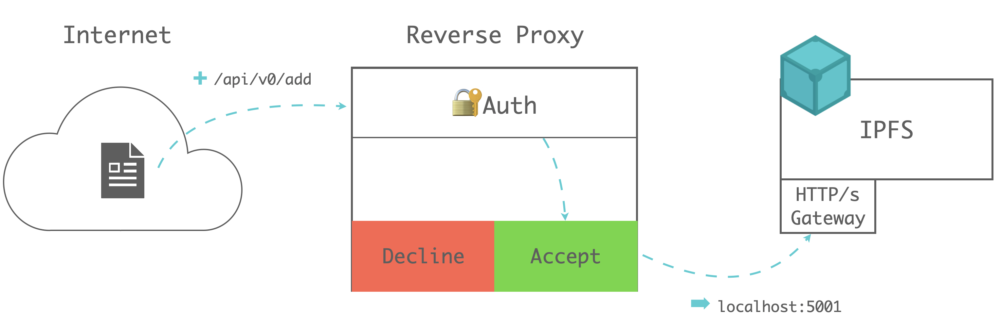

# IPFS Gateway

An _IPFS gateway_ provides an HTTP-based service that allows IPFS-incompatible browsers, tools and software to access IPFS content. For example, errors occur when a browser or a tool like [Curl](https://curl.haxx.se/) or [Wget](https://www.gnu.org/software/wget/) that does not support IPFS attempts access to IPFS content using canonical addressing like `ipfs://{CID}/{optional path to resource}`. While tools like [IPFS Companion](https://github.com/ipfs-shipyard/ipfs-companion) resolve these content access errors, not every user has permission or abilities to alter their system to work with IPFS. As such, there are multiple gateway types and <VueCustomTooltip label="A way to address data by its hash rather than its location (IPs)." underlined multiline>gateway providers</VueCustomTooltip> available so that applications of all kinds can interface with IPFS using HTTP.

This page discusses:

- The IPFS gateway request lifecycle
- The several types of gateways.
- Gateway role in the use of IPFS.

## Gateway request lifecycle

When a client request for a CID reaches an IPFS gateway, the gateway first checks whether the CID is cached locally. At this point, one of the following occurs:

- **If the CID is cached locally**, the gateway responds with the content referred to by the CID, and the lifecycle is complete.

- **If the CID is not in the local cache**, the gateway will attempt to retrieve it from the network.

The CID retrieval process is composed of two parts, content discovery / routing and content retrieval:

1. In the **content discovery / routing** step, the gateway will determine <VueCustomTooltip label="An IPFS network peer that can provide data specified by a particular CID upon request." underlined multiline>provider</VueCustomTooltip>  location; that is, _where_ the data specified by the CID can be found:

   - Asking peers that it is directly connected to if they have the data specified by the CID.
   - Query the DHT for the IDs and network addresses of peers that have the data specified by the CID.

2. Next, the gateway performs **content retrieval**, which can be broken into three substeps:

   1. The gateway connects to the provider.
   1. The gateway fetches the CIDs content.
   1. The gateway streams the content to the client.

:::callout
**Learn more**

Dive deeper into content discovery, routing, retrieval and the subsystems involved in each part of the process in [How IPFS works](./how-ipfs-works.md).
:::

## Gateway providers
 
Regardless of who deploys a gateway and where, any IPFS gateway resolves access to any requested IPFS [content identifier](content-addressing.md). Therefore, for best performance, when you need the service of a gateway, you should use the one closest to you.

### Your local gateway

Your machine may host a gateway as a local service; e.g., at `localhost:8080`. You have a local gateway service if you installed [IPFS Desktop](https://github.com/ipfs-shipyard/ipfs-desktop#ipfs-desktop) or another form of IPFS node.

### Private gateways

Running [IPFS Desktop](https://github.com/ipfs-shipyard/ipfs-desktop#ipfs-desktop) or another form of IPFS node triggers connection attempts to other IPFS peers. Private network administrators may treat such connection attempts as potential security vulnerabilities. Private IPFS gateway servers located inside the private network and running a trusted code base provide an alternative architecture for read/write access to externally-hosted IPFS content.

A gateway behind a firewall represents just one potential location for a private gateway. More generally, one may consider any gateway as a _private gateway_ when configured to limit access to requests from specific domains or parts of the public internet. This [tutorial configuring an IPFS gateway on a Google Cloud platform](https://blog.stacktical.com/ipfs/gateway/dapp/2019/09/21/ipfs-server-google-cloud-platform.html) includes a description of constraining access.

### Public gateways

Public gateway operators include:

- Protocol Labs, which deploys the public gateway `https://ipfs.io`.
- Third-party public gateways such as `https://cf-ipfs.com`.

Protocol Labs maintains a [list of public gateways](https://ipfs.github.io/public-gateway-checker/) and their status.

## Gateway types

There are multiple gateway types, each with specific use case, security, performance, and functional implications.

- [Read/write support](#read-only-and-writeable-gateways)
- [Authentication support](#authenticated-gateways)
- [Resolution style](#resolution-style)
- [Service](#gateway-services)

### Read-only and writeable gateways

The examples discussed in the earlier sections above illustrated the use of read-only HTTP gateways to fetch content from IPFS via an HTTP GET method. _Writeable_ HTTP gateways also support `POST`, `PUT`, and `DELETE` methods.

### Authenticated gateways

If a gateway provider wants to limit access to requests with authentication, they may need to configure a reverse proxy, develop an IPFS plugin, or set a cache-layer above IPFS.

Configuring a reverse proxy is the most popular way for providers handling authentication. Reverse proxy can also keep the original IPFS API calls which makes gateway adaptable to all IPFS SDK and toolkits.



Providers can design their own centralized authentication service like [Infura IPFS Auth](https://infura.io/docs/ipfs#section/Authentication/Overview), or a decentralized authentication service like [IPFS W3Auth](https://wiki.crust.network/docs/en/buildIPFSWeb3AuthGW)).

### Resolution style

Three resolution styles exist:

- [Path](#path)
- [Subdomain](#subdomain)
- [DNSLink](#dnslink)

#### Path

The examples discussed above employed path resolution:

```bash
https://{gateway URL}/ipfs/{content ID}/{optional path to resource}
```

Path-resolving gateways, however, violate the [same-origin policy](https://en.wikipedia.org/wiki/Same-origin_policy) that protects one website from improperly accessing session data of another website.

#### Subdomain

Subdomain resolution style maintains compliance with the [single-origin policy](https://en.wikipedia.org/wiki/Same-origin_policy). The canonical form of access, `https://{CID}.ipfs.{gatewayURL}/{optional path to resource}`, causes the browser to interpret each returned file as being from a different origin.

Subdomain resolution support began with [Kubo](https://github.com/ipfs/kubo) release `0.5.0`.

#### DNSlink

Whenever the content of data within IPFS changes, IPFS creates a new CID based on the content of that data. Many applications require access to the latest version of a file or website but will not know the exact CID for that latest version. The [InterPlanetary Name Service (IPNS)](ipns.md) allows a version-independent IPNS identifier to resolve into the current version's IPFS CID.

The version-independent IPNS identifier contains a hash. When a gateway processes a request in the form `https://{gatewayURL}/ipns/{IPNS identifier}/{optional path}`, the gateway employs IPNS to resolve the IPNS identifier into the current version's CID and then fetches the corresponding content.

But the IPNS identifier may instead refer to a fully-qualified domain name in the usual form of `example.com`.

DNSLink resolution occurs when the gateway recognizes an IPNS identifier contains `example.com`. For example, the URL `https://libp2p.io` returns the current version of that website — a site stored in IPFS — as follows:

1. The gateway receives a request in the form:

   ```bash
   https://{gateway URL}/ipns/{example.com}/{optional path}
   ```

2. The gateway searches the DNS TXT records of the requested domain `{example.com}` for a string of the form `dnslink=/ipfs/{CID}` or `_dnslink=/ipfs/{CID}`. If found, the gateway uses the specified CID to serve up `ipfs://{CID}/{optional path}`. As with path resolution, this form of DNSLink resolution violates the single-origin policy. The domain operator may ensure single-origin policy compliance — and the delivery of the current version of content — by adding an `Alias` record in the DNS that refers to a suitable IPFS gateway; e.g., `gateway.ipfs.io`.
3. The `Alias` record redirects any access to that `example.com` to the specified gateway. Hence the browser's request to `https://{example.com}/{optional path to resource}` redirects to the gateway specified in the `Alias`.
4. The gateway employs DNSLink resolution to return the current content version from IPFS.
5. The browser does not perceive the gateway as the origin of the content and therefore enforces the single-origin policy to protect `example.com`.

### Gateway services

Currently HTTP gateways may access both IPFS and IPNS services:

| Service | Style     | Canonical form of access                                                                                                                                                                      |
| ------- | --------- | --------------------------------------------------------------------------------------------------------------------------------------------------------------------------------------------- |
| IPFS    | path      | `https://{gateway URL}/ipfs/{CID}/{optional path to resource}`                                                                                                                                |
| IPFS    | subdomain | `https://{CID}.ipfs.{gatewayURL}/{optional path to resource}`                                                                                                                                 |
| IPFS    | DNSLink   | `https://{example.com}/{optional path to resource}` **preferred**, or <br>`https://{gateway URL}/ipns/{example.com}/{optional path to resource}`                                              |
| IPNS    | path      | `https://{gateway URL}/ipns/{IPNS identifier}/{optional path to resource}`                                                                                                                    |
| IPNS    | subdomain | `https://{IPNS identifier}.ipns.{gatewayURL}/{optional path to resource}`                                                                                                                     |
| IPNS    | DNSLink   | Useful when IPNS identifier is a domain: <br>`https://{example.com}/{optional path to resource}` **preferred**, or <br>`https://{gateway URL}/ipns/{example.com}/{optional path to resource}` |

## Working with gateways

For more information on working with gateways, see [best practices](../how-to/gateway-best-practices.md) and [troubleshooting](../how-to/gateway-troubleshooting.md).

## Frequently asked questions (FAQs)

### What is the ipfs.io gateway?

The ipfs.io gateway makes it possible for Internet users to access and view data hosted by third parties on the IPFS network. The ipfs.io gateway is a community resource run by Protocol Labs to help developers build on IPFS.

### How is the ipfs.io gateway different from other gateways?

The ipfs.io gateway is a gateway run by Protocol Labs. Many other entities run their own gateways with different policies around throttling and access, which may be subject to other local laws and regulations. A [list of public gateways is available here](https://ipfs.github.io/public-gateway-checker/).

Protocol Labs does not store or host the data that is viewable through the ipfs.io gateway. Rather, the ipfs.io gateway allows users to view content hosted by third parties. Protocol Labs does not have any control over the data that is viewed through the ipfs.io gateway, nor does Protocol Labs have control over other gateways.

### Is the ipfs.io gateway a data storage host?

No. The ipfs.io gateway is a passthrough portal to data hosted by third parties on nodes in the IPFS network. It is not a data storage host.

### Can websites rely on the ipfs.io gateway for hosting?

No. Websites should not rely on the ipfs.io gateway for hosting of any kind. The ipfs.io gateway is a community resource run by Protocol Labs to help developers build on IPFS. Users of the ipfs.io gateway must use resources sparingly. Protocol Labs will throttle or ban users who overuse or misuse community resources, including relying on the ipfs.io gateway for website hosting or violating the Community Code of Conduct.

### How does the ipfs.io Gateway handle global data regulations?

Protocol Labs complies with the laws and regulations of relevant jurisdictions.

As explained above, the ipfs.io gateway is not a website hosting provider or data storage provider, and Protocol Labs cannot remove material from the Internet that is accessible through the ipfs.io gateway.

### Who is responsible for the content that is viewed through the ipfs.io gateway?

Users of the ipfs.io gateway are required to comply with all applicable laws and regulations while using the ipfs.io gateway.

The ipfs.io gateway is not a data storage provider or website host. The ipfs.io gateway allows users to view content hosted by third parties over which Protocol Labs exercises no control. The fact that certain content is viewable through the ipfs.io gateway does not mean it is hosted by the ipfs.io gateway or that Protocol Labs can do anything to delete that content.

As explained above, the ipfs.io gateway is not a website hosting provider or data storage provider, and Protocol Labs cannot remove material from the Internet that is accessible through the ipfs.io gateway. If you believe that material accessible through the ipfs.io gateway is illegal or violates your copyright, you are encouraged to directly notify whoever is hosting or controls that data.

While the ipfs.io gateway does not serve as a host for data or websites, in appropriate circumstances, Protocol Labs can disable the ability to view certain content via the ipfs.io gateway. This does not mean that the data itself has been taken down from the network but rather that the content is not viewable using the ipfs.io gateway. This also will not impact the availability of the data through other gateways run by other parties.

You can report abuse by emailing abuse@protocol.ai. When appropriate, we will disable access through the ipfs.io gateway to the specific content set forth in your abuse report.

### Can Protocol Labs take down content viewable through the ipfs.io gateway?

No. The ipfs.io gateway is one of many portals used to view content stored by third parties on the Internet. Protocol Labs is not hosting that content and cannot take it down, but it can block the ability of users to view that content via the ipfs.io gateway in appropriate circumstances.

## Learning more

- [A Practical Explainer for IPFS Gateways – Part 1](https://blog.ipfs.tech/2022-06-09-practical-explainer-ipfs-gateways-1/), [Part 2](https://blog.ipfs.tech/2022-06-30-practical-explainer-ipfs-gateways-2/)
- [Kubo: Gateway configuration options](https://github.com/ipfs/kubo/blob/master/docs/config.md#gateway)
- [Gateway specifications](https://github.com/ipfs/specs/blob/main/http-gateways/#readme)