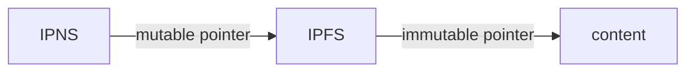
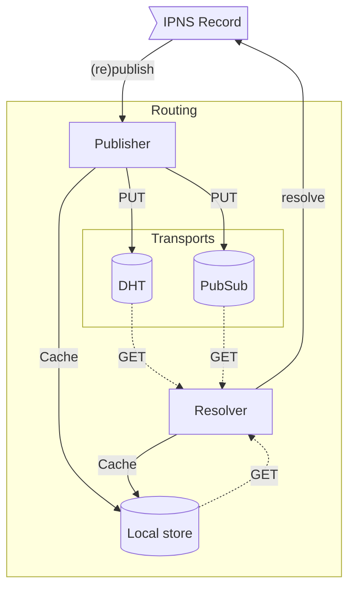

# InterPlanetary Name System (IPNS)

- [InterPlanetary Name System (IPNS)](#interplanetary-name-system-ipns)
  - [Mutability in IPFS](#mutability-in-ipfs)
  - [How IPNS works](#how-ipns-works)
    - [Anatomy of an IPNS name](#anatomy-of-an-ipns-name)
      - [How IPNS names relate to content paths](#how-ipns-names-relate-to-content-paths)
    - [IPNS names are self-certifying](#ipns-names-are-self-certifying)
    - [Common IPNS operations](#common-ipns-operations)
    - [IPNS is transport agnostic](#ipns-is-transport-agnostic)
      - [IPNS over the DHT](#ipns-over-the-dht)
      - [IPNS over PubSub](#ipns-over-pubsub)
        - [Publishing IPNS records over PubSub lifecycle](#publishing-ipns-records-over-pubsub-lifecycle)
    - [Tradeoffs between consistency vs. availability](#tradeoffs-between-consistency-vs-availability)
      - [IPNS record validity](#ipns-record-validity)
      - [Practical considerations](#practical-considerations)
  - [IPNS in practice](#ipns-in-practice)
    - [Resolving IPNS names using IPFS gateways](#resolving-ipns-names-using-ipfs-gateways)
    - [Publishing IPNS names](#publishing-ipns-names)
  - [Alternatives to IPNS](#alternatives-to-ipns)
  - [Further Resources](#further-resources)

## Mutability in IPFS

[Content addressing](content-addressing.md) in IPFS is by nature _immutable_: when you add a file to IPFS, it creates a hash from the data, with which the CID is constructed. Changing a file changes its hash, and consequently its CID which is used as an address.

Yet, there are many situations where content-addressed data needs to be regularly updated, for example, when publishing a website that frequently changes. It would be impractical to share a new CID every time you update the website. With **mutable pointers**, you can share the address of the pointer once, and update the pointer – to the new CID – every time you publish a change.

The InterPlanetary Name System (IPNS) is a system for creating such mutable pointers to CIDs known as **names** or **IPNS names**. IPNS names can be thought of as links that can be updated over time, while retaining the verifiability of content addressing.

> **Note:** Technically, an IPNS name can point to an arbitrary content path (`/ipfs/` or `/ipns/`), including another IPNS name or DNSLink path. However, it most commonly points to a fully resolved and immutable path, i.e. `/ipfs/[CID]`.

## How IPNS works

### Anatomy of an IPNS name

A **name** in IPNS is the [hash](hashing.md) of a public key. It is associated with an [**IPNS record**](https://github.com/ipfs/specs/blob/main/ipns/IPNS.md#ipns-record) containing the content path (`/ipfs/CID`) it links to and other information such as the expiration, the version number, and a cryptographic signature signed by the corresponding private key. New records can be signed and published at any time by the holder of the private key.

For example, the following is an IPNS name represented by a CIDv1 of public key: [`k51qzi5uqu5dlvj2baxnqndepeb86cbk3ng7n3i46uzyxzyqj2xjonzllnv0v8`](https://cid.ipfs.tech/#k51qzi5uqu5dlvj2baxnqndepeb86cbk3ng7n3i46uzyxzyqj2xjonzllnv0v8).

> **Note:** Kubo uses the `self` key (ed25519 private key used for the PeerID) as the default IPNS name. But you can generate multiple keys via [`ipfs key gen`](https://docs.ipfs.tech/reference/kubo/cli/#ipfs-key-gen), and use them for managing multiple IPNS names.

#### How IPNS names relate to content paths

IPNS record can point at an immutable or a mutable path. The meaning behind CID used in a path depends on used namespace:

- `/ipfs/<cid>` – an [immutable content on IPFS](https://cid.ipfs.tech/#bafybeibml5uieyxa5tufngvg7fgwbkwvlsuntwbxgtskoqynbt7wlchmfm) (since the CID contains a multihash)
- `/ipns/<cid-of-libp2p-key>` – a mutable, cryptographic [IPNS name](https://cid.ipfs.tech/#k51qzi5uqu5dlvj2baxnqndepeb86cbk3ng7n3i46uzyxzyqj2xjonzllnv0v8) which corresponds to a libp2p public key.

The following is a useful mental model for understanding the difference between the two:



```
IPFS = immutable *Pointer => content
IPNS = **Pointer => content
```

IPNS names are essentially pointers (IPNS names) to pointers (IPFS CIDs) whereas IPFS CIDs are immutable (because they're derived from the content) pointers to content.

### IPNS names are self-certifying

IPNS names are self-certifying. This means that an IPNS record contains all the information necessary to certify its authenticity. IPNS achieves this using public and private key pairs:

- Each IPNS name corresponds to a key pair
- The IPNS name is a CID with a multihash of the public key
- The IPNS record contains the public key and signature, allowing anyone to verify that the record was signed by the private key holder.

This self-certifying nature gives IPNS several benefits not present in hierarchical and consensus systems such as DNS, and blockchain identifiers. Notably, IPNS records can come from anywhere, not just a particular service/system, and it is very fast and easy to confirm a record is authentic.

### Common IPNS operations

As a user or developer using IPNS for naming, there are three common operations worth understanding:

- **Updating/Creating an IPNS record:** refers to the creation of an IPNS record and signing it with a private key.
- **Publishing an IPNS record:** advertising the IPNS record so that other nodes can resolve it. Details depend on the transport.
- **Resolving an IPNS name:** Resolving an IPNS name to a content path.

### IPNS is transport agnostic



The self-certifying nature of IPNS records means that they are not tied to a specific transport protocol. In practice, most IPFS implementations rely on the [**DHT**](dht.md) and [**libp2p PubSub**](https://docs.libp2p.io/concepts/publish-subscribe/) to publish and resolve IPNS records.

There are nuanced differences and trade-offs between the **DHT** and **PubSub** to be aware of.

The main qualitative difference between the two is that IPNS over the DHT publishes and resolves to a global shared state, whereas IPNS over PubSub uses messaging over topics (where each IPNS name has a unique topic) to publish to and resolve from **interested peers**.

The main implication of this difference is that IPNS operations (publishing and resolving) over the DHT can take longer than over PubSub, while potentially ensuring higher consistency (you resolve to the latest version).

> **Note:** This trade-off is best explained by [CAP theorem](https://en.wikipedia.org/wiki/CAP_theorem).

#### IPNS over the DHT

The DHT is the default transport mechanism for IPNS records in many IPFS implementations.

Due to the ephemeral nature of the DHT, peers forget records after 24 hours. This applies to any record in the DHT, irrespective of the `validity` (also referred to as `lifetime`) field in the IPNS record.

Therefore, IPNS records need to be regularly (re-)published to the DHT. Moreover, publishing to the DHT at regular intervals ensures that the IPNS name can be resolved even when there's high node churn (nodes coming and going.)

By default, Kubo will republish IPNS records to the DHT based on the [`Ipns.RepublishPeriod`](https://github.com/ipfs/kubo/blob/master/docs/config.md#ipnsrepublishperiod) configuration which defaults to 4 hours. [Republishing](https://github.com/ipfs/go-namesys/blob/1bf7d3d9cbe8f988b232b92288b24d25add85a00/republisher/repub.go#L130-L167) involves two steps:

1. Creating an updated IPNS record with the `validity` timestamp field updated (by default based on [`Ipns.RecordLifetime`](https://github.com/ipfs/kubo/blob/master/docs/config.md#ipnsrecordlifetime)), and signing it with the private key. The `sequence` number will only be incremented if the content path changes.
2. Publish the [IPNS record to the DHT](https://docs.ipfs.tech/concepts/dht/#ipns-records)

> **Note:** See the [DHT documentation](dht.md#ipns-records) for more information on the lifecycle of GETs and PUTs of IPNS records.

It's worth noting that publishing and resolving IPNS names using the DHT can be slow. This is because multiple records need to be found to ensure the latest version (record with the highest `sequence`), which involves round trips to multiple nodes.

#### IPNS over PubSub

IPNS over PubSub uses the [Libp2p PubSub](https://docs.libp2p.io/concepts/publish-subscribe/) to publish records and resolve names amongst **interested peers**.

This is achieved by deriving the PubSub topic name from the IPNS name so that each IPNS name has a unique topic.

Because PubSub doesn't have the notion of persistence (messages are ephemeral and dropped after propagation), IPNS over PubSub [adds a persistence layer](https://github.com/ipfs/specs/blob/main/ipns/IPNS_PUBSUB.md#layering-persistence-onto-libp2p-pubsub) to ensure that IPNS records are always available to the network.

In Kubo, IPNS over PubSub is not enabled by default and can be enabled using the [`Ipns.UsePubsub`](https://github.com/ipfs/kubo/blob/master/docs/config.md#ipnsusepubsub) configuration.

Initial operations, e.g. resolving or publishing an IPNS name for the first time can take time as they involve a roundtrip to the DHT (to lookup or publish provider records for the topic).

After the subscription to the topic is established, PubSub usually improves both publishing and resolving times of IPNS by relying on interested peers for both operations.

It should be noted that there's an upper limit to the number of unique IPNS names you can resolve over PubSub, because for each name, a subscription is created which opens several (by default 6) network connections to mesh members.

##### Publishing IPNS records over PubSub lifecycle

1. Create a record and sign it.
2. Calculate PubSub topic name from IPNS name.
3. Join the topic by querying the DHT for the topic's provider records.
4. Publish the IPNS record to the topic.
5. Whenever [a new peer joins the topic](https://github.com/libp2p/go-libp2p-pubsub-router/blob/292d99457d224853706c5e49f8ddc112740a856a/pubsub.go#L538-L560) (specifically your mesh), ask them for the record. If they respond with a newer record, update it locally and publish the updated record to the topic.
6. Periodically (by default every 10 minutes) rebroadcast the IPNS record.

Steps 5 and 6 describe from a high level how IPNS record persistence is layered over PubSub by ensuring continuous propagation of the IPNS record in the face of node churn (nodes dropping in and out of the network).

> Further details about the IPNS over PubSub protocol can be found in the [IPNS over PubSub Spec](https://github.com/ipfs/specs/blob/main/ipns/IPNS_PUBSUB.md#protocol)

### Tradeoffs between consistency vs. availability

The self-certifying nature of IPNS comes with an inherent tradeoff between **consistency** and **availability**.

Consistency means ensuring that users resolve to the latest published IPNS record for the name (with the highest sequence number) at the cost of potentially not being able to resolve.

Availability means resolving to a valid IPNS record, at the cost of potentially resolving to an outdated record.

#### IPNS record validity

When setting the `validity` (referred to as [`lifetime` by Kubo](https://github.com/ipfs/kubo/blob/master/docs/config.md#ipnsrecordlifetime)) field of an IPNS record, you typically need to choose whether you favor **consistency** (short validity period, e.g. 24 hours) or **availability** (long validity period, e.g. 1 month), due to the inherent trade-off between the two.

#### Practical considerations

One of the most important things to consider with IPNS names is **how frequently you intend on updating the name**.

Practically, two levers within your control determine where your IPNS name is on the spectrum between consistency and availability:

- **IPNS record validity:** longer validity will veer towards availability. Moreover, longer validity will reduce the dependence on the key holder (which for most purposes is stored on a single machine and rare shared) since the record can continue to persist without requiring the private key holder to sign a new record. Another benefit of a longer validity is that the transport can be delegated to other nodes or services (such as [w3name](https://staging.web3.storage/docs/how-tos/w3name/)), without compromising the private key.
- **Transport mechanism:** the DHT veers towards consistency while PubSub veers towards availability. However, with Kubo, IPNS names are always published to the DHT, while PubSub is opt-in. For most purposes, enabling PubSub is a net gain unless you hit the upper limit of connections as a result of too many PubSub subscriptions.

## IPNS in practice

### Resolving IPNS names using IPFS gateways

IPNS names can be resolved by [IPFS gateways](ipfs-gateway.md) in a _trusted_ fashion using both path resolution and subdomain resolution style:

- Path resolution: `https://ipfs.io/ipns/{ipns-name}`
- Subdomain resolution: `https://{ipns-name}.ipns.dweb.link`

> **Note** IPNS resolution via an IPFS gateway is **trusted** (in the sense of trusting the gateway) which means you delegate IPNS resolution to the gateway without any means to verify the authenticity response you get, i.e the content path and signature of the IPNS record.

<!-- ### Third-party providing/publishing w3name -->

### Publishing IPNS names

See the following guide on [publishing IPNS names with Kubo and js-ipfs](../how-to/publish-ipns.md).

## Alternatives to IPNS

IPNS is not the only way to create mutable addresses on IPFS. You can also use [DNSLink](dnslink.md), which is currently much faster than IPNS and also uses human-readable names. Other community members are exploring ways to use blockchains to store common name records.

## Further Resources

- [ResNetLab on Tour - Mutable Content](https://research.protocol.ai/tutorials/resnetlab-on-tour/mutable-content/)
