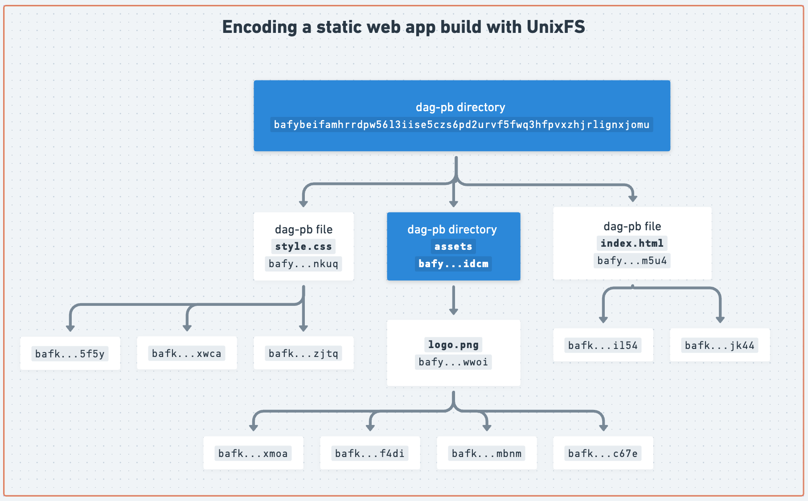

# The lifecycle of data in IPFS

- [1. Content-addressing / Merkleizing](#1-content-addressing--merkleizing)
- [2. Providing](#2-providing)
- [3. Retrieving](#3-retrieving)
- [Learn more](#learn-more)

## 1. Content-addressing / Merkleizing

The first stage in the lifecycle of data in IPFS is to address it by CID. This is a local operation that takes arbitrary data and encodes it so it can be addressed by a CID. This is also known as _merkleizing_ the data, because the input data is transformed into a [Merkle DAG](./merkle-dag.md).

The exact process depends on the type of data. For files and directories, this is done by constructing a [UnixFS](./file-systems.md#unix-file-system-unixfs) [Merkle DAG](./merkle-dag.md). For other data types, such as dag-cbor, this is done by encoding the data with [dag-cbor](https://ipld.io/docs/codecs/known/dag-cbor/) which is hashed to produce a CID.

For example, merkleizing a static web application into a UnixFS DAG looks like this, where the whole application is addressed by the CID in the top block (`bafy...jomu`):

## 2. Providing

Once the input data has been merkleized and addressed by a CID, the node announces itself as a provider of the CID(s) to the IPFS network, thereby creating a public mapping between the CID and the node. This is typically known as **providing**, other names for this step are **publishing** and **advertising**.

IPFS nodes announce CID(s) to either the [DHT](./dht.md) or the [IPNI](./ipni.md) — the two content routing systems supported by [IPFS Mainnet](./glossary.md#mainnet).

### What about Pinning?

[Pinning](./glossary.md#pinning) can have slightly different meanings depending on the context:

From a high level, pinning can mean either:

- **Pin by CID:** Requesting a pinning service or IPFS Node to pin a CID, without uploading the data, in this case the pinning service or IPFS node handles retrieval from provider nodes; a process that can fail if no providers are available. Once pinned, the pinning service or IPFS node will keep a copy of the data locally and typically provide the CIDs it is pinning to the network. The [Pinning API spec](https://ipfs.github.io/pinning-services-api-spec/) provides a standard way to do this with pinning services, though some pinning services have their own APIs. With Kubo, the `ipfs pin add CID` command can be used to pin a CID.
- **Pin data:** Uploading data (files, directories, etc.) to the pinning service and get back a CID, in this case the pinning service handles merkleizing the data so it is addressed by a CID. With Kubo, the `ipfs add file` command is used to both merkleize the data and pin it.

To summarize, pinning, when successful, results in a node or pinning service providing the CIDs to the network.

## 3. Retrieving

In this stage, an IPFS node fetches the blocks of the CID and constructs the Merkle DAG. This usually involves several steps:

- **Content routing:** The IPFS node finds other IPFS nodes providing the CIDs you are requesting. Content routing is facilitated by either the [DHT](./dht.md), asking already connected peers over [Bitswap](./bitswap.md), or making an HTTP call to a [delegated routing](https://github.com/ipfs/specs/blob/main/IPIP/0337-delegated-routing-http-api.md) server like the [network indexer](https://cid.contact/). The term **content discovery** is also commonly used to refer to this step.

- **Block fetching:** An IPFS node fetches the blocks of the Merkle DAG (of the file or folder) from providers.

- **Verification:** The IPFS node verifies the blocks fetched by hashing them and ensuring that the resulting hash is correct. Note that this type of retrieval is _trustless_; that is, blocks can come from any node in the network.

- **Local access:** Once all blocks of the DAG with the requested CID are successfully replicated locally, the data is available for local access.

## Learn more

Learn more about the lifecycle of data in IPFS in the following video:

@[youtube](iaVXRPsRCUc)
