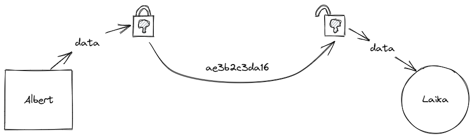
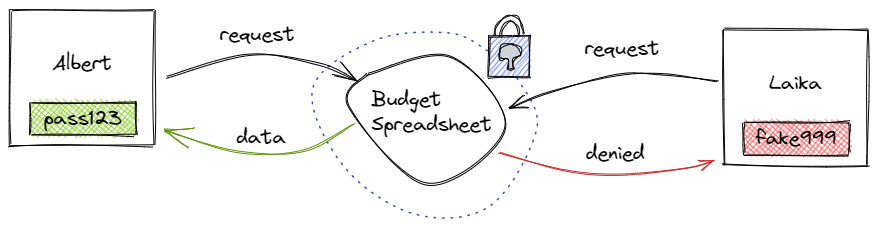

# Privacy and encryption

As a protocol for peer-to-peer data storage and delivery, IPFS is a _public network_: Nodes participating in the network store data affiliated with globally consistent [content addresses](content-addressing.md) (CIDs) and advertise that they have those CIDs available for other nodes to use through publicly viewable [distributed hash tables](dht.md) (DHTs). This paradigm is one of IPFS's core strengths — at its most basic, it's essentially a globally distributed "server" of the network's total available data, referenceable both by the content itself (those CIDs) and by the participants (the nodes) who have or want the content.

What this does mean, however, is that IPFS itself isn't explicitly protecting knowledge _about_ CIDs and the nodes that provide or retrieve them. This isn't something unique to the distributed web; on both the d-web and the legacy web, traffic and other metadata can be monitored in ways that can infer a lot about a network and its users. Some key details on this are outlined below, but in short: While IPFS traffic _between nodes_ is encrypted, the metadata those nodes publish to the DHT is public. Nodes announce a variety of information essential to the DHT's function — including their unique node identifiers (PeerIDs) and the CIDs of data that they're providing — and because of this, information about which nodes are retrieving and/or reproviding which CIDs is publicly available.

So, why doesn't the IPFS protocol itself explicitly have a _privacy layer_ built-in? This is in line with key principles of the protocol's highly modular design — after all, different uses of IPFS over its lifetime may call for different approaches to privacy. Explicitly implementing an approach to privacy within the IPFS core could "box in" future builders due to a lack of modularity, flexibility, and future-proofing. On the other hand, freeing those building on IPFS to use the best privacy approach for the situation at hand ensures IPFS is useful to as many as possible.

If you're worried about the implications of this, it might be worth taking additional measures such as disabling reproviding, encrypting sensitive content, or even running a private IPFS network if that's appropriate for you.

::: tip
While IPFS traffic _between nodes_ is encrypted, the essential metadata that nodes publish to the DHT — including their unique node identifiers (PeerIDs) and the CIDs of data that they're providing — is public. If you're worried about the implications of this for your personal use case, it's worth taking additional measures.
:::

## What's public on IPFS

All traffic on IPFS is public, including the contents of files themselves, unless they're [encrypted](#encryption). For purposes of understanding IPFS privacy, this may be easiest to think about in two halves: content identifiers (CIDs) and IPFS nodes themselves.

### Content identifiers

Because IPFS uses [content addressing](content-addressing.md) rather than the legacy web's method of location addressing, each piece of data stored in the IPFS network gets its own unique content identifier (CID). Copies of the data associated with that CID can be stored in any number of locations worldwide on any number of participating IPFS nodes. To make retrieving the data associated with a particular CID efficient and robust, IPFS uses a [distributed hash table](dht.md) (DHT) to keep track of what's stored where. When you use IPFS to retrieve a particular CID, your node queries the DHT to find the closest nodes to you with that item — and by default also agrees to re-provide that CID to other nodes for a limited time until periodic "garbage collection" clears your cache of content you haven't used in a while. You can also "pin" CIDs that you want to make sure are never garbage-collected — either explicitly using IPFS's low-level `pin` API or implicitly using the [Mutable File System](file-systems.md#mutable-file-system-mfs) (MFS) — which also means you're acting as a permanent reprovider of that data.

This is one of the advantages of IPFS over traditional legacy web hosting. It means retrieving files — especially popular ones that exist on lots of nodes in the network — can be faster and more bandwidth-efficient. However, it's important to note that those DHT queries happen in public. Because of this, it's possible that third parties could be monitoring this traffic to determine what CIDs are being requested, when, and by whom. As IPFS continues to grow in popularity, it's more likely that such monitoring will exist.

### Node identifiability

The other half of the equation when considering the prospect of IPFS traffic monitoring is that nodes' unique identifiers are themselves public. Just like with CIDs, every individual IPFS node has its own public identifier (known as a PeerID), such as `QmRGgYP1P5bjgapLaShMVhGMSwGN9SfYG3CM2TfhpJ3igE`.

While a long string of letters and numbers may not be a "Johnny Appleseed" level of human-readable specificity, your PeerID is still a long-lived, unique identifier for your node. Keep in mind that it's possible to do a DHT lookup on your PeerID and, particularly if your node is regularly running from the same location (like your home), find your IP address. (It's possible to [reset your PeerID](../reference/kubo/cli.md#ipfs-key-rotate) if necessary, but similarly to changing your user ID on legacy web apps and services, is likely to involve extra effort.) Additionally, longer-term monitoring of the public IPFS network could yield information about what CIDs your node is requesting and/or reproviding and when.

## Enhancing your privacy

If there are situations in which you know you'll need to remain private but still want to use IPFS, one of the approaches outlined below may help. And don't forget, you can always discuss privacy and get others' input or ideas in the official [IPFS forums](https://discuss.ipfs.tech).

### Controlling what you share

By default, an IPFS node announces to the rest of the network that it is willing to share every CID in its cache (in other words, _reproviding_ content that it's retrieved from other nodes), as well as CIDs that you've explicitly pinned or added to MFS to make them consistently available. If you'd like to disable this behavior, you can do so in the [reprovider settings](https://github.com/ipfs/kubo/blob/master/docs/config.md#reprovider) of your node's config file.

Changing your reprovider settings to "pinned" or "roots" will keep your node from announcing itself as a provider of non-pinned CIDs that are in your cache — so you can still use pinning to provide other nodes with content that you care about and want to make sure continues to be available over IPFS.
The most private option is "roots", as it will only announce "direct" pins instead of "indirect" pins, We suggest that you choose the option most appropriate for your needs.

### Using a public gateway

Using a public [IPFS gateway](../how-to/address-ipfs-on-web.md#http-gateways) is one way to request IPFS-hosted content without revealing any information about your local node — because you aren't using a local node! However, this method does keep you from enjoying all the benefits of being a full participant in the IPFS network.

Public IPFS gateways are primarily intended as a "bridge" between the legacy web and the distributed web; they allow ordinary web clients to request IPFS-hosted content via HTTP. That's great for backward compatibility, but if you only request content through public gateways rather than directly over IPFS, you're not actually part of the IPFS network; that gateway is the network participant acting on your behalf. It's also important to remember that gateway operators could be collecting their own private metrics, which could include tracking the IP addresses that use a gateway and correlating those with what CIDs are requested. Additionally, content requested through a gateway is visible on the public DHT, although it's not possible to know _who_ requested it.

### Using Tor

If you're familiar with [Tor](https://www.torproject.org/) and comfortable with the command line, you may wish to try running IPFS over Tor transport by configuring your node's settings.

If you're a developer building on IPFS, it's worth noting that the global IPFS community continues to experiment with using Tor transport — see [this example from e-commerce organization OpenBazaar](https://github.com/OpenBazaar/go-onion-transport) — and there may already be an open-source codebase to help your project achieve this.

### Encryption

There are two types of encryption in a network: _transport-encryption_ and _content-encryption_.

Transport-encryption is used when sending data between two parties. Albert encrypts a file and sends it to Laika, who then decrypts it once it has been received. This stops a third party from viewing the data while it is moving from one place to another.

Content encryption is used to secure data until someone needs to access it. Albert creates a spreadsheet for his monthly budget and saves it with a password. When Albert needs to access it again, he must enter his password to decrypt the file. Without the password, Laika cannot view the file.

IPFS uses transport-encryption but not content encryption. This means that your data is secure when being sent from one IPFS node to another. However, anyone can download and view that data if they have the CID. The lack of content encryption is an intentional decision. Instead of forcing you to use a particular encryption protocol, you are free to choose whichever method is best for your project. This modular design keeps IPFS lightweight and free of _vendor lock-in_.

#### Encryption best practices

If your privacy concerns are less about the potential for monitoring and more about the visibility of the IPFS-provided content itself, this can be mitigated simply by encrypting the content before adding it to the IPFS network. While traffic involving the encrypted content could still be tracked, the _data_ represented by encrypted content's CIDs remains unreadable by anyone without the ability to decrypt it.

:::warning Encryption isn't bulletproof
While today's encryption might seem bulletproof _right now_, there is no guarantee that it won't be broken at some point in the future. Future breakthroughs in computing might allow going back and decrypting older content that's been put on a public network, such as IPFS. If you want to guard against this potential attack vector, using IPFS hybrid-private networks — in which nodes sit behind connection gates that check request ACLs before giving a node a request — is a potential design direction. For more details, [this article from Pinata](https://medium.com/pinata/dedicated-ipfs-networks-c692d53f938d) may be helpful.
:::

If you're curious about implementing encryption with IPFS on a large scale, you may enjoy reading [this case study on Fleek, a fast-growing IPFS file hosting and delivery service](case-study-fleek.md).

#### Encryption-based projects using IPFS

- [Ceramic](https://ceramic.network/)
- [Fission.codes](https://fission.codes/)
- [Fleek](case-study-fleek.md)
- [Lit Protocol](https://litprotocol.com/)
- [OrbitDB](https://orbitdb.org/)
- [Peergos](https://peergos.org/)
- [Textile](https://www.textile.io/)

### Creating a private network

[Private IPFS networks](https://github.com/ipfs/kubo/blob/release-v0.9.0/docs/experimental-features.md#private-networks) provide full protection from public monitoring but can lack the scale benefits provided by the public IPFS network. A private network operates identically to the public one, but with one critical difference: it can only be accessed by nodes that have been given access, and it will only ever scale to those nodes. This means that the benefits of the public IPFS network's massive scale, such as geographic resiliency and speedy retrieval of high-demand content, won't be realized unless the private network is explicitly designed and scaled with this in mind.

Running a private network can be a great option for corporate implementations of IPFS — for one example, see [this case study on Morpheus.Network](case-study-morpheus.md) — because the network's topology can be specified and built exactly as desired.

