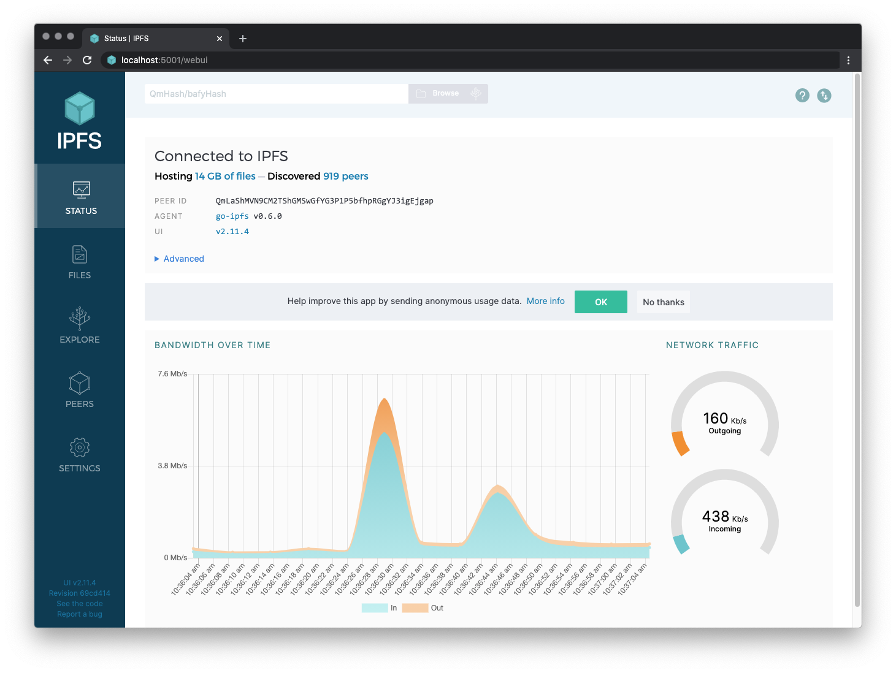

# Initialize a Kubo node and interact with the IPFS Network

In this tutorial, you will initialize an IPFS Kubo node repository, take your node online, interact with the IPFS network, and view the web console on your local node. If you run into any problems while following this guide, see [Troubleshooting](#troubleshooting).

## Prerequisites

If you have not yet installed Kubo, follow the [Kubo install guide](../install/command-line.md).

## Initialize the repository

`ipfs` stores all its settings and internal data in a directory called _the repository._ Before using Kubo for the first time, you’ll need to initialize the repository. 

:::tip
 - If you are running a Kubo node in a data center, you should initialize IPFS with the `server` profile. Doing so will prevent IPFS from creating data center-internal traffic trying to discover local nodes:

    ```bash
    ipfs init --profile server
    ```
 - Be careful using `sudo` on Unix platforms (including macOS)! Running `sudo ipfs init` will create the repository for the `root` user, instead of your local user account. Kubo doesn't require root privileges, so it's best to run all `ipfs` commands as a regular user!
:::

1. Open a terminal window.

1. Initialize the repository with the `ipfs init` command

    ```bash
    ipfs init
    ```

   Output similar to the following displays:

    ```bash
    > initializing ipfs node at /Users/jbenet/.ipfs
    > generating 2048-bit RSA keypair...done
    > peer identity: Qmcpo2iLBikrdf1d6QU6vXuNb6P7hwrbNPW9kLAH8eG67z
    > to get started, enter:
    >
    >   ipfs cat /ipfs/QmYwAPJzv5CZsnA625s3Xf2nemtYgPpHdWEz79ojWnPbdG/readme
    ```
    
    :::tip
    The hash next to `peer identity` is your node’s ID and will be different from the one shown in the above output. Other nodes on the network use `peer identity` to find and connect to you. 
    
    Run `ipfs id` to display the `peer identity` if you need it.
    :::


2. Now, try running the command suggested to you in the output of `ipfs init` (i.e. `ipfs cat /ipfs/QmYwAPJzv5CZsnA625s3Xf2nemtYgPpHdWEz79ojWnPbdG/readme`):

   ```bash
   ipfs cat /ipfs/QmYwAPJzv5CZsnA625s3Xf2nemtYgPpHdWEz79ojWnPbdG/readme
   ```

    You should see something like this:

    ```
    Hello and Welcome to IPFS!

    ██╗██████╗ ███████╗███████╗
    ██║██╔══██╗██╔════╝██╔════╝
    ██║██████╔╝█████╗  ███████╗
    ██║██╔═══╝ ██╔══╝  ╚════██║
    ██║██║     ██║     ███████║
    ╚═╝╚═╝     ╚═╝     ╚══════╝

    If you see this, you have successfully installed
    IPFS and are now interfacing with the ipfs merkledag!

    -------------------------------------------------------
    | Warning:                                              |
    |   This is alpha software. use at your own discretion! |
    |   Much is missing or lacking polish. There are bugs.  |
    |   Not yet secure. Read the security notes for more.   |
    -------------------------------------------------------

    Check out some of the other files in this directory:

      ./about
      ./help
      ./quick-start     <-- usage examples
      ./readme          <-- this file
      ./security-notes
    ```

1. The respository's `quick-start` directory shows other example commands to try. To display the contents of `quick-start, run:

    ```bash
    ipfs cat /ipfs/QmYwAPJzv5CZsnA625s3Xf2nemtYgPpHdWEz79ojWnPbdG/quick-start
    ```

   :::tip
   There are a whole host of other configuration options you can set — see the [the full reference](https://github.com/ipfs/kubo/blob/master/docs/config.md) for more.
   :::

## Take your node online

Next, take your node online and interact with the IPFS network:

1. Open another terminal window. 

2. Start the IPFS daemon in the new terminal window:

    ```bash
    ipfs daemon
    ```

   After a few moments, output like the following displays, and your node is ready:

    ```bash
    > Initializing daemon...
    > API server listening on /ip4/127.0.0.1/tcp/5001
    > Gateway server listening on /ip4/127.0.0.1/tcp/8080
    ```

    Make a note of the TCP ports in the output. If they are different, use yours in the commands below.

    ::: danger NEVER EXPOSE THE RPC API TO THE PUBLIC INTERNET

    The API port (by default `5001`) provides admin-level access to your Kubo IPFS node.  See [RPC API v0 docs](../reference/kubo/rpc.md) for more information.

    :::

1. Switch back to your original terminal window. 

1. If you’re connected to the network, run `ipfs swarm peers` to see the IPFS addresses of your peers:

    ```bash
    ipfs swarm peers
    ```

    Output similar to the following displays:

    ```bash
    > /ip4/104.131.131.82/tcp/4001/p2p/QmaCpDMGvV2BGHeYERUEnRQAwe3N8SzbUtfsmvsqQLuvuJ
    > /ip4/104.236.151.122/tcp/4001/p2p/QmSoLju6m7xTh3DuokvT3886QRYqxAzb1kShaanJgW36yx
    > /ip4/134.121.64.93/tcp/1035/p2p/QmWHyrPWQnsz1wxHR219ooJDYTvxJPyZuDUPSDpdsAovN5
    > /ip4/178.62.8.190/tcp/4002/p2p/QmdXzZ25cyzSF99csCQmmPZ1NTbWTe8qtKFaZKpZQPdTFB
    ```

    The addresses displayed are composed of a `<transport address>` (i.e. `/ip4/104.131.131.82/tcp/4001`) and a `<hash-of-public-key>` (i.e. `QmSoLju6m7xTh3DuokvT3886QRYqxAzb1kShaanJgW36yx`), resulting in an address of the form `<transport address>/p2p/<hash-of-public-key>`.

1. Now, fetch a cool picture of a spaceship launch from the netwok using `ipfs cat`:

    ```bash
    ipfs cat /ipfs/QmSgvgwxZGaBLqkGyWemEDqikCqU52XxsYLKtdy3vGZ8uq > ~/Desktop/spaceship-launch.jpg
    ```

   When the above command runs, Kubo searches the IPFS network for the CID specified (`QmSgv...`) and writes the data into a file called `spaceship-launch.jpg`.

1. Verify that a photo of a spaceship launch called `spaceship-launch.jpg` is located in your `~/Desktop`.

1. Next, create a file to add to your node:

   ```bash
   echo "meow" > meow.txt
   ```

1. Add `meow.txt` using `ipfs add`:

   ```bash
   ipfs add meow.txt
   ```
  
   Output similar to the following displays:

   ```bash
   > added QmabZ1pL9npKXJg8JGdMwQMJo2NCVy9yDVYjhiHK4LTJQH meow.txt
   ```

   Make note of the CID (i.e. `QmabZ1..`), as you'll need it in the next step.

1. View the objects by specifying the CID `<CID>` returned in the previous step:

    :::tip
    The example below uses `curl` as the browser, but you can open the IPFS url in other browsers. Depending on the state of the network, `curl` may take a while due to public gateways being overloaded or having a hard time reaching you.
    :::

    ```bash
    curl "https://ipfs.io/ipfs/<CID>"
    ```

    Output like the following displays:

    ```bash
    > meow
    ```

    In this step, the gateway served a file _from your computer_. The gateway queried the distributed hash table (DHT), found your machine, requested the file, your computer sent it to the gateway, and the gateway sent it to your browser.

1. View the objects on your own local gateway:

    ```bash
    curl "http://127.0.0.1:8080/ipfs/<CID>"
    ```

    ```bash
    > meow
    ```

    By default, your gateway is not exposed to the world. It only works locally.

## Interact with the node using the web console

You can view the web console for your local node by navigating to `localhost:5001/webui`. 



The web console shows files that are in your [Mutable File System (MFS)](../concepts/file-systems.md#mutable-file-system-mfs). MFS is a tool built into the web console that helps you navigate IPFS files in the same way you would a standard, name-based file system.

When you add files using the [CLI command `ipfs add ...`](../reference/kubo/cli.md#ipfs-add), these files are not automatically available within the MFS. To view files in IPFS Desktop that you added using the CLI, you must copy the files over to the MFS:

1. Enter `localhost:5001/webui` into your browser to view the web console.

1. In the left sidebar menu, click **Files**. An empty directory displays, along with the following message:

    ```plaintext
    No files here yet! Add files to your local IPFS node by clicking the Import button above.
    ```

1. Navigate back to your original terminal window.

1. Using the CID `<CID>` obtained when adding `meow.txt` to your node in the previous step, copy the files over to the MFS.

    ```shell
    ipfs files cp /ipfs/<CID> /meow.txt
    ```

    For example, if the `<CID>` of `meow.txt` is `QmabZ1pL9npKXJg8JGdMwQMJo2NCVy9yDVYjhiHK4LTJQH`, it would be coopied to the MFS with:

    ```shell
    ipfs files cp /ipfs/QmabZ1pL9npKXJg8JGdMwQMJo2NCVy9yDVYjhiHK4LTJQH /meow.txt
    ```

1. In your browser, refresh the **Files** page. The list of files displays `meow.txt`.

## Use IPFS Companion with Kubo

You can use IPFS Companion, a browser extension that simplifies access to IPFS resources and adds support for the IPFS protocol, to automatically redirect IPFS gateway requests to your local daemon so that you are not relying on remote gateways.

For more information on IPFS companion, including how to install it, see the [IPFS Companion quickstart](../install/ipfs-companion.md).

## Troubleshooting

### Check your Go version

IPFS works with Go 1.12.0 or later. To check what go version you have installed, type `go version`:

```bash
go version

> go version go1.12.2 linux/amd64
```

If you need to update, we recommend you install from the [canonical Go packages](https://go.dev/doc/install). Package managers often contain out-of-date Go packages.

### Check that FUSE is installed

You need to install and set up FUSE in order to mount the file system. For more details on setting up FUSE, see [github.com/ipfs/kubo/blob/master/docs/fuse.md](https://github.com/ipfs/kubo/blob/master/docs/fuse.md)

### Further help

The IPFS community is friendly and able to help! Get support from other IPFS developers in the official [IPFS forums](https://discuss.ipfs.tech/), or join [community chat channels](../community/chat.md).
