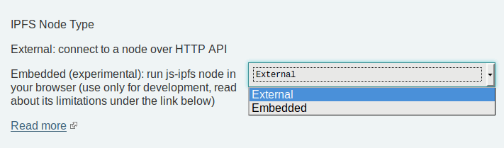

# Understand node types in IPFS Companion

IPFS Companion's preferences screen allows you to choose from several different node types. The available types you'll see in your Companion preferences depends on the browser you're using (i.e. Firefox, Chrome, Brave), but the full list is as follows:

[[toc]]

**If you're already running a local IPFS node, choose _External_.** If not, do one of the following:

- [Install](../install/README.md) and run IPFS as an [external node](#external) (recommended).
- Use a [native node](#native) built into your browser (Brave v1.19 or later only) or the [embedded node](#embedded) built into Companion.

## External

An _external_ node can be any instance of an IPFS daemon that:

- Runs outside of your web browser.
- Exposes a _gateway_ and writeable _API_ over HTTP at TCP ports.

The [go-ipfs](https://github.com/ipfs/go-ipfs) implementation of IPFS is the recommended choice for running an external IPFS node. It's less power-hungry than other implementations and uses the `dhtclient` mode to decrease ambient bandwidth use and reduce battery drain.

A good practice is to run your go-ipfs daemon on localhost (`127.0.0.1`), as it provides:

- Increased security: native IPFS used as end-to-end transport.
- Better UX in the browser: no mixed-content warnings.
- Improved performance: local loopback is used, so no network overhead.

You can get started with running a go-ipfs node on your local machine in several ways:

- [IPFS Desktop](https://github.com/ipfs-shipyard/ipfs-desktop) installs and manages a local node for you, as well as offering an easy, convenient user interface for managing files and peers.
- If you're comfortable with the command line and don't need the convenience of the IPFS Desktop UI, follow the directions in the [command line quick-start guide](command-line-quick-start.md).
- Docker fans can run and use go-ipfs from [inside a Docker container](https://github.com/ipfs/go-ipfs#running-ipfs-inside-docker).

## Native

### Provided by Brave

Users of the [Brave](https://brave.com/) browser (v1.19 or later) can enable native support for IPFS using a go-ipfs node built directly into the browser itself. This is a great way to experiment with IPFS without having to install or run IPFS Desktop or the command-line daemon.

This node type offers the same benefits as an [external](#external) node, with additional features provided within Brave itself:

- Native support for `ipfs://` and `ipns://` URIs:
  - Built-in fallback to a public gateway.
  - Ability to change your preferred public gateway from Brave's settings page.
  - Options for default resolution of IPFS resources: through a public gateway, through a local node, or asking each time.
- The IPFS node is managed by Brave itself:
  - Automatic go-ipfs updates and migrations.
  - Your node is only running when Brave is open.
  - You can start/stop your Brave-based node by clicking the power button icon in IPFS Companion's main menu.

::: tip TOOLS FOR BRAVE USERS

- `ipfs://bafybeigdyrzt5sfp7udm7hu76uh7y26nf3efuylqabf3oclgtqy55fbzdi`
  Popular URI for triggering and testing native IPFS support
- `brave://settings/extensions`
  One-click Companion install and URI resolution settings
- `brave://ipfs`
  Status page for Brave's built-in go-ipfs node

:::

## Embedded

An _embedded_ node is a js-ipfs instance running in the browser in-memory, without the need for any external software.

::: warning

This node type is only for development and experimentation. Most users should use [external](#external) or [native](#native) node types instead.

:::

Power users can provide [custom config](https://github.com/ipfs/js-ipfs#faq) (e.g. to enable experimental pubsub) via the IPFS Companion [Preferences](https://user-images.githubusercontent.com/157609/38084660-0b97c0cc-334e-11e8-9368-823345ced67f.png)

Please note that there are some limitations when running an embedded js-ipfs instance in the browser context using Companion:

- Embedded js-ipfs cannot act as an HTTP gateway; the extension uses a public one as a fallback.
- Running an embedded js-ipfs instance is known to be CPU-hungry over time, which may drain your battery. See GitHub issues ([#450](https://github.com/ipfs-shipyard/ipfs-companion/issues/450) and [ipfs/js-ipfs#1190](https://github.com/ipfs/js-ipfs/issues/1190)) for further details
- Missing DHT (see [js-ipfs/#856](https://github.com/ipfs/js-ipfs/pull/856)).
- Default transports limited to websockets ([js-ipfs/#1088](https://github.com/ipfs/js-ipfs/issues/1088)):
  - Lack of connection closing ([ipfs/js-ipfs#962](https://github.com/ipfs/js-ipfs/issues/962))
  - Missing relay discovery ([js-ipfs/v0.29.x/examples/circuit-relaying](https://github.com/ipfs/js-ipfs/tree/v0.29.3/examples/circuit-relaying))
- An embedded node _does not run_ when an external node is selected; every time you switch back to the embedded node, a new instance is created on demand, and it can take a few seconds for a newly running node to find peers.

### Embedded + `chrome.sockets` (deprecated)

::: warning
This node type has been deprecated and is no longer supported by Chromium browsers. While this option still appears in IPFS Companion preferences, users of this node type are strongly urged to migrate to a different node type.
:::

## Public

A _public_ node is used as a fallback for gateway functionality when an external node is offline or an embedded node is used. It does not expose the API port. This type of node is not included as an option in Companion's preferences.
