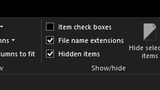

<!-- This page was created in response to an issue: https://github.com/ipfs/docs/issues/442 -->

## Create a copy of your IPFS repository

The easiest way to backup, migrate, or copy your IFPS repository is to grab the `.ipfs` folder, and move it to another destination.

### Linux and MacOS

1. Stop any IPFS daemons, services, or applications from running.
1. In a terminal move to where your IPFS repository is stored. This is likely your _home_ folder:

    ```bash
    cd ~/
    ```

1. Make a copy of the `.ipfs` directory:

    ```bash
    cp --recursive --verbose .ipfs ipfs-from-linux

    > '.ipfs' -> 'ipfs-from-linux'
    > '.ipfs/datastore_spec' -> 'ipfs-backup/data'
    > ...
    ```

1. You now have a copy of your IPFS repository within the `ipfs-backup`.

### Windows

1. Stop any IPFS daemons, services, or applications from running.
1. Open the file explorer and go to **C:** -> **Users** -> **Your Username**.
1. Select the **View** tab at the top of the file explorer window, and check the **Hidden items** checkbox.

    

1. Find the `.ipfs` within your users _home_ folder.
1. Copy this folder to somewhere convenient like the `Desktop`.

## Restore a backup of IPFS

Once you have a backup of your IPFS repository in `ipfs-backup`, you can move it to the computer you want to restore to. Once there you can restore your IPFS repository.

### Linux and MacOS

1. Stop any IPFS daemons, services, or applications from running.
1. In a terminal move to where your IPFS repository is stored. This is likely your _home_ folder:

    ```bash
    cd ~/
    ```

1. Move your current IPFS repository to another folder. If something goes wrong you can revert back to this later:

    ```bash
    mv .ipfs ipfs-old
    ```

1. Move your backup IPFS repository to `.ipfs`:

    ```bash
    mv ipfs-backup .ipfs
    ```

1. Start an IPFS daemon. Everything should properly load from the newly restored `.ipfs` folder:

    ```bash
    ipfs daemon

    > Initializing daemon...
    > go-ipfs version: 0.5.0-dev-a22dc826c
    > Repo version: 7
    > ...
    > Daemon is ready
    ```

1. If everything is working fine, you can delete your old IPFS repository:

    ```bash
    rm -rf .ipfs-old
    ```

### Windows

1. If restoring to the IPFS Desktop application, open the application at least once before attempting to restore anything.
1. Stop any IPFS daemons, services, or applications from running.
1. Open the file explorer and go to **C:** -> **Users** -> **Your Username**.
1. Select the **View** tab at the top of the file explorer window, and check the **Hidden items** checkbox.

    

1. Find the `.ipfs` within your users _home_ folder.
1. Rename the `.ipfs` folder to `ipfs-old`. We can restore from `ipfs-old` if anything goes wrong.
1. Copy your backup IPFS repository into your users _home_ folder and rename it to `.ipfs`.
1. Open the IPFS Desktop application or run `ipfs daemon` with Powershell. Everything should start normally and your IPFS repository should be restored.

## Windows Subsystem for Linux

If you have IPFS installed in the Windows Subsystem for Linux you can migrate your IPFS repository from Linux into your Windows environment. These steps will overwrite Windows IPFS repository.

1. On Windows, open the IPFS Desktop application or run an `ipfs daemon`. This needs to be done at least once.
1. Stop any IPFS daemons, services, or applications from running in your Linux and Windows environments.
1. Copy your Linux IPFS repository to Windows. This will overwrite your Windows IPFS repository:

    ```bash
    cp --recursive --verbose ~/.ipfs /mnt/c/Users/Your Username/
    ```

1. On Windows, open the IPFS Desktop application or run an `ipfs daemon`. Everything should open successfully.

## Troubleshooting

### Linux and MacOS

#### IPFS daemon doesn't run successfully

If `ipfs daemon` doesn't run successfully then you can restore your old IPFS repository, assuming you made a copy:

```bash
mv .ipfs ipfs-backup-broken
mv .ipfs-old .ipfs
```

Running `ipfs daemon` now will load your old IPFS repository. Try repeating the backup and restore steps again. Make sure to stop any IPFS services, daemons, or applications when backing up and restoring an IPFS repository.

### Windows

#### IPFS Desktop has an error

Make sure to open the IPFS Desktop application at least once before attempting to migrate any IPFS repositories. The IPFS Desktop relies upon another directory called `.ipfs-desktop`. The migration sometimes fails if this folder does not exist.

#### IPFS Desktop won't open

In your users _home_ folder, delete `.ipfs` and `.ipfs-desktop`. Open the IPFS Desktop application. It will have a completely fresh repository.