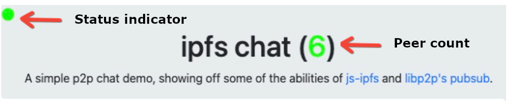

# Create a simple chat app

This how-to demonstrates a minimal chat app in [js-ipfs](/reference/js/api#js-ipfs) entirely in the browser.

Here’s a quick demo of the app:


The heading shows which user is chatting and has a status indicator in the top left to let you know what kind of connection you have.



- Green means you're connected to the relay, even if it's via another peer.
- Yellow means you're only seeing direct peers (no other peer in the middle).
- Red means you have no peers (at least none using the chat application).

To see a live demo, start your ipfs daemon (open IPFS Desktop or enter ipfs daemon in the CLI) and have a chat buddy do the same. Then you can both open the [live demo](https://ipfs.io/ipfs/bafybeia5f2yk6td7ciroeped2uwfivo333b524t3zmoderfhl3xn7wi7aa/&sa=D&source=editors&ust=1651157762663308&usg=AOvVaw1sQEgWa5q7YI8HnLTPUq0Y) and chat. Once our chat app gets some traction, you’ll be able to make new friends on the network.

## How it works

To get a minimal chat app going in your browser, you can [download a copy of the chat app code](#getting-the-code), run the daemon, and open index.html (instructions below).

To test and deploy your own version with your own nodes (recommended for deployments), follow the setup below for:

- [Getting the code](#getting-the-code)
- [Discovery and connectivity set up](#peer-discovery-and-connectivity) to peers
- [Advertising set up](#advertising) to let other peers know your users are there
- [Publishing set up and staying connected](#communication) to peers

Besides [IPFS](/concepts/what-is-ipfs) (with CIDv1) and JavaScript, our chat app uses these technologies:

- [Libp2p](https://libp2p.io/)’s [WebRTC](https://www.npmjs.com/package/libp2p-webrtc-star)-Star and [circuit relay](https://docs.libp2p.io/concepts/circuit-relay) for discovery and connecting (with two libraries:  [js-ipfs](https://github.com/ipfs/js-ipfs/blob/master/docs/BROWSERS.md),  Bootstrap–with minified CSS), and [go-ipfs](https://docs.ipfs.io/reference/go/api/%23working-with-go) for p2p circuit connecting with websockets,
- some [Python code](#advertising) that we supply for advertising, and
- Libp2p’s experimental [PubSub](https://docs.libp2p.io/concepts/publish-subscribe) feature for publishing, with some tips for staying connected.

## Getting the code

There are two ways to get the code: You can download it or you can clone or fork [TheDiscordian/browser-ipfs-chat](https://github.com/TheDiscordian/browser-ipfs-chat) from GitHub.

To download the code:

1. In the CLI, start your daemon with: ipfs daemon
2. In another instance of the CLI, get the chat app code directory with:  

    ```shell
    ipfs get bafybeia5f2yk6td7ciroeped2uwfivo333b524t3zmoderfhl3xn7wi7aa
    ```
3. Change directories:  

    ```shell
    cd bafybeia5f2yk6td7ciroeped2uwfivo333b524t3zmoderfhl3xn7wi7aa
    ```

4. Use open `index.html` to see it in the browser.

A tab with the app opens and you’ll automatically begin connecting to nodes and looking for peers! Your home folder will contain the new directory with the html, bootstrap, and js files.

To test and deploy your own version, you’ll be editing `index.html`.

Let's take a look at how this works.

## Peer discovery and connectivity

Browsers don’t automatically provide discovery and connectivity, so, without the code we provide, you can't listen for new peers and get access to the navigation system that the [distributed hash table (DHT)](https://docs.ipfs.io/concepts/dht) provides. Our chat app provides discovery and connectivity in two ways:

- [WebRTC-Star](https://www.npmjs.com/package/libp2p-webrtc-star) achieves direct browser-to-browser communication.
- [circuit relay](https://docs.libp2p.io/concepts/circuit-relay/), maintains the connection with a relay in the middle.

This diagram demonstrates what a three-user network can look like.


The browser nodes can communicate with go-ipfs as well, so BrowserC doesn't have to be a browser at all, but instead could be a go-ipfs node!

### WebRTC-Star

We use [WebRTC-Star](https://github.com/libp2p/js-libp2p-webrtc-star) nodes to help discover other peers to connect with directly, browser-to-browser. We use the [js-ipfs](https://github.com/ipfs/js-ipfs/blob/master/docs/BROWSERS.md) and Bootstrap libraries. For Bootstrap, we’re only using minified CSS. If you want a newer version of [js-ipfs](https://github.com/ipfs/js-ipfs/blob/master/docs/BROWSERS.md), you can use the [latest version available](https://cdn.jsdelivr.net/npm/ipfs/dist/index.min.js) from JSDelivr.

If you're familiar with the concept of [STUN](https://en.wikipedia.org/wiki/STUN), it might be helpful to think of WebRTC-Star nodes as conceptually similar. Effectively, each connecting node is given a WebRTC-Star [multiaddress](https://docs.libp2p.io/concepts/addressing/) that other nodes can use to discover and connect to your browser directly. This means that if you peer with someone using the star node, and the star node goes offline, you remain connected\!

#### Usage

Here’s how we connect to a star node, in the \<script\> of the html files:

```javascript
ipfs = await Ipfs.create({
    repo: 'ok' + Math.random(), // random so we get a new peerid every time, useful for testing
    config: {
        Addresses: {
            Swarm: [
                '/dns4/star.thedisco.zone/tcp/9090/wss/p2p-webrtc-star',
                '/dns6/star.thedisco.zone/tcp/9090/wss/p2p-webrtc-star'
            ]
        },
    }
});
```

#### Setup

Please note that this how-to uses example star nodes — however, those won't necessarily always be accessible. Currently it's important to either find a reliable star node or host your own. You can host your own by following the instructions for a [native setup](https://github.com/libp2p/js-libp2p-webrtc-star/tree/master/packages/webrtc-star-signalling-server) or for a [Docker container](https://github.com/libp2p/js-libp2p-webrtc-star/blob/master/packages/webrtc-star-signalling-server/DEPLOYMENT.md) which includes Nginx (for SSL). If you opt for the native setup, we cover the Nginx reverse proxy process and SSL cert retrieval later in this post.

### p2p-circuit

:::warning
This section is currently only relevant for go-ipfs versions **before** v0.11.0 as it's about circuit relay v1. There is currently no solution available to directly replace it, though most of the work has been complete [here](https://github.com/libp2p/go-libp2p-relay-daemon).
:::

WebRTC-Star is a very clean and effective method of P2P communications; however, sometimes NATs get in the way, so we use [p2p-circuit](https://docs.libp2p.io/concepts/circuit-relay) to get around that.

Using p2p-circuit is helpful for peers behind tricky NATs (or a VPN, or anything really). If you're familiar with [TURN](https://en.wikipedia.org/wiki/Traversal_Using_Relays_around_NAT), it might be useful to think of the relaying of p2p-circuit as something similar.

#### Usage

Once all the services for p2p-circuit are put together, connecting to the node can be achieved in a few different ways.

First, to connect on startup to only our node(s):

```javascript
ipfs = await Ipfs.create({
    config: {
        Bootstrap: \[
            '/dns6/ipfs.thedisco.zone/tcp/4430/wss/p2p/12D3KooWChhhfGdB9GJy1GbhghAAKCUR99oCymMEVS4eUcEy67nt',
            '/dns4/ipfs.thedisco.zone/tcp/4430/wss/p2p/12D3KooWChhhfGdB9GJy1GbhghAAKCUR99oCymMEVS4eUcEy67nt'
        \]
}});
```

Or you can add your own after, then manually initiate the connection:

```javascript
await ipfs.bootstrap.add('/dns6/ipfs.thedisco.zone/tcp/4430/wss/p2p/12D3KooWChhhfGdB9GJy1GbhghAAKCUR99oCymMEVS4eUcEy67nt');
await ipfs.swarm.connect('/dns6/ipfs.thedisco.zone/tcp/4430/wss/p2p/12D3KooWChhhfGdB9GJy1GbhghAAKCUR99oCymMEVS4eUcEy67nt');
await ipfs.bootstrap.add('/dns4/ipfs.thedisco.zone/tcp/4430/wss/p2p/12D3KooWChhhfGdB9GJy1GbhghAAKCUR99oCymMEVS4eUcEy67nt');
await ipfs.swarm.connect('/dns4/ipfs.thedisco.zone/tcp/4430/wss/p2p/12D3KooWChhhfGdB9GJy1GbhghAAKCUR99oCymMEVS4eUcEy67nt');
```

If you're looking to do your own client without copying the example, ensure that you're also communicating with the announce channel, which is described under [Advertising](https://docs.ipfs.io/how-to/create-simple-chat-app/%23advertising) below. This is the simplified version of the relevant code in the chat demo:

```javascript
var ipfs; // store the IPFS node you're using in this variable
// processes a circuit-relay announce over pubsub

async function processAnnounce(addr) {
    // get our peerid
    me = await ipfs.id();
    me = me.id;

    // not really an announcement if it's from us
    if (addr.from == me) {
        return;
    }

    // if we got a keep-alive, nothing to do
    if (addr == "keep-alive") {
        console.log(addr);
        return;
    }

    peer = addr.split("/")\[9\];
    console.log("Peer: " + peer);
    console.log("Me: " + me);

    if (peer == me) { // return if the peer being announced is us
        return;
    }

    // get a list of peers
    peers = await ipfs.swarm.peers();
    for (i in peers) {

        // if we're already connected to the peer, don't bother doing a
        // circuit connection
        if (peers\[i\].peer == peer) {
            return;
        }
    }

    // log the address to console as we're about to attempt a connection
    console.log(addr);

    // connection almost always fails the first time, but almost always
    // succeeds the second time, so we do this:
    try {
        await ipfs.swarm.connect(addr);
    } catch(err) {
        console.log(err);
        await ipfs.swarm.connect(addr);
    }
}

// process announcements over the relay network, and publish our own
// keep-alives to keep the channel alive
await ipfs.pubsub.subscribe("announce-circuit", processAnnounce);
setInterval(function(){ipfs.pubsub.publish("announce-circuit", "peer-alive");}, 15000);
```

#### Setup

Like the star nodes, it will be important to host your own things, as the ones in this how-to could go offline at any moment.

For the purposes of this example, you'll need to do a few things on a server hosting your own [go-ipfs](https://github.com/ipfs/go-ipfs) node. You'll also need a working Nginx install setup, which will be used for SSL, which is a requirement for browsers.

First configure the Go node, enabling [WebSocket](https://en.wikipedia.org/wiki/WebSocket) support, and designate it as a relay so we can communicate with it from a browser by editing `~/.ipfs/config` to add the following settings:

```javascript
{
    "Addresses": {
        "Swarm" : [
            "/ip4/0.0.0.0/tcp/4011/ws",
            "/ip6/::/tcp/4011/ws"
        ]
    },
    "Swarm": {
        "EnableRelayHop": true
    }
}
```

:::tip
Restart your go-ipfs node however you normally would (such as by using `systemctl --user restart ipfs`), and you're mostly set up! You've enabled regular WebSockets with relaying support; however, you still need secure WebSockets (outlined in the [SSL](https://docs.ipfs.io/how-to/create-simple-chat-app/%23ssl-nginx) section below) — otherwise browsers won't be able to connect to us.
:::

## Advertising

Using p2p-circuit can be a bit tricky. Once you connect to the relay from a browser, you're still not advertising that you're able to be reached through it\! For this purpose, this how-to includes a Python script that runs alongside go-ipfs and advertises the browser js-ipfs peers it encounters over [PubSub](https://docs.libp2p.io/concepts/publish-subscribe/) with a p2p-circuit [multiaddress](https://docs.libp2p.io/concepts/addressing/).

Here is  the [Python script](https://gist.github.com/TheDiscordian/51962fea72f8d5a5c3bba79dd7009e1c). You can  run it with python `ipfs_peeradvertiser.py`. However, first ensure that you edit CIRCUITS with your own node's information, or you won't announce peers correctly, and they won't know how to use your relay to connect to other peers.

You can retrieve your own circuit info by running ipfs id on your go-ipfs node to get your PeerID. Then form the circuit URL like so:

```shell
/dns6/YOURDOMAIN.COM/tcp/4430/p2p/YOUR\_PEERID/p2p-circuit/p2p/
```

You should see here where you fill out the domain name that you got the SSL cert for, as well as your node's PeerID. For the script, the leading and trailing slash are required, too.

:::warning
Ensure you specify DNS6 or DNS4, depending on if you're forming an IPv6 or IPv4 address. It's important to ensure that you use DNS, otherwise browser nodes likely won't be able to connect. Also note the port 4430; if you used a different one, you'll need to specify that.
:::

## SSL and Nginx

So far you've setup WebRTC-Star and p2p-circuit without SSL (unless you used the WebRTC-Star Docker setup). If you want to use your nodes over the internet, with a browser, they need to support SSL. If you're using the defaults, currently WebRTC-Star should be running on port 9090 (no-SSL) and p2p-circuit will be on port 4011 (no-SSL). We're going to put those on port 9091 (SSL) and port 4430 (SSL), respectively.

First, ensure that Nginx is installed, then obtain and install [Certbot](https://certbot.eff.org/docs/install.html).

Create two files from the templates below. Ensure that you're editing entries like YOURDOMAIN.COM with the full domain (including subdomain) that you plan to use for your services.

```plaintext
/etc/nginx/sites-available/ipfs (p2p-circuit, 4430(SSL) ➡ 4011)
map $http_upgrade $connection_upgrade {
        default upgrade;
        '' close;
}

upstream ipfs {
        server 127.0.0.1:4011;
}

server {
        server_name YOURDOMAIN.COM;
        listen 4430 ssl;
        ssl_certificate /etc/letsencrypt/live/YOURDOMAIN.COM/fullchain.pem;
        ssl_certificate_key /etc/letsencrypt/live/YOURDOMAIN.COM/privkey.pem;
        location / {
                proxy_set_header X-Forwarded-For $proxy_add_x_forwarded_for;
                proxy_pass http://ipfs;
                proxy_http_version 1.1;
                proxy_set_header Upgrade $http_upgrade;
                proxy_set_header Connection $connection_upgrade;
                proxy_set_header Host $host;
        }
}

-----

/etc/nginx/sites-available/star (WebRTC-Star, 9091(SSL) ➡ 9090)
map $http_upgrade $connection_upgrade {
        default upgrade;
        '' close;
}

upstream star {
        server 127.0.0.1:9090;
}

server {
        server_name YOURDOMAIN.COM;
        listen 9091 ssl;
        ssl_certificate /etc/letsencrypt/live/YOURDOMAIN.COM/fullchain.pem;
        ssl_certificate_key /etc/letsencrypt/live/YOURDOMAIN.COM/privkey.pem;
        location {

                proxy_set_header X-Forwarded-For $proxy_add_x_forwarded_for;
                proxy_pass http://star;
                proxy_http_version 1.1;
                proxy_set_header Upgrade $http_upgrade;
                proxy_set_header Connection $connection_upgrade;
                proxy_set_header Host $host;
        }
}
```

In this example, we're accepting SSL on port 4430 — this is our "wss port" (WebSocket Secure) — and then passing it to the unsecured port locally on 4011 — this is our "ws port". So if you want to connect to this node from a browser, you'd use port 4430.

Next, run the following:

```shell
sudo systemctl stop nginx
sudo certbot -d YOURDOMAIN.COM --standalone
```

Edit YOURDOMAIN.COM to the domain you want a cert for, if you need multiple, fill in multiple or run the command multiple times

Next, run:

```shell
sudo ln -s /etc/nginx/sites-available/ipfs /etc/nginx/sites-enabled/ipfs
sudo ln -s /etc/nginx/sites-available/star /etc/nginx/sites-enabled/star
sudo systemctl start nginx
```

Nginx is now operating as a reverse proxy, giving you secured WebSockets!

## Communication

Whew! Since you made it this far, you might be wondering "what is communication like?" We're rolling out [PubSub](https://docs.libp2p.io/concepts/publish-subscribe/) for communication. It still has a couple issues to handle manually, so we’ll walk you through those.

### PubSub

With PubSub, you can subscribe to topics and retrieve any messages posted to those topics. In js-ipfs, you can set a callback function, which gets called whenever a message is received:

```javascript
function echo(msg) {
        msg = new TextDecoder().decode(msg.data);
        console.log(msg);
}

await ipfs.pubsub.subscribe("example\_topic", echo);
```

To publish use::

```shell
await ipfs.pubsub.publish("example\_topic", "Hello world\!");
```

This is effectively what the chat demo is doing: It's subscribing to a global topic (named `discochat-global`), and relaying the messages people type over PubSub.

### Staying connected

So let's say you've done everything correctly. You're able to find peers using WebRTC-Star and p2p-circuit — awesome! However, you might find your connections expire, and you're unable to restore them, so here's how to mitigate these issues:

#### Staying connected to peers

We stay connected to peers in a couple of ways. The first way is more direct: by subscribing to and sending a `keepalive` announcement over discochat-keepalive every 4 seconds:

```javascript
setInterval(function(){sendmsg("1", prefix+"keepalive");}, 4000);
setInterval(checkalive, 1000);
```

This should help ensure that you give peers looking to chat a high priority. Additionally, we report over announce-circuit every 15 seconds to make sure we keep a connection to the circuit relay so we can connect to peers stuck behind a NAT. That's accomplished like so:

```javascript
// process announcements over the relay network, and publish our own keep-alives to keep the channel alive
await ipfs.pubsub.subscribe("announce-circuit", processAnnounce);
setInterval(function(){ipfs.pubsub.publish("announce-circuit", "peer-alive");}, 15000);
```

:::tip
A simplified version of processAnnounce is found under [p2p-circuit](#usage) above.
:::

The Python script on the circuit relay will report a keepalive every 4 seconds. You may have noticed we're reporting peer-alive instead of "keep-alive; this is to separate peer requests from relay requests, making it easier to tell when we no longer see a relay.

#### Staying connected to the circuit relay

Outside of the simplified version of processAnnounce, in the real version there are a few variables used for tracking keep-alive and peer-alive. These are lastAlive and lastPeer, respectively. We even track the last time you bootstrapped with lastBootstrap. Using all this, we display the yellow status when you're only connected to peers (tracked via lastPeer), and if we don't see a keep-alive for 35 seconds (and you haven't attempted a bootstrap in 60 seconds), we attempt to re-connect to the bootstrap relay (and display a red status). We accomplish this like so:

```javascript
const bootstraps = \[
    '/dns6/ipfs.thedisco.zone/tcp/4430/wss/p2p/12D3KooWChhhfGdB9GJy1GbhghAAKCUR99oCymMEVS4eUcEy67nt',
    '/dns4/ipfs.thedisco.zone/tcp/4430/wss/p2p/12D3KooWChhhfGdB9GJy1GbhghAAKCUR99oCymMEVS4eUcEy67nt'
\];

var lastAlive = 0;        // last keep-alive we saw from a relay
var lastPeer = 0;         // last keep-alive we saw from another peer
var lastBootstrap = 0; // used for tracking when we last attempted to bootstrap (likely to reconnect to a relay)

// if reconnect is true, it'll first attempt to disconnect from the bootstrap nodes
async function dobootstrap(reconnect) {
    now = new Date().getTime();
    if (now-lastBootstrap \< 60000) { // don't try to bootstrap again if we just tried within the last 60 seconds
        return;
    }

    lastBootstrap = now;

    for (i in bootstraps) {
        if (reconnect) {
            try {
                await ipfs.swarm.disconnect(bootstraps\[i\]);
            } catch (e) {
                console.log(e);
            }
        } else {
            await ipfs.bootstrap.add(bootstraps\[i\]);
        }
        await ipfs.swarm.connect(bootstraps\[i\]);
    }
}

// check if we're still connected to the circuit relay
function checkalive() {
    now = new Date().getTime();

    if (now-lastAlive \>= 35000) {
        if (now-lastPeer \>= 35000) {
            document.getElementById("status-ball").style.color = "red";
        } else {
            document.getElementById("status-ball").style.color = "yellow";
        }
        dobootstrap(true); // let's try to reconnect
    } else {
        document.getElementById("status-ball").style.color = "lime";
    }
}

setInterval(checkalive, 1000);
```

:::warning
The above code  should be used with the full version of processAnnounce, as it relies on lastAlive and lastPeer, which aren't updated in the simplified version.
:::

## More resources

If you were successful in following this entire guide, you now have the ability to deploy powerful IPFS apps that run entirely in the browser and leverage decentralized p2p whenever you can\! To learn more, check the resources below:

- [js-ipfs/docs/BROWSERS.md](https://github.com/ipfs/js-ipfs/blob/master/docs/BROWSERS.md)
- [js-ipfs/docs/CONFIG.md](https://github.com/ipfs/js-ipfs/blob/master/docs/CONFIG.md)
- [js-ipfs/docs/core-api](https://github.com/ipfs/js-ipfs/tree/master/docs/core-api)
- [js-ipfs/examples/circuit-relaying](https://github.com/ipfs-examples/js-ipfs-examples/tree/master/examples/circuit-relaying)
- [js-libp2p-webrtc-star](https://github.com/libp2p/js-libp2p-webrtc-star)

Thanks to [TheDiscordian](https://github.com/thediscordian) for originally creating this material as a post in [IPFS Blog & News](https://blog.ipfs.io/2021-06-10-guide-to-ipfs-connectivity-in-browsers).

