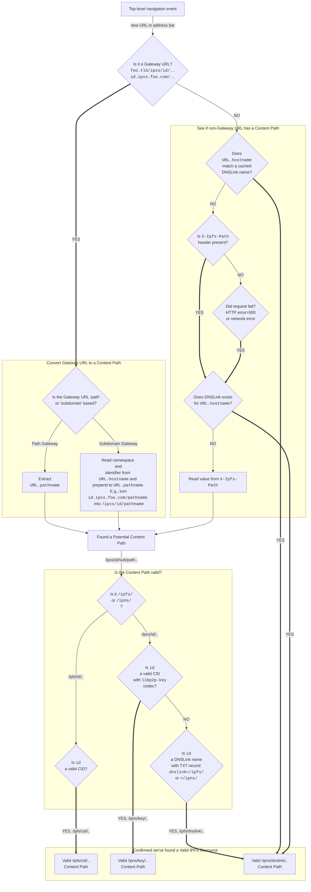

# Discover IPFS content from Web2

The goal of this page is to provide some suggestions and best practices for Web 2 web browsers and other [user agents](https://en.wikipedia.org/wiki/User_agent) that are interested in adding support for [content-addressed resources](./address-ipfs-on-web.md).

## Detecting content-addressed resources

In many cases, IPFS resources can be detected just by looking at the URI, especially if it is an HTTP URL pointed at a public gateway. This allows a browser to upgrade the transport protocol to IPFS, and removes the need to send an HTTP request to a remote server.

### Methodology

To determine if a resource is an IPFS resource, answer the following questions in order:

1. Does the `URL` follow [path or subdomain gateway](./address-ipfs-on-web.md) convention?
1. If not, does [DNSLink](../concepts/dnslink.md) with an IPFS path exist for `URL.hostname`?

If you answered yes to either of the above questions, a user agent should be able to find a content path that can be used for data retrieval over IPFS, as described in the illustration below:

 

## What to do with detected paths

What you do with the detected IPFS resource path depends on the type of path.

### Immutable `/ipfs/cid/..`

- Display "Open via IPFS" button in UI
  - Clicking it should open `ipfs://cid/path?query#hash` (preserving any `?query` or `#hash` from the original HTTP URL)
- If "IPFS Gateway Redirect / Protocol Upgrade" feature is enabled, and the HTTP URL was a gateway one, redirect automatically to `ipfs://cid/path?query#hash`

### Mutable `/ipns/key/..`
- Display "Open via IPFS" button in UI
  - Clicking it should open `ipns://key/path?query#hash` (preserving any `?query` or `#hash` from the original HTTP URL)
- If "IPFS Gateway Redirect / Protocol Upgrade" is enabled, and the original HTTP URL was a gateway one, redirect automatically to `ipns://dnslink/path?query#hash`

### Mutable `/ipns/dnslink/..`

- Display "Open via IPFS" button in UI
  - Clicking it should open `ipns://dnslink/path?query#hash` (preserving `?query` or `#hash` from the original HTTP URL)
- If "DNSLink Website Redirect / Protocol Upgrade" is enabled, redirect automatically to `ipns://dnslink/path?query#hash`
- It is a good practice to internally cache the fact that domain has a valid DNSLink.
  - TTL from TXT record can be used as a hint when to expire cache entry.
  - Performance can be improved further by using cached flag and revalidating it asynchronously, without blocking browser navigation.

## Implementation examples

### Brave

[Brave has supported IPFS since 2021](https://brave.com/brave-integrates-ipfs/). Current features include `ipfs://` and `ipns://` URI support, ability to resolve this type of address using a public / local gateway, opt-in Gateway and/or DNSLink redirects, and an **Open via IPFS** button in the address bar:

> 

### IPFS Companion

Firefox and Chromium-based browsers such as Google Chrome or Microsoft Edge can access IPFS with the [IPFS Companion](../install/ipfs-companion.md) browser extension, which allows them to detect IPFS content.

## FAQ

**What if a browser does not support `ipfs://` and `ipns://` natively?** Implementations can use an [HTTP Gateway](../reference/http/gateway.md) as a fallback, convert ththe path to `//gatewayhost/ipxs/id/..`-type paths, or leverage the built-in URI router at `//gatewayhost/ipfs/?uri=%s`

**Why should `?query` or `#hash` from the original HTTP URL be preserved?** The link could point at specific `#section` of  a longer article. It is also common for JavaScript running on a page to use the `?query` and `#hash` for navigation and ad-hoc storage of some state.

**Should a user agent redirect when the URL does not match gateway convention, `URL.hostname` does not have a valid DNSLink, but `X-Ipfs-Path` is present in HTTP response AND points at an immutable `/ipfs/cid`?** This is an edge case, and we've seen that it is often a misconfiguration caused by an invalid or missing DNSLink that could lead to bad UX when automatic redirect is involved. The user ends up on an immutable copy of a website, bookmarks it or keeps tabs open, and misses updates when DNSLink setup is fixed. It is suggested to not redirect this edge case, or provide a setting that controls this type of redirect. Usually, showing "Open via IPFS" in the user interface is enough for this case.
