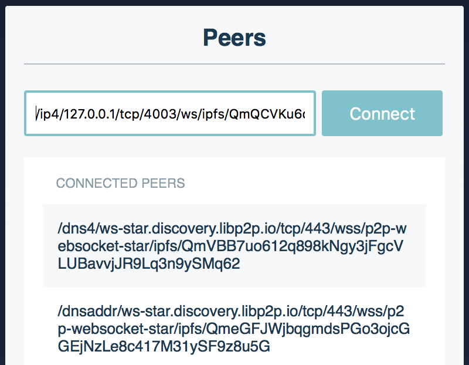
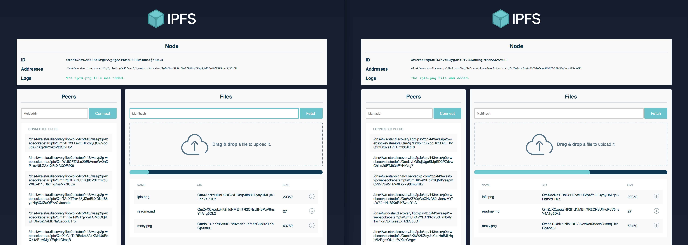

# Exchange files between nodes

This tutorial aims to create a simple application with an IPFS node that dials to other instances using WebRTC, and at the same time, dial and transfer files from a browser IPFS node using WebSockets as the transport.

As `js-ipfs@0.41.x` currently doesn't support DHT peer discovery, the peer from which you are fetching data should be within reach (local or in public IP) of the browser node. That being said, we explain how to circumvent these caveats in this tutorial, and once they are fixed, we'll update everything here.

```
┌──────────────┐                ┌──────────────┐
│   Browser    │ libp2p(WebRTC) │   Browser    │
│              │◀──────────────▶│              │
└──────────────┘                └──────────────┘
       ▲                                  ▲
       │WebSockets              WebSockets│
       │        ┌──────────────┐          │
       │        │   Desktop    │          │
       └───────▶│   Terminal   │◀─────────┘
                └──────────────┘
```

Here's what we are going to be doing:

1. Install an IPFS node in your machine.
2. Make your daemons listen on WebSockets.
3. Start a `libp2p-webrtc-star` signaling server.
4. Start the app.
5. Connect to a node using WebSockets.
6. Transfer files between all of your nodes!

At the end of the tutorial you should have something that looks like this:


## Prerequisites

You must have the following installed:

- [Node.js](https://nodejs.org/en/)
- [NPM](https://www.npmjs.com/)
- [Bundle](https://www.npmjs.com/package/bundle-js)
- [IPFS](/install)

## Set up

Before we get stared, you'll need to download the JS-IPFS project repo, install the dependencies, and build the project.

1. Download the project repository:

   ```bash
   git clone https://github.com/ipfs/js-ipfs.git
   ```

2. Move into the `js-ipfs` folder and install the dependencies:

   ```bash
   cd js-ipfs
   npm install
   ```

3. Build the project:

   ```bash
   npm run bundle
   ```

### Make your daemons listen on WebSockets

Now you need to edit your `config` file, the one you just set up with `{js}ipfs init`. It should be in either `~/.jsipfs/config` or `~/.ipfs/config`, depending on whether you're using JS or Go.

**Note:** `js-ipfs` sets up a websocket listener by default, so if you're using the JS implementation you can skip this and just start the daemon.

Since websockets support is currently not on by default, you'll need to add a WebSockets address manually. Look into your config file to find the `Addresses` section:

```json
"Addresses": {
  "Swarm": [
    "/ip4/0.0.0.0/tcp/4002"
  ],
  "API": "/ip4/127.0.0.1/tcp/5002",
  "Gateway": "/ip4/127.0.0.1/tcp/9090"
}
```

Add the `/ip4/127.0.0.1/tcp/4003/ws` entry to your `Swarm` array. Now it should look like this:

```json
"Addresses": {
  "Swarm": [
    "/ip4/0.0.0.0/tcp/4002",
    "/ip4/127.0.0.1/tcp/4003/ws"
  ],
  "API": "/ip4/127.0.0.1/tcp/5002",
  "Gateway": "/ip4/127.0.0.1/tcp/9090"
}
```

Save the file and it should be able to listen on Websockets. We're ready to start the daemon.

```sh
> ipfs daemon
# or
> jsipfs daemon
```

You should see the Websocket address in the output:

```sh
Initializing daemon...
Swarm listening on /ip4/127.0.0.1/tcp/4001
Swarm listening on /ip4/127.0.0.1/tcp/4003/ws
Swarm listening on /ip4/192.168.10.38/tcp/4001
Swarm listening on /ip4/192.168.10.38/tcp/4003/ws
API server listening on /ip4/127.0.0.1/tcp/5001
Gateway (readonly) server listening on /ip4/0.0.0.0/tcp/8080
Daemon is ready
```

Check the `/ws` in line 5, that means it is listening. Cool.

### 3. Start the app

Make sure you're in `js-ipfs/examples/exchange-files-in-browser`.

We'll need to bundle the dependencies to run the app. Let's do it:

```sh
> npm run bundle
...
> npm start
```

You should see something like this if all went well:

```sh
Starting up http-server, serving public
Available on:
  http://127.0.0.1:12345
  http://192.168.2.92:12345
Hit CTRL-C to stop the server
```

Now go to http://127.0.0.1:12345 in a modern browser and you're on!

### 4. Dial to a node using WebSockets (your desktop ones)

Make sure you have a daemon running. If you don't, run:

```sh
> ipfs daemon
# or
> jsipfs daemon
```

Open another terminal window to find the websocket addresses that it is listening on:

```sh
> ipfs id
# or
> jsipfs id
```

It should look like this: `/ip4/127.0.0.1/tcp/4003/ws/ipfs/<your_peer_id>`.

Copy and paste the _multiaddr_ to connect to that peer:



Check that you got connected:


> It only works on localhost environments because of a restriction with WebCrypto where it will not load in a page unless that page is loaded over https, or the page is served from localhost: [libp2p/js-libp2p-crypto#105][js-libp2p-crypto#105]

[js-libp2p-crypto#105]: https://github.com/libp2p/js-libp2p-crypto/issues/105

### 5. Transfer files between all of your nodes!

Now you can add files through the CLI with:

```sh
> ipfs add <file>
# or
> jsipfs add <file>
```

Copy and paste the _multihash_ and fetch the file in the browser!


You can also open two browser tabs, drag and drop files in one of them, and fetch them in the other!

But the coolest thing about this tutorial is `pubsub`! You can open two tabs that will share files through workspaces named after the url. Try opening two tabs with the following url:

```
http://127.0.0.1:12345/#file-exchange
# You can substitute `file-exchange` with anything you like, just make sure the two tabs are in the same workspace.
```

Now every file that you upload in one tab will appear in the other! You can even open a new tab in that workspace and it will sync the files that were added before!



## Going to production?

This example uses public webrtc-star servers. These servers should be used for experimenting and demos, they **MUST NOT** be used in production as there is no guarantee on availability.

### Use your own `libp2p-webrtc-star` signaling server

This server allows the two browser nodes to talk to each other by doing the initial handshake and network introductions.

First install the `libp2p-webrtc-star` module globally:

```sh
> npm install -g libp2p-webrtc-star
```

This will give you the `webrtc-star` command. Use this to start a signaling server:

```sh
> webrtc-star
```

By default it will listen to all incoming connections on port 13579. Override this with the `--host` and/or `--port` options. That is, the following multiaddr: `/ip4/127.0.0.1/tcp/13579/wss/p2p-webrtc-star`.

You should add your signaling server in the IPFS config swarm addresses, so that you listen for new connections through it.
