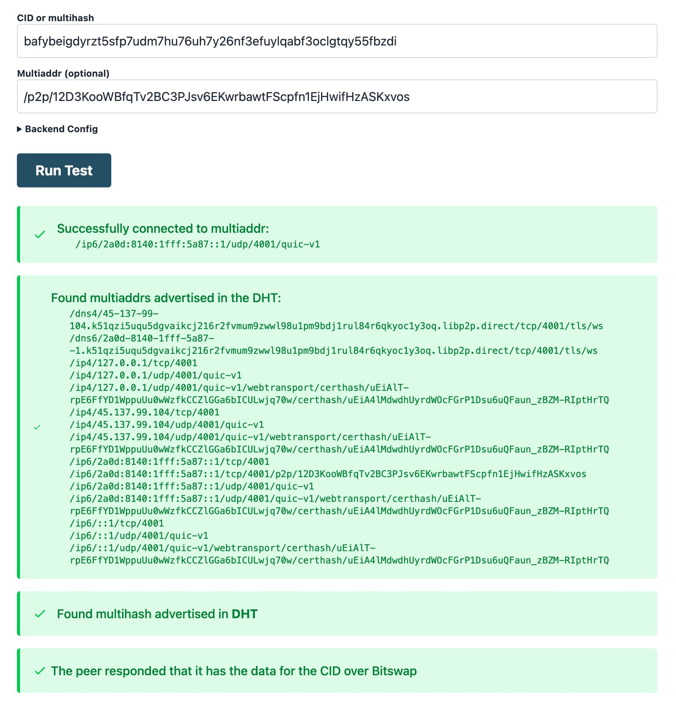
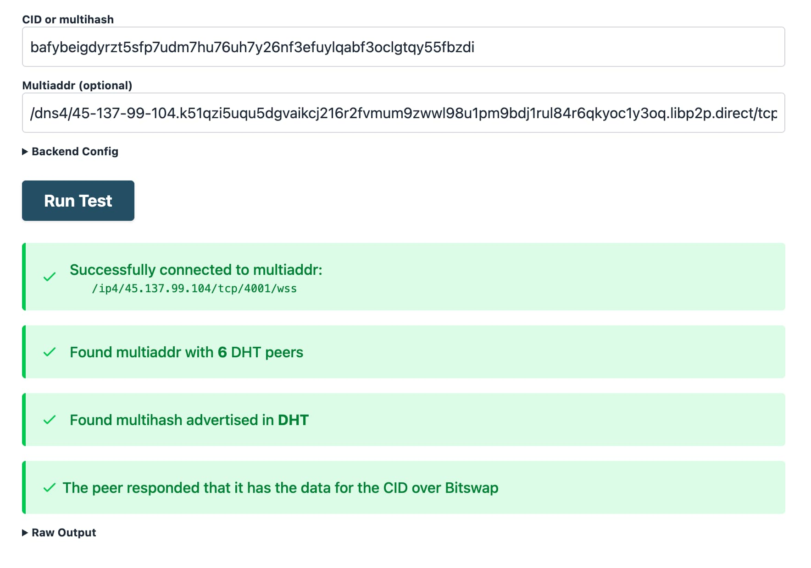
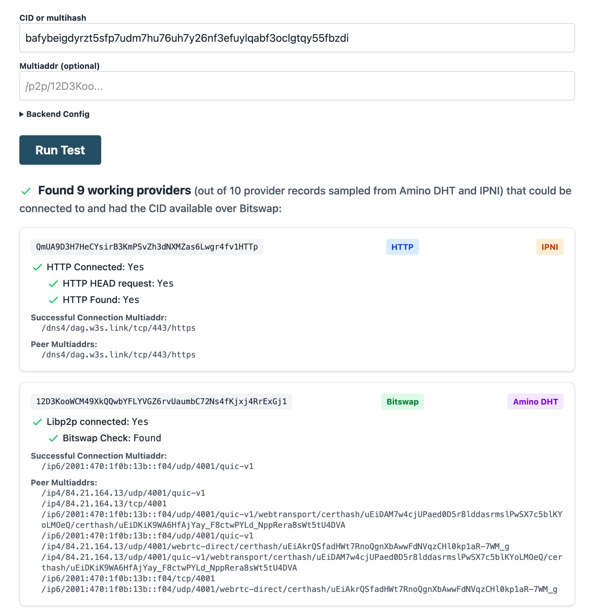
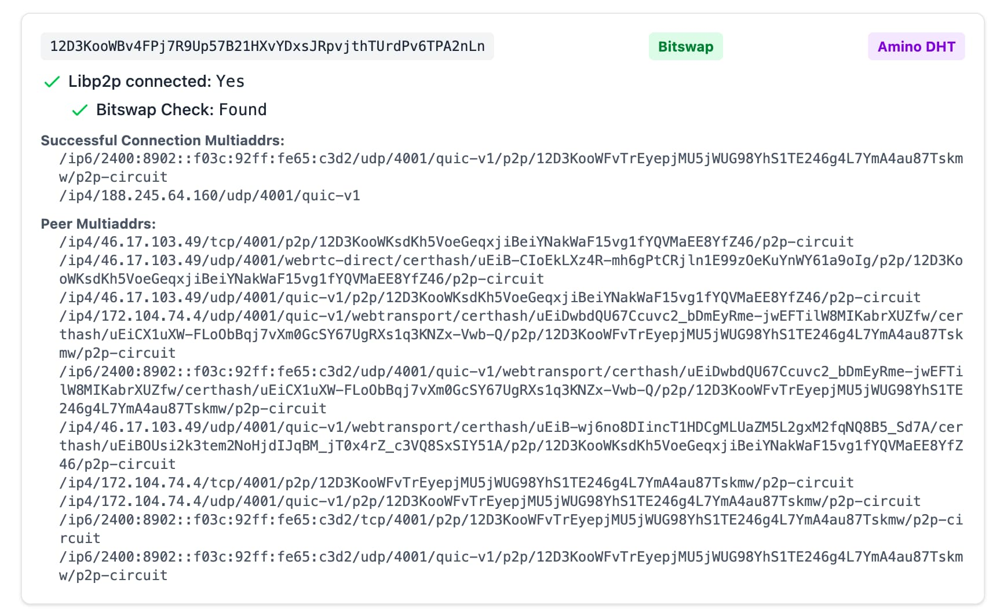
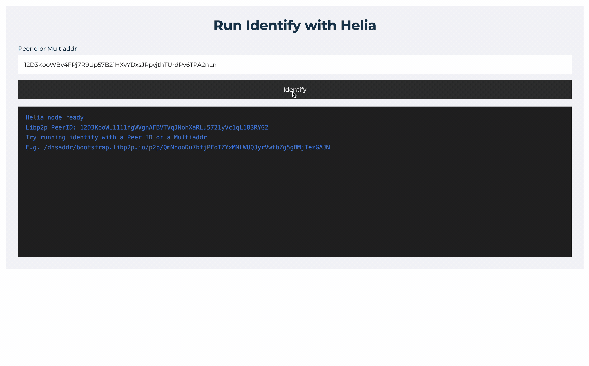

<!-- 
## TODO
- Make it broader and split into two main topics:
  - Troubleshooting retrieval
    - content routing
      - IPNI (Network Indexer)
      - DHT
    - content retrieval
      - Bitswap
      - HTTP
  - Troubleshooting providing
    - public reachability / NAT traversal
    - provider configuration (decrease cids to advertise)
    - Provider not advertising
    - Reprovides falling behind 

## Questions / checks for guiding troubleshooting process

- How are you trying to retrieve the data?
  - Public recursive IPFS gateways (like [ipfs.io](https://ipfs.io))
  - IPFS node (Kubo, Helia, etc.)
  - Are you trying to retrieve the data from a browser? (service worker gateway or with Helia/verified-fetch)
- How is the data being provided?
  - is the provider online?
  - Is the provider publicly reachable?
  - If the provider is not publicly reachable, does it have a relay
  - is NAT hole punching possible?
  - What network transports does the provider support? (TCP, QUIC, WebSockets WebTransport, WebRTC-direct)
  - What transfer protocols does the provider support? (Bitswap and/or HTTP trustless gateway)
  - If the provider is announcing the CID?
    - -->

# Troubleshooting IPFS

From a high level, troubleshooting IPFS typically comes down to finding the root cause of a problem in one of the following operations:

- [**Retrieval**](#troubleshooting-retrieval) - Retrieving data by CID from other peers in the network.
- [**Providing**](#troubleshooting-providing) - Providing data to other peers in the network.

In both cases, the failure modes can be attributed to the following:

- **Content routing**: providers for a CID cannot be found in the DHT or the IPNI.
- **Network connectivity**: a connection to provider is not possible, either because the provider is not online, or because the provider is not reachable over the network.

This guide outlines techniques to troubleshoot and identify the root cause of common issues with retrieval and providing.

For the purposes of this guide, we will use the following tools:
- [IPFS Check](https://check.ipfs.network) - A browser-based debugging tool that can help you identify the root cause of a problem with retrieval.
- [Kubo](https://github.com/ipfs/kubo) - A command-line debugging tool that can help you identify the root cause of a problem with retrieval.
- [Helia Identify tool](https://ipfs.fyi/identify) - A browser-based tool to run libp2p identify with a given peer id, testing whether the peer is dialable from a browser.
- [Public Delegated Routing Endpoint](../concepts/public-utilities.md#delegated-routing-endpoint) at `https://delegated-ipfs.dev/routing/v1` - which can be used to find providers for a CID.

## Troubleshooting retrieval

In this section, you will learn to troubleshoot common issues with retrieval. For a more detailed overview of the retrieval process, see [the lifecycle of data in IPFS](../concepts/lifecycle.md#3-retrieving).


::: callout
If you are troubleshooting retrieval from a public recursive IPFS gateway, keep in mind that the gateway is just another IPFS node and an additional point of failure that you commonly have no insight into. This can make it harder to troubleshoot, because it's not clear whether the problem is with the gateway or the provider node.

We therefore recommended using Kubo or IPFS Check to troubleshoot retrieval, which give you direct insight into the retrievability of the data by CID.
:::

### What causes failure to retrieve data by CID?

When failing to fetch the data for a given CID, there are main classes of errors that may be the reason for this:

- Content routing: providers for the CID cannot be found in the DHT or the IPNI:
  - Because there are no providers for the CID.
  - Because the providers aren't announcing the CID to the DHT or IPNI
  - Because there are problems with the [DHT](https://discuss.ipfs.tech/t/incident-report-increased-latency-on-the-amino-dht/17338) or the [IPNI](https://blog.ipfs.tech/newsletter-205/#ipni-service-update).
- Connectivity:
  - The provider is offline or unreachable over the network due to NAT or firewall issues.
  - The provider is not dialable from browsers:
    - Because the provider doesn't have a public IP.
    - Because the provider doesn't support browser transports like Secure WebSockets, WebTransport, or WebRTC.

In the next section, you will learn how to determine the root cause with IPFS Check. 

### Troubleshooting retrieval with IPFS Check

[IPFS Check](https://check.ipfs.network) is a web app that helps you troubleshoot retrieval by CID. 

It helps you answer the following questions:

1. How many providers for this CID could be found on IPFS Mainnet?
1. In which routing system was each of those providers found, the Amino DHT or the IPNI?
1. Is the data for the CID retrievable from the providers that are announcing it?
1. Is the data for the CID retrievable over Bitswap and/or HTTP?
1. What multiaddresses and network transports are used to connect to successful providers for a CID?
1. Was NAT hole punching necessary to retrieve the data?

IPFS Check is comprised of a frontend interacting with a backend. The backend is a set of Go libraries that are used to query the DHT and IPNI, and to probe retrieval from the providers for a given CID. The frontend is a web app that allows you to interact with the backend and see the results.

### IPFS Check modes of operation

IPFS Check supports two modes of operation:

1. **Multi-provider check**: you pass a CID and IPFS Check will search for providers both in the IPNI and the DHT, and return the retrievability results for multiple providers.
2. **Provider-specific check**: you pass a CID and a provider's multiaddr or peer id, with `/p2p/` prepended.

### Provider-specific checks with IPFS Check

1. Navigate to the [IPFS Check](https://check.ipfs.network/) tool.
2. In the **CID** field, enter the CID you are trying to check
3. In the **Multiaddr field**, enter the multiaddress (either Peer ID or full multiaddr) of the IPFS peer you are trying to check.
4. Click **Run Test**.

The **Multiaddr** field can be either:
- Just the Peer ID, with `/p2p/` prepended, e.g. `/p2p/12D3KooWBgwLwbTX5YYgASx8sqv49WBhy9gzLCLFVCP9jshfVdC5`. IPFS Check will route the Peer ID to find the full multiaddr.
- The full multiaddr, e.g. `/ip4/1.1.1.1/tcp/4001/p2p/12D3KooWBgwLwbTX5YYgASx8sqv49WBhy9gzLCLFVCP9jshfVdC5`.

For example, the output will look as follows, when doing a Peer ID specific check for a CID:



Looking at the output, you can know the following:

- The provider and the CID were routable via the DHT.
- The provider is online, and the data for the CID is retrievable over Bitswap.
- The provider was reachable over IPv6 with the QUIC transport, and also supports Secure WebSockets (the multiaddr with `dns4.../...libp2p.direct/tls/`, ), WebTransport,
- No NAT hole punching was necessary to retrieve the data, you can know this because there is a single connection multiaddr in the output, and it doesn't contain `p2p-circuit`.

You can also test a specific multiaddr and transport combination, by entering the full multiaddr in the **Multiaddr** field. For example, this is what the output looks like when testing the Secure WebSockets multiaddr:



Since the Secure WebSockets multiaddr is also supported by all browsers, you can also test connectivity to the provider directly from a browser (rather than the IPFS Check backend like in this example) with the [Helia Identify tool](#debug-browser-connectivity-with-helia-identify).

### Multi-provider checks with IPFS Check

In this mode, IPFS Check will search for providers both in the IPNI and the DHT, and return the retrievability results for multiple providers.

1. Navigate to the [IPFS Check](https://check.ipfs.network/) tool.
2. In the **CID** field, enter the CID you are trying to check
3. Click **Run Test**.

The output will look as follows:



Looking at the output, you can know the following:

- There are 9 working providers for the CID.
- Some providers were found in the IPNI, some in the DHT.
- Some providers are providing the data with HTTP (the first result), and others with Bitswap over a libp2p QUIC connection (the second result).

### Identifying NAT hole punching

When using IPFS Check, you can identify whether NAT hole punching was necessary to connect to a provider, by looking at the connection multiaddrs in the output. If there are two connection multiaddrs, and one of them contains `p2p-circuit`, for example:



This is because when a provider peer is behind NAT, it will acquire a circuit relay reservation as part of the [NAT hole punching process (DCUtR)](https://blog.ipfs.tech/2022-01-20-libp2p-hole-punching/).

If NAT traversal is necessary to connect to a provider, and you are also behind NAT, there's a chance that NAT hole punching will fail for you, because unlike the IPFS Check backend which has a public IP, allowing DCUtR to leverage dialback for direct connection, when two peers are behind NAT, they cannot dial back to each other, and require hole punching, which is not guaranteed to be successful.

### IPFS Check video guide

The following video gives an overview of how to use IPFS Check and its different modes of operation.

@[youtube](XeNOQDOrdC0)

## Debug browser connectivity with Helia Identify

[Helia Identify](https://ipfs.fyi/identify) is a browser-based tool to run libp2p identify with a given peer id, testing whether the peer is dialable from a browser. This is useful to test whether a provider is reachable from a browser, which is a common cause of browser-based retrieval failures.

The following gif shows how to use Helia Identify to test whether a provider is reachable from a browser, by entering a Peer ID in the input field and clicking the **Identify** button.



## Troubleshooting with Kubo

This procedure assumes that you have the latest version of kubo installed. To debug manually:

1. Open up a terminal window.

1. Using kubo, determine if any peers are advertising the `<CID>` you are requesting:

   ```shell
   ipfs routing findprovs <CID>
   ```

   **If providers are found**, their Peer IDs are returned. Example output:

   ```
   12D3KooWSvjCTS6w6f6nyJQ615p4ipiW3L7BTbt9XvpR6Kxi385m
   12D3KooWDCNa4MmDPHr3916gpk2PcQJbJXyKxfByTL6UBmSwBM2H
   12D3KooWDEYGGZAH4v1Hu75nqyF4vnN8UyfgCCwerTD98F1Z8Q1z
   12D3KooWHr9MZJVKwe7tZyD6Z8uRcZFQ7XUqhM2nQvpeQxDyAN4E
   12D3KooWGLyBGRMdNQe5KnkeT2g3QYp7uM71tpn77somfRHaWmmS
   ```

   In this case, complete the steps described in [Providers returned](#providers-returned).

   **If no providers were returned**, the cause of your problem might be content publishing. Complete the steps described in [No providers returned](#no-providers-returned).

### Providers returned

If providers were found, do the following:

1. In the terminal, retrieve the network addresses of one of the peers returned using its `<peer-id>`:

   ```shell
   ipfs id -f '<addrs>' <peer-id>
   ```

   Upon success, you'll see a list of addresses like:

   ```
   /ip4/145.40.90.155/tcp/4001/p2p/12D3KooWSH5uLrYe7XSFpmnQj1NCsoiGeKSRCV7T5xijpX2Po2aT
   /ip4/145.40.90.155/tcp/4002/ws/p2p/12D3KooWSH5uLrYe7XSFpmnQj1NCsoiGeKSRCV7T5xijpX2Po2aT
   ip6/2604:1380:45e1:2700::d/tcp/4001/p2p/12D3KooWSH5uLrYe7XSFpmnQj1NCsoiGeKSRCV7T5xijpX2Po2aT
   /ip6/2604:1380:45e1:2700::d/tcp/4002/ws/p2p/12D3KooWSH5uLrYe7XSFpmnQj1NCsoiGeKSRCV7T5xijpX2Po2aT
   ```

2. Note the returned addresses, as you'll use them in step 4.
3. Navigate to [IPFS Check](https://check.ipfs.network/).
4. Enter the following information:
   - In the **CID** field, enter the `<CID>` you are requesting.
   - In the **Multiaddr field**, enter one of the peer addresses noted in step 2.
5. Click **Run Test**.

### No providers returned

If no providers are returned, it could be due to one of the following reasons:

- All providers for the CID are currently offline.
- There is a problem with the content routing system (either the DHT or IPNI).
- The provider is having trouble announcing the CID to the DHT or IPNI.
- The provider is not online.

To get an additional confirmation that the CID is not being advertised, you can try the delegated routing endpoint at `https://delegated-ipfs.dev/routing/v1` with the CID.

```shell
curl "https://delegated-ipfs.dev/routing/v1/providers/<CID>"
```

If the CID is not being advertised, you will see an empty array in the response.

If that happens, check the [IPNI website](https://cid.contact/) to rule out an issue with the IPNI.

Broadly speaking, the Amino DHT is more resilient to outages, so it's less likely to be the cause of the issue. A more likely cause is that the provider is having trouble announcing the CID to the DHT.

If you are the provider for the CID, see the next section on [troubleshooting providing](#troubleshooting-providing).

If you are not the provider for the CID and you cannot find any providers for the CID there's not much more you can do. If you have a copy of the content or a `.car` file, you can provide it to the network by importing it into Kubo with `ipfs dag import <file>.car`.

## Troubleshooting providing

In this section, you will learn to troubleshoot common issues with providing. For a more detailed overview of the providing process, see [the lifecycle of data in IPFS](../concepts/lifecycle.md#2-providing).

If no providers are returned, the issue may lie in the content providing lifecycle, specifically _reprovider runs_, the continuous process in which a node advertises provider records. _Provider records_ are mappings of CIDs to network addresses, and have an expiration time of 48 hours, which accounts for provider churn. Generally speaking, as more files are added to an IPFS node, the longer reprovide runs take. When a reprovide run takes longer than 48 hours (the expiration time for provider records), CIDs will no longer be discoverable.

With this in mind, if no providers are returned, do the following:

1. First, determine how long a reprovide run takes:

   ```shell
   ipfs stats provide
   ```

   The output should look something like:

   ```shell
   TotalProvides:          7k (7,401)
   AvgProvideDuration:     271.271ms
   LastReprovideDuration:  13m16.104781s
   LastReprovideBatchSize: 1k (1,858)
   ```

2. Note the value for `LastReprovideDuration`. If it is close to 48 hours, select one of the following options, keeping in mind that each has tradeoffs:

   - **Enable the [Accelerated DHT Client](https://github.com/ipfs/go-ipfs/blob/master/docs/experimental-features.md#accelerated-dht-client) in Kubo**. This configuration improves content providing times significantly by maintaining more connections to peers and a larger routing table and batching advertising of provider records. However, this performance boost comes at the cost of increased resource consumption, most notably network connections to other peers, and can lead to degraded network performance in home networks.

   - **Change the reprovider strategy from `all` to either `pinned` or `roots`.** In both cases, only provider records for explicitly pinned content are advertised. Differences and tradeoffs are noted below:
      - The `pinned` strategy will advertise both the root CIDs and child block CIDs (the entire DAG) of explicitly pinned content.
      - The `roots` strategy will only advertise the root CIDs of pinned content, reducing the total number of provides in each run. This strategy is the most efficient, but should be done with caution, as it will limit discoverability only to root CIDs. In other words, if you are adding folders of files to an IPFS node, only the CID for the pinned folder will be advertised. All the blocks will still be retrievable with Bitswap once a connection to the node is established.

3. Manually trigger a reprovide run:

   ```shell
   ipfs routing reprovide
   ```
