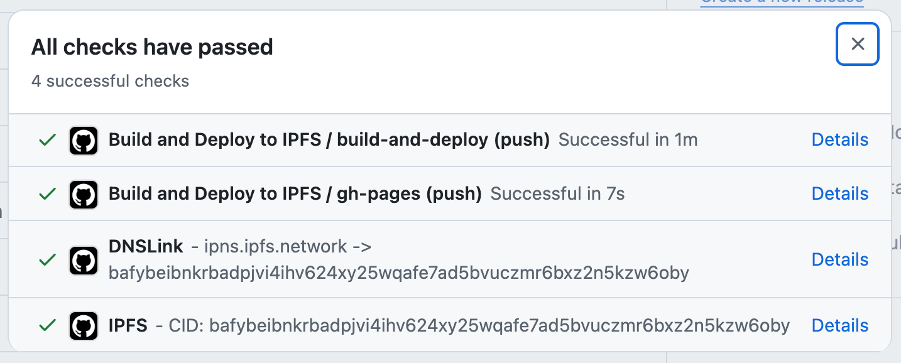
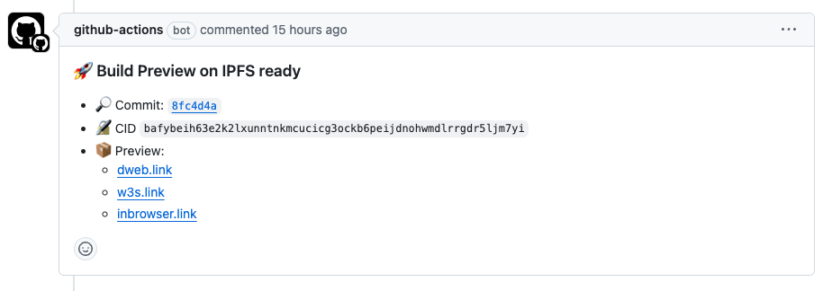
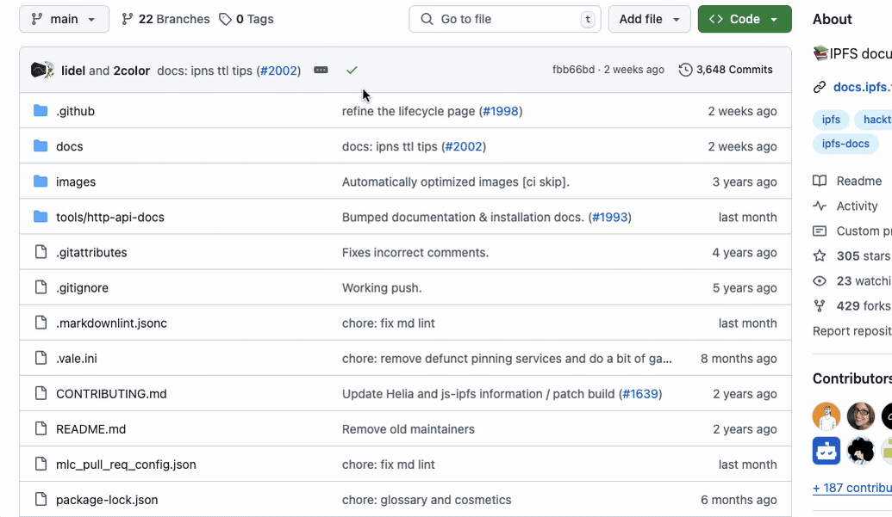

# Deploy static apps to IPFS with GitHub Actions

This guide will walk you through the process of configuring a [GitHub Actions](https://docs.github.com/en/actions) workflow to deploy a repository containing a static site or app to IPFS using the [IPFS Deploy Action](https://github.com/ipshipyard/ipfs-deploy-action).

By the end of this guide, your web app (or just a static website) will be deployed to IPFS automatically when you push to your repository. It will also deploy pull request previews for each commit, and provide some other developer experience features, like commit status updates with the CID of the build, and a comment on pull requests with the IPFS CID and preview links.





Once deployed, each deployment of your app will be addressed by a CID and accessible via [recursive gateways](https://docs.ipfs.tech/concepts/ipfs-gateway/#recursive-vs-non-recursive-gateways), as well as the [Service Worker Gateway](https://inbrowser.link).

To see what this looks like in a real-world example, check out the [IPNS Inspector](https://github.com/ipshipyard/ipns-inspector).

## What is the IPFS Deploy Action?

The [IPFS Deploy Action](https://github.com/ipshipyard/ipfs-deploy-action) is a [composite action](https://docs.github.com/en/actions/creating-actions/creating-a-composite-action) that you call as a step in a [GitHub Actions workflow](https://docs.github.com/en/actions/writing-workflows). It owns one stage of the deploy: turning your build into a [CAR](../../concepts/glossary.md#car) file with a deterministic root CID.

- 📦 Merkleizes your static site into a CAR file
- 🚀 Pins the CAR to your own [IPFS Cluster](https://ipfscluster.io/) or [Kubo](https://github.com/ipfs/kubo#readme) node, when you configure one
- 🧩 Hands the same CAR to any third-party pinning service as a follow-up step
- 💬 PR previews, with a comment containing the CID and preview links
- ✅ Commit status updates

Because the CAR is finished before any third party sees it, pinning is composable. A pinning service stores the bytes; it does not re-derive the CID. You can pass one CAR to as many services as you like.

The action makes no assumptions about your build process. Whether you use React, Vuepress, Astro, Next.js, or any other static site generator, this guide applies. The only requirement is that your app is static: once built, it is a folder of HTML, CSS, and JavaScript served as-is to the client.

## Prerequisites

Before you begin, make sure you have:

1. A GitHub repository with your static web application. This can be a single page application, or a multi-page application (like Next.js) that requires no server-side rendering or backend logic.
2. Somewhere to pin the result. Either your own IPFS node ([Kubo](https://github.com/ipfs/kubo#readme) or [IPFS Cluster](https://ipfscluster.io/)) with a publicly reachable [Kubo RPC](../../reference/kubo/rpc.md) endpoint (see [securing the Kubo RPC endpoint](../kubo-rpc-tls-auth.md)), or an account with a third-party pinning service.

Pinning is optional. You can start without it: the action still produces a CAR file and attaches it to the workflow run, which is enough to inspect the CID before you commit to a provider.

## Step 1: Create the CAR

Create a new file `.github/workflows/deploy.yml` in your repository:

```yaml
name: Deploy to IPFS

permissions:
  contents: read
  pull-requests: write
  statuses: write

on:
  push:
    branches:
      - main
  pull_request:

jobs:
  deploy:
    runs-on: ubuntu-latest
    steps:
      - name: Checkout code
        uses: actions/checkout@v4

      - name: Setup Node.js
        uses: actions/setup-node@v4
        with:
          node-version: 'lts/*'
          cache: 'npm'

      - name: Install dependencies
        run: npm ci

      - name: Build project
        run: npm run build

      - name: Deploy to IPFS
        uses: ipshipyard/ipfs-deploy-action@v2
        id: deploy
        with:
          path-to-deploy: dist # Change this to your build output directory
          github-token: ${{ github.token }}
```

A couple of things to note:

- This workflow assumes your build command is `npm run build`. If yours differs, change the `run` command in the build step.
- Set `path-to-deploy` to whatever directory your build writes to, such as `dist`, `out`, `public`, or `_site`.

With only `path-to-deploy` and `github-token` set, the action produces the CAR and stops. The root CID is exposed as the `cid` output and the file path as `car-path`, so later steps can pin it. PR comments and commit status stay quiet until you pin somewhere or set `set-pr-comment` and `set-github-status` explicitly.

If your repository accepts pull requests from forks, secrets are not available to fork builds. Use the [dual-workflow setup](https://github.com/ipshipyard/ipfs-deploy-action#dual-workflows-with-fork-prs) instead, which splits building from deploying.

## Step 2: Pin the CAR

### Pin to your own node

The action pins to IPFS Cluster and Kubo natively. Add your credentials as [GitHub secrets](https://docs.github.com/en/actions/security-for-github-actions/security-guides/using-secrets-in-github-actions), then pass them in.

For an IPFS Cluster:

```yaml
- name: Deploy to IPFS
  uses: ipshipyard/ipfs-deploy-action@v2
  with:
    # ... other inputs ...
    cluster-url: ${{ secrets.CLUSTER_URL }}
    cluster-user: ${{ secrets.CLUSTER_USER }}
    cluster-password: ${{ secrets.CLUSTER_PASSWORD }}
```

For a Kubo node, using its [RPC endpoint](https://github.com/ipfs/kubo/blob/master/docs/config.md#addressesapi) and [API token](https://github.com/ipfs/kubo/blob/master/docs/config.md#apiauthorizations):

```yaml
- name: Deploy to IPFS
  uses: ipshipyard/ipfs-deploy-action@v2
  with:
    # ... other inputs ...
    kubo-api-url: ${{ secrets.KUBO_API_URL }}
    kubo-api-auth: ${{ secrets.KUBO_API_AUTH }}
```

Configure a provider fully or not at all. Setting `cluster-url` without `cluster-user` and `cluster-password` is a hard error rather than a silent skip, and the same rule applies to the two Kubo inputs.

For the full list of tuning options, including `kubo-version`, `cid-profile`, pin expiry, and retry behavior, see [Inputs](https://github.com/ipshipyard/ipfs-deploy-action#inputs) in the action's README.

### Pin with a third-party service

Third-party pinning is a follow-up step that consumes the CAR the action just produced. Each recipe below is copy-pasteable and reads `steps.deploy.outputs.car-path` and `steps.deploy.outputs.cid`:

- [Filecoin via the `filecoin-pin` CLI](https://github.com/ipshipyard/ipfs-deploy-action/blob/main/docs/recipes/filecoin-pin.md)
- [Pinata via the V3 Files API](https://github.com/ipshipyard/ipfs-deploy-action/blob/main/docs/recipes/pinata.md)
- [Filebase via the S3 endpoint](https://github.com/ipshipyard/ipfs-deploy-action/blob/main/docs/recipes/filebase.md)

The CAR is also uploaded as a workflow artifact by default, so a pinning step can run in a separate job that downloads it.

## Accessing your deployed site

After a successful deployment, you can find the CID for a commit:

1. In the GitHub Actions run output
2. In the PR comment, if deploying from a PR
3. In the commit status checks

For example, here's where you can find the CID for a given commit on GitHub:



You can load the app using the CID from the commit status, and it will be accessible through:

- [Public Good Gateway](../../concepts/public-utilities.md#public-ipfs-gateways): `https://<CID>.ipfs.dweb.link`
- [Service Worker Gateway](https://inbrowser.link): `https://<CID>.ipfs.inbrowser.link`

If your pinning service runs its own gateway, that will work too.

### With IPFS Desktop or Kubo

If you have IPFS Desktop or Kubo installed, you can load the site with the local gateway they expose.

For example, here's the URL for a given CID: `http://bafybeicbpllqfrjfygcdwkz2q5prdtu4q7obmsqr2fkk5byn45rs24ypcu.ipfs.localhost:8080`

This URL uses subdomain resolution (where the CID has its own subdomain), which ensures [origin isolation](../gateway-best-practices.md/#use-subdomain-gateway-resolution-for-origin-isolation) per CID.

## Troubleshooting

1. **Build output directory not found**

   - Double-check that `path-to-deploy` matches your build output directory
   - Ensure your build command is completing successfully

2. **Authentication issues**

   - Verify your credentials are correctly set in GitHub secrets
   - Check that the secrets are properly referenced in the workflow file
   - For IPFS Cluster, ensure URL, username, and password are all provided
   - For Kubo, ensure both API URL and auth are provided

3. **Workflow permission issues**

   - Ensure the `permissions` block is included in your workflow
   - Check that your GitHub token has the necessary permissions

## Best practices

1. Pin the action to a major version, such as `@v2`
2. Pin to more than one provider for redundancy
3. Use environment-specific configurations when needed

## Next steps

After deploying your site to IPFS, you may want to:

- **Add a custom domain**: Use [DNSLink](./dnslink-action.md) to automatically update DNS records so users can access your site via a human-readable domain name like `yourdomain.com` instead of a CID.
- **Set up a DNSLink gateway**: If you want to serve your site directly from your own domain over HTTPS, see [Setup a DNSLink Gateway](./dnslink-gateway.md).
- **Learn about custom domains**: For an overview of domain options, see [Custom domains and DNSLink](./custom-domains.md).

## Getting help

If you encounter any issues:

1. Check the GitHub Actions run logs for detailed error messages
2. Review the [action's README](https://github.com/ipshipyard/ipfs-deploy-action) for updates
3. Open an issue in the [action's repository](https://github.com/ipshipyard/ipfs-deploy-action/issues/new) with detailed information about your setup and the problem you're experiencing
