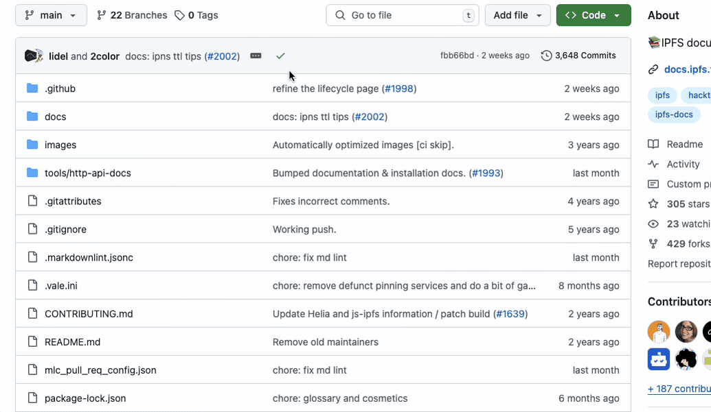

# Deploy Static Apps to IPFS with GitHub Actions

This guide will walk you through the process of configuring a GitHub Actions workflow to deploy a repository containing a static site or app to IPFS using the [IPFS Deploy Action](https://github.com/ipfs/ipfs-deploy-action).

By the end of this guide, your app will be deployed to IPFS automatically when you push to your repository. It will also deploy pull request previews for each commit, and provide some other developer experience features, like commit status updates with the CID of the build, and a comment on pull requests with the IPFS CID and preview links.


Once deployed, each deployment of your app will be addressed by a CID and accessible via [recursive gateways](https://docs.ipfs.tech/concepts/ipfs-gateway/#recursive-vs-non-recursive-gateways), as well as the [Service Worker Gateway](https://inbrowser.link).

To see what this looks like in a real-world example, check out the [IPNS Inspector](https://github.com/ipshipyard/ipns-inspector).

## What is the IPFS Deploy Action?

The IPFS Deploy Action is a [composite action](https://docs.github.com/en/actions/creating-actions/creating-a-composite-action), that can be called as a step in a GitHub Actions workflow, and combines the following features:

- 📦 Merkleizes your static site into a CAR file
- 🚀 Uploads CAR file to either Storacha, IPFS Cluster, or Kubo
- 📍 Optional pinning to Pinata
- 💾 Optional CAR file upload to Filebase
- 💬 PR Previews, with a comment containing the CID and preview links
- ✅ Commit Status updates

The IPFS Deploy Action works with both self-hosted IPFS nodes (Kubo or IPFS Cluster) and pinning services (Storacha, Pinata, Filebase) and was built based on the best practices in 2025.

The IPFS Deploy Action makes no assumptions about your build process. Whether you're using React, Vuepress, Astro, Next.js, or any other static site generator, this guide will help you get your web application deployed on IPFS. The only requirement is that your web application is static, meaning that once built, it is a folder containing HTML, CSS, and JavaScript files that are served as-is to the client.

## Prerequisites

Before you begin, make sure you have:

1. A GitHub repository with your static web application
2. A [Storacha](https://storacha.network) account or an IPFS Node (Kubo or IPFS Cluster) with the RPC endpoint publicly reachable (see [this guide](../kubo-rpc-tls-auth.md) for instructions on how to secure the Kubo RPC endpoint with TLS and authentication)

This guide will use Storacha for simplicity. If you have an IPFS Node, you can skip the Storacha setup and use your own node instead.

## Step 1: Setting Up Storacha

If you don't have a Storacha account, you can create one at [https://storacha.network](https://storacha.network).


1. Install the w3cli tool:

   ```bash
   npm install -g @web3-storage/w3cli
   ```

2. Login to your Storacha account:

   ```bash
   w3 login
   ```

3. Create a new space for your deployments:

   ```bash
   w3 space create my-app-space
   ```

4. Create a signing key:

   ```bash
   $ w3 key create --json
   {
     "did": "did:key:YOUR_KEY_DID",
     "key": "STORACHA_KEY"
   }
   ```

   Save the key value as a GitHub secret named `STORACHA_KEY`

5. Create a UCAN proof. Note that the command will create a UCAN proof allowing uploads to the space created in step 3:

   ```bash
   w3 delegation create did:key:YOUR_KEY_DID -c space/blob/add -c space/index/add -c filecoin/offer -c upload/add --base64
   ```
   Save the output as a GitHub secret named `STORACHA_PROOF`

## Step 2: Configure Your Workflow

Create a new file `.github/workflows/deploy.yml` in your repository:

```yaml
name: Deploy to IPFS

permissions:
  contents: read
  pull-requests: write
  statuses: write

on:
  push:
    branches:
      - main
  pull_request:

jobs:
  deploy:
    runs-on: ubuntu-latest
    steps:
      - name: Checkout code
        uses: actions/checkout@v4

      - name: Setup Node.js
        uses: actions/setup-node@v4
        with:
          node-version: '20'
          cache: 'npm'

      - name: Install dependencies
        run: npm ci

      - name: Build project
        run: npm run build

      - name: Deploy to IPFS
        uses: ipfs/ipfs-deploy-action@v1
        id: deploy
        with:
          path-to-deploy: dist # Change this to your build output directory
          storacha-key: ${{ secrets.STORACHA_KEY }}
          storacha-proof: ${{ secrets.STORACHA_PROOF }}
          github-token: ${{ github.token }}
```

A couple of things to note:

- This workflow assumes that your build command is `npm run build`. If your build command is different, you can change the `run` command in the build step.
- The `path-to-deploy` input is set to `dist` by default. If your build output directory is different, you can change the `path-to-deploy` input.

## Step 3: Optional Configurations

### Uploading the CAR file to a Kubo Node

To upload the CAR file to a Kubo node instead of or in addition to Storacha:

1. Get your Kubo RPC endpoint and API token
2. Add them as GitHub secrets named `KUBO_API_URL` and `KUBO_API_AUTH`
3. Add these lines to your workflow:

```yaml
- name: Deploy to IPFS
  uses: ipfs/ipfs-deploy-action@v1
  with:
    # ... other inputs ...
    kubo-api-url: ${{ secrets.KUBO_API_URL }}
    kubo-api-auth: ${{ secrets.KUBO_API_AUTH }}
```

You can also customize the Kubo version used for merkleizing your content:

```yaml
- name: Deploy to IPFS
  uses: ipfs/ipfs-deploy-action@v1
  with:
    # ... other inputs ...
    kubo-version: 'v0.33.0' # Default, change if needed
    ipfs-add-options: '--cid-version 1 --chunker size-1048576' # Default options
```

### Using IPFS Cluster

To upload the CAR file to an IPFS Cluster:

1. Get your IPFS Cluster URL, username, and password
2. Add them as GitHub secrets
3. Add these lines to your workflow:

```yaml
- name: Deploy to IPFS
  uses: ipfs/ipfs-deploy-action@v1
  with:
    # ... other inputs ...
    cluster-url: ${{ secrets.CLUSTER_URL }}
    cluster-user: ${{ secrets.CLUSTER_USER }}
    cluster-password: ${{ secrets.CLUSTER_PASSWORD }}
```

You can also configure additional IPFS Cluster options:

```yaml
- name: Deploy to IPFS
  uses: ipfs/ipfs-deploy-action@v1
  with:
    # ... other inputs ...
    cluster-retry-attempts: '3' # Default number of retry attempts
    cluster-timeout-minutes: '5' # Default timeout in minutes per attempt
    ipfs-cluster-ctl-version: 'v1.1.2' # Default version
    cluster-pin-expire-in: '720h' # Optional: Set pin to expire after time period (e.g., 30 days)
```

This works by sending a request to the Pinning API with the CID of the deployment, and Pinata handles pinning in the background.

To pin your content to Pinata:

1. Get your Pinata JWT token from the Pinata dashboard
2. Add it as a GitHub secret named `PINATA_JWT`
3. Add these lines to your workflow:

```yaml
- name: Deploy to IPFS
  uses: ipfs/ipfs-deploy-action@v1
  with:
    # ... other inputs ...
    pinata-jwt-token: ${{ secrets.PINATA_JWT_TOKEN }}
    pinata-pinning-url: 'https://api.pinata.cloud/psa' # Default URL
```

### Adding Filebase Storage

To store CAR files on Filebase:

1. Create a Filebase account and bucket
2. Get your access and secret keys
3. Add them as GitHub secrets
4. Add these lines to your workflow:

```yaml
- name: Deploy to IPFS
  uses: ipfs/ipfs-deploy-action@v1
  with:
    # ... other inputs ...
    filebase-bucket: 'your-bucket-name'
    filebase-access-key: ${{ secrets.FILEBASE_ACCESS_KEY }}
    filebase-secret-key: ${{ secrets.FILEBASE_SECRET_KEY }}
```


## Accessing Your Deployed Site

After successful deployment, you can find the CID for commits:

1. In the GitHub Actions run output, which will contain the IPFS CID
2. In the PR comments (if deploying from a PR)
3. In the commit status checks

For example, here's where you can find the CID for a [given commit on GitHub]():



You can load the app using the CID from the commit status, and it will be accessible through:

- [Public Good Gateway](../../concepts/public-utilities.md#public-ipfs-gateways): `https://<CID>.ipfs.dweb.link`
- [Service Worker Gateway](https://inbrowser.link): `https://inbrowser.link/ipfs/<CID>`
- [Storacha Gateway](https://docs.storacha.network/concepts/ipfs-gateways/) (if using Storacha): `https://<CID>.ipfs.w3s.link`.

### With IPFS Desktop or Kubo

If you have IPFS Desktop or Kubo installed, you can load with the local gateway exposed by IPFS Desktop or Kubo.

For example, here's the URL for a given CID: `bafybeicbpllqfrjfygcdwkz2q5prdtu4q7obmsqr2fkk5byn45rs24ypcu.ipfs.localhost:8080`

This URL uses subdomain resolution (where the CID has its own subdomain), which ensures [origin isolation](../gateway-best-practices.md/#use-subdomain-gateway-resolution-for-origin-isolation) per CID.

## Troubleshooting

1. **Build Output Directory Not Found**

   - Double-check the `path-to-deploy` matches your build output directory
   - Ensure your build command is completing successfully

2. **Authentication Issues**

   - Verify your credentials are correctly set in GitHub secrets
   - Check that the secrets are properly referenced in the workflow file
   - For Storacha, ensure both the key and proof are provided
   - For IPFS Cluster, ensure URL, username, and password are all provided
   - For Kubo, ensure both API URL and auth are provided

3. **Workflow Permission Issues**
   - Ensure the `permissions` block is included in your workflow
   - Check that your GitHub token has the necessary permissions

## Best Practices

1. Always use a specific version of the action (e.g., `@v1`)
2. Set up proper caching for your dependencies to speed up builds
3. Consider using multiple IPFS providers for redundancy
4. Use environment-specific configurations when needed
  

## Getting Help

If you encounter any issues:

1. Check the GitHub Actions run logs for detailed error messages
2. Review the [action's README](https://github.com/ipfs/ipfs-deploy-action) for updates
3. Open an issue in the action's repository with detailed information about your setup and the problem you're experiencing
