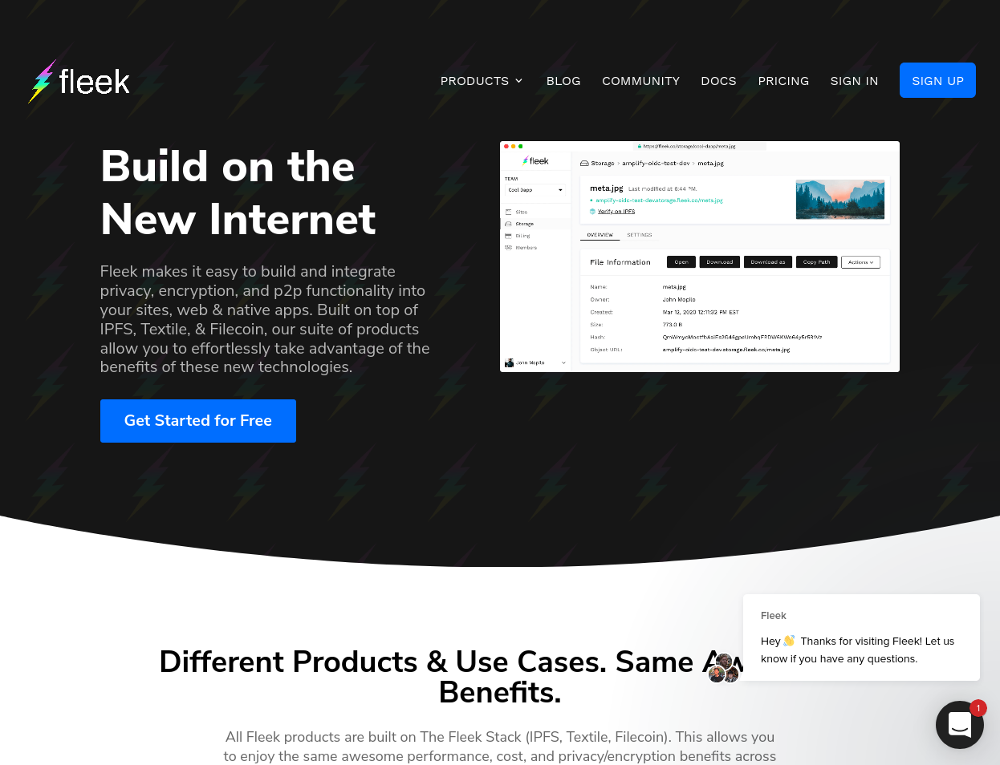
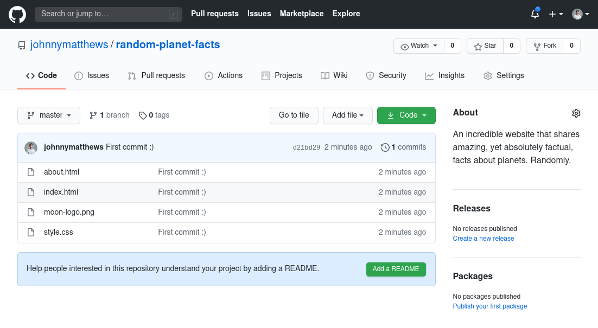
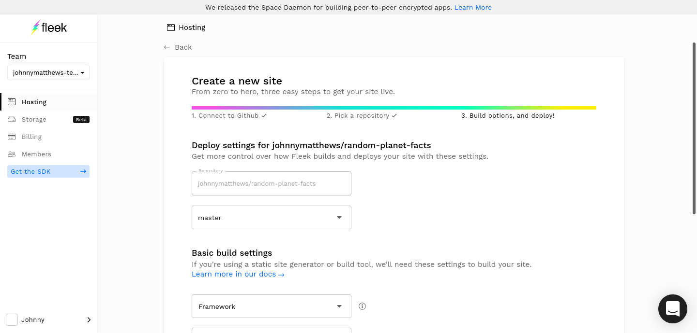
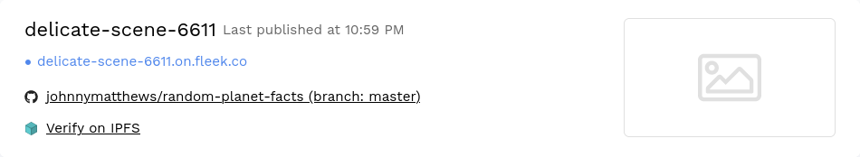
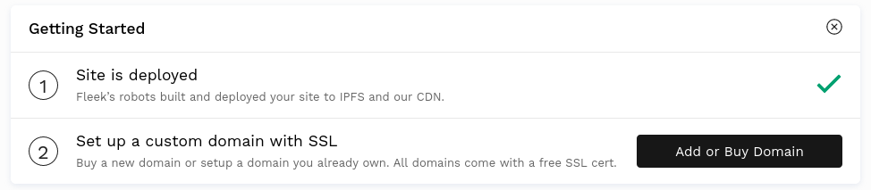

# Introducing Fleek

Most of the steps we've covered in this tutorial series have been fairly manual. Wouldn't it be nice if there were a service that did all the busy work for you, so you could focus on hosting great websites on IPFS? That's where Fleek comes in!

Fleek is a service that lets you host a website on IPFS without needing to install anything on your computer or deal with the command-line.

We already know that files and folders on IPFS are content-addressed, meaning you can find them using the hash of their content. If the content changes, then the hash changes too. As we've seen in previous lessons, this can be an issue when it comes to updating a website. A single character change to an HTML file will create an entirely new hash!

Fleek offers a simple workflow. Once you've pushed your changes to Git, Fleek builds, pins, and updates your site! The sevice also integrates well with React, Next.js, Gatsby, Jekyll, Hugo, and [a bunch of other popular development frameworks](https://docs.fleek.co/hosting/site-deployment/#common-frameworks). You can also manage your domains through Fleek, and monitor your sites in a similar method to traditional web development.

If you're looking to host a fast website on IPFS, Fleek is a great option! For more information check out [Fleek.co](https://fleek.co) and [their documentation](https://docs.fleek.co/).

## Host a site

If you've never used a service like Fleek, or just need a refresher, this quick guide walks through adding a website to a GitHub repository and linking that repo to your Fleek account.

We're going to re-use the Random Planet Facts site we created in a previous tutorial. If you've been following this tutorial series, you should already have this project ready to go! If you don't, just download the [project `.zip` here](https://github.com/johnnymatthews/random-planet-facts/archive/master.zip) or [clone this repository](https://github.com/johnnymatthews/random-planet-facts).

### Upload to GitHub

If you cloned the Random Planet Facts repo above, you don't need to follow this section.

1. Log into [GitHub](https://github.com).
1. Create a new repository and upload the Random Planet Facts project.
1. Your project repository should look something like this:

   

### Add a repository to Fleek

1. Go to [Fleek.co](https://fleek.co/) and sign in using your GitHub account. You may need to allow Fleek to access your GitHub profile.
1. Once logged in, click **Add new site**.
1. Select **Connect with GitHub** and find the site that you want to host on IPFS.
1. Leave all the options with their default settings. Since we're not dealing with a special framework or a repository with lots of branches we don't have to change anything here.

   

1. Click **Deploy site**. Fleek will add your site into the build queue. Once it's done you can click **Verify on IPFS** to view your site!

   

   Fleek will also assign you a random URL to view your site like [`delicate-scene-6611`](https://delicate-scene-6611.on.fleek.co/)

## Domain names

Fleek allows you to configure your domain names with your sites on IPFS! No more wrangling with DNSlink or IPNS. You can even buy domains directly through Fleek. Click **Add or Buy Domain** to get started. [Check out the Fleek documentation for more information on how to get your domain linked up →](https://docs.fleek.co/hosting/domain-management/)

## Up next

For the final tutorial in this series, we're going to take a quick look at [static-site generators, and how to host them on IPFS](../static-site-generators).
