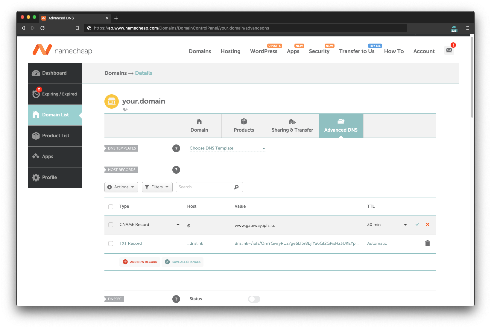

# Link a domain

In this guide you will learn how to link up an existing domain name to the CID of your site on IPFS. You'll be able to visit `www.YourDomainName.com` and view your website's content hosted on IPFS. We'll show you how to do this is a general Domain Name System (DNS), along with one purchased through the Ethereum Naming System (ENS).

## DNS

To get started you'll need:

- A domain name registrar
- A website.
- An idea for a domain name.

Access your registrar's control panel to manage the CNAME record and TXT record.

CNAME: `www.gateway.ipfs.io.`

TXT: `dnslink=/ipfs/$SITE_CID`

Save and in a few hours, you'll be able to go to www.YourDomainName.com and view your website.

## ENS

<!-- What the ENS is. What it's used for. -->

ENS is a decentralized way to address resources. Similar to DNS, where it converts human readable names to IP, ENS converts human readable names such as `randomplanetfacts.eth.link` to Ethereum addresses.

<!-- How it compares to other DNS systems. -->

ENS is built on smart contracts on the Ethereum blockchain. This means ENS is decentralized with no central point of failure and allows anyone to register for a domain.

To get started you'll need:

- Metamask installed.
- A website.
- An idea for a domain name.

You'll also need some amount of `ETH`. Due to how the Ethereum domain name system works, the amount you need changes with time.

### Purchase an Ethereum domain name

1. Go to [app.ens.domains](https://app.ens.domains/).
2. Log into MetaMask.

   

3. Search for the domain you want to use:

   

4. Click on the domain if it's available.
5. Click **Request To Register**:

   

6. In the MetaMask window that pops up, click **Confirm**. This action will cost you `ETH`.
7. Wait for the _Request to register_ transaction to complete. This process can take a couple of minutes:

   

8. Once the transaction has completed, ENS requires that you wait for around a minute. This delay is to make sure there is no-one else attempting to purchase the same domain at the same time as you.

   

9. Click **Register**. Then click **Confirm** in the MetaMask window that pops up.

   

10. Wait for the transaction to be confirmed. This process can take a couple of minutes:

    

    You should now be able to see all the settings for your `.eth` domain:

    

### Link your IPFS content identifier (CID)

11. Click the plus `+` icon next to **Records**.

    

12. Select **Content** from the dropdown.

    

13. Set the **Content** text box as the CID of your website, prefixed with `ipfs://`.

    

14. Confirm this change by clicking **Confirm** in the MetaMask pop-up.

    

    This transaction can take a couple of minutes to complete.

In a few minutes, you'll be able to go to `Your_Domain.eth/` and view your website (note the tailing slash). Because `.eth` is not a registered DNS top-level domain, it is normally inaccessible through regular browsers.

[Eth.link](https://eth.link/) provides a way for any browser to access your website. Simply append `.link` to your domain `Your_Domain.eth.link`. There are no additional steps for this. Simply give it time to propagate.
