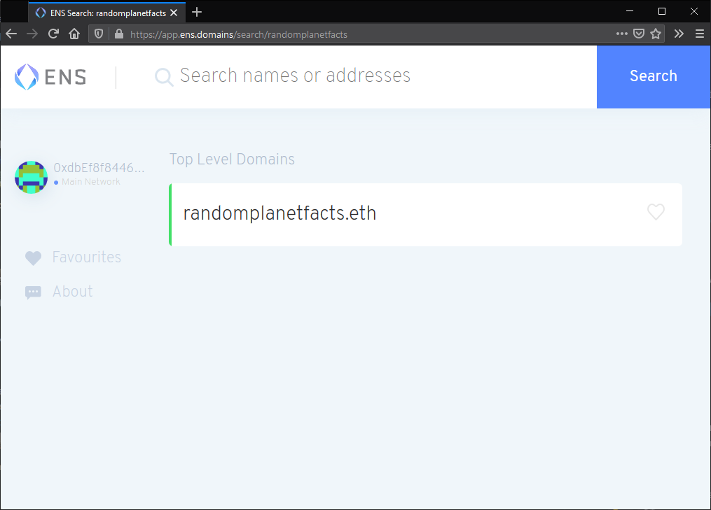
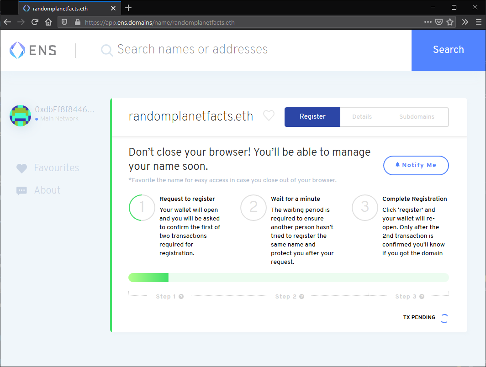
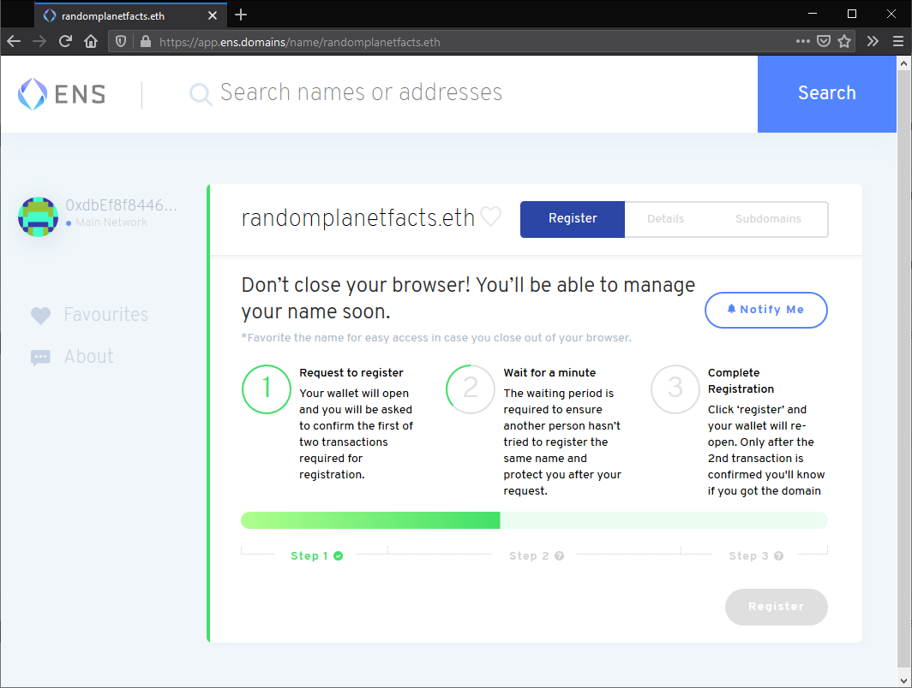
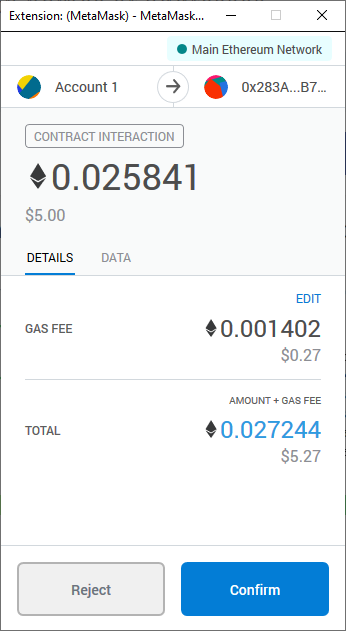
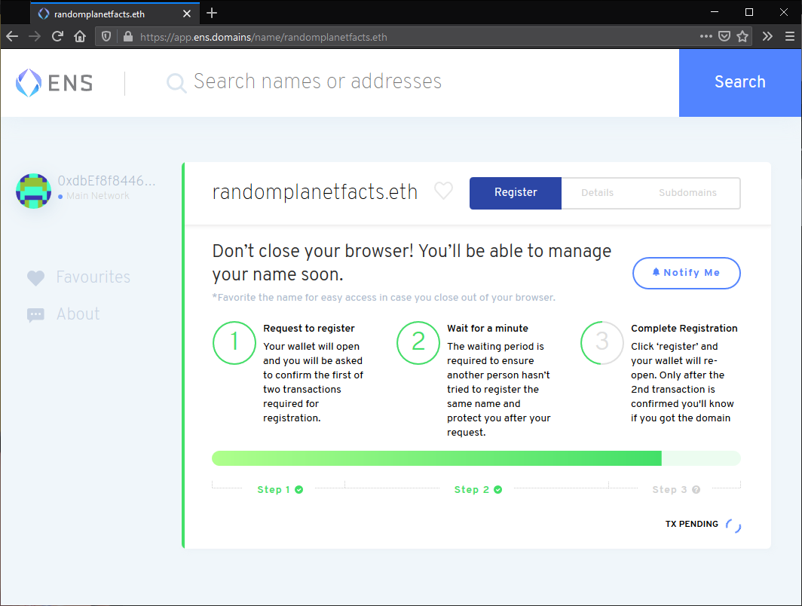
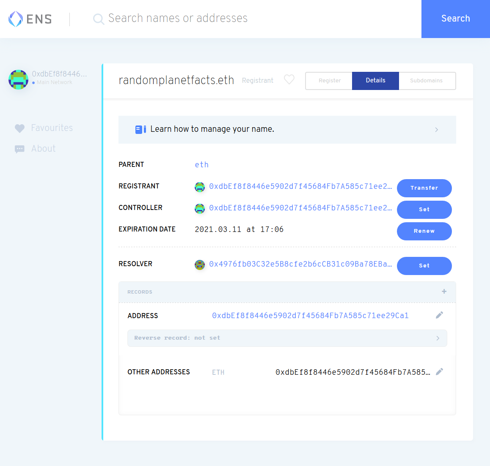
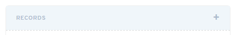
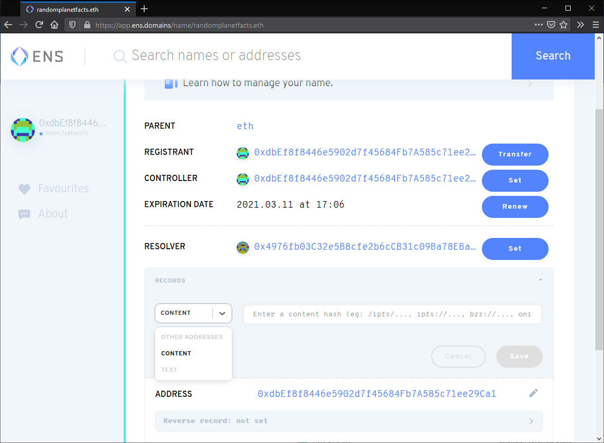
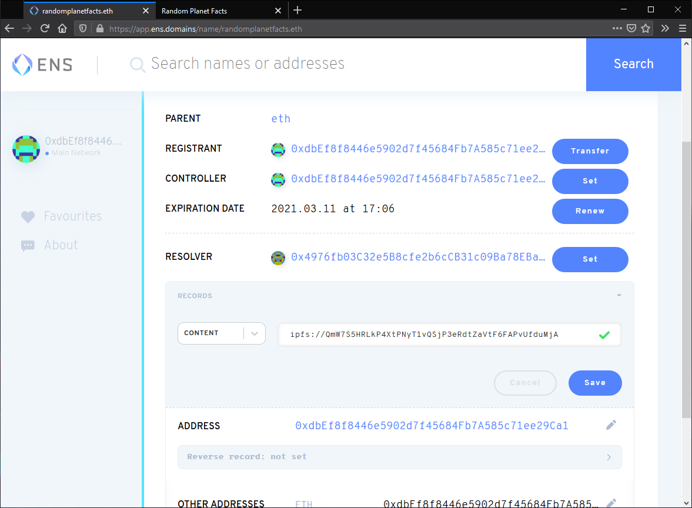
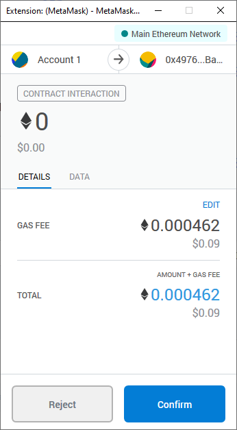

# Link a domain

Users can view your website by entering its content identifier (CID) into their address bar. But, much like IP addresses, CIDs aren't particularly user-friendly or nice to look at. To fix this, we can map a domain name to your CID, so when users visit `www.YourDomain.com` they'll be forwarded to your site hosted on IPFS. This guide shows you how to map a regular domain name through DNS, and decentralized domains through the Ethereum naming service (ENS) or Handshake.

This section is completely optional, but following it will give you a solid grasp on how to manage domain names with IPFS.

## Domain name service (DNS)

See [dnslink.io](https://dnslink.io) for explanation and instructions.

## Ethereum naming service (ENS)

The Ethereum Name Service (ENS) is a decentralized way to address resources. Like DNS, which converts human-readable names to IP addresses, ENS converts human-readable names such as `randomplanetfacts.eth.link` to Ethereum addresses. These addresses can then be used to point to CIDs on IPFS. Without going into too much detail, ENS aims to fix some of DNS's problems, mainly man-in-the-middle attacks and scalability. For more information on why DNS is broken, [check out Cynthia Taylor's post on recompilermag.com](https://recompilermag.com/issues/issue-1/the-web-is-broken-how-dns-breaks-almost-every-design-principle-of-the-internet/).

### Things you'll need 

You need these things to get a domain name through ENS:

- The [Metamask](https://metamask.io/) browser extension installed.
- An Ethereum account with some `ETH` in it.
- A website hosted on IPFS. If you've been following this tutorial series, you should already have a website and CID ready.
- A cool idea for a domain name!

:::tip The price of domain names
The cost of your domain depends on a few things:

- Which domain you want to purchase.
- The current price of ETH.
- The gas fees associated with your transaction.
- How long you want the domain for. 

The more years you choose to prepay, the less you will spend on gas fees overall: `(1 year + 1 gas fee) < (10 years + 1 gas fee) < (10 * (1 year + 1 gas fee))`
:::

### Purchase an Ethereum domain name

1. Go to `ens.eth` using a browser that supports ENS domains, like Brave or Opera. You can also go to [app.ens.domains](https://app.ens.domains/) to use regular DNS and the centralized web.
2. Log in to MetaMask:

   

3. Search for the domain you want to use:

   

4. Click on the domain if it's available.
5. Click **Request To Register**:

   

6. In the MetaMask window that pops up, click **Confirm**. This action will cost you `ETH`.
7. Wait for the _Request to register_ transaction to complete. This process can take a couple of minutes:

   

8. ENS requires that you wait for around a minute once the transaction has been completed. This delay is to make sure there is no-one else attempting to purchase the same domain at the same time as you:

   

9. Click **Register**. Then click **Confirm** in the MetaMask window that pops up:

   

10. Wait for the transaction to be confirmed. This process can take a couple of minutes:

    

    You should now be able to see all the settings for your `.eth` domain:

    

### Link your IPFS content identifier (CID)

11. Click the plus `+` icon next to **Records**:

    

12. Select **Content** from the dropdown:

    

13. Set the **Content** text box as the CID of your website, prefixed with `ipfs://`:

    

14. Confirm this change by clicking **Confirm** in the MetaMask pop-up:

    

    This transaction can take a couple of minutes to complete.

In a few minutes, you'll be able to go to `Your_Domain.eth/` and view your website. Note the trailing slash `/`. Because `.eth` is not a registered DNS top-level domain, it is normally inaccessible through regular browsers.

[Eth.link](https://eth.link/) provides a way for any browser to access your website. Just append `.link` to your domain. For example, `Your_Domain.eth.link`. There are no additional steps required for this.

## Handshake 

Handshake is a blockchain built specifically for DNS. 

When you attempt to visit a website like GitHub.com, your browser will first need to figure out how to get to .com’s servers. To find .com, your browser will consult something called the root zone file — you can think of it like a spreadsheet where Column A are the top-level domains like .com, .net, .org, .io, and Column B are the servers each TLD points to. Controlling the root zone file is a single entity called ICANN, and they alone dictate whether you’re allowed to have a top-level domain. 

Handshake is shifting control of the root zone file away from ICANN to a decentralized blockchain. From a practical standpoint, Handshake provides fully decentralized and uncensorable top-level domains that you can own and use for your websites. To learn more, visit the [Namebase Learning Center](https://learn.namebase.io).

### Prerequisites

Before we get started, you will need:

- A [Handshake domain](https://learn.namebase.io/starting-from-zero/how-to-get-a-name)
- The CID of your website hosted on IPFS
- A [way for resolving Handshake domains](https://www.namebase.io/blog/how-to-access-handshake-domains/) (to test the setup)

### Bare TLD

1. Access your name's DNS records. You're looking for where you can add `ALIAS` and `TXT` records for your domain.
1. Create an `ALIAS` record:
    a. Set the **Host** to `@`.
    a. Set the **Value** to `ipfs.namebase.io.` and notice the trailing dot `.` at the end of `ipfs.namebase.io.`
1. Create a `TXT` record:
    a. Set the **Host** to `_dnslink`.
    a. Set the value to `dnslink=/ipfs/SITE_CID`, replacing `SITE_CID` with the CID of your website.
1. Save your changes.

You should now be able to visit your IPFS website at your Handshake domain! If your Handshake name is `yourname/`, you can visit your website at <!-- markdown-link-check-disable--> http://yourname/ 
<!-- markdown-link-check-enable--> (no dots, just yourname/!)

### Subdomain

If you want to create your website on a subdomain rather than a bare TLD (e.g. `sub.yourname/` vs. `yourname/`), follow these instructions instead:

1. Access your name's DNS records. You're looking for where you can add `CNAME` and `TXT` records for your domain.
1. Create a `CNAME` record:
   a. Set the **Host** to `sub`, replacing `sub` with your desired subdomain name.
   b. Set the **Value** to `ipfs.namebase.io.` and notice the trailing dot `.` at the end of `ipfs.namebase.io.`
1. Create a `TXT` record:
   a. Set the **Host** to `_dnslink.sub`, replacing `sub` with your desired subdomain name.
   b. Set the value to `dnslink=/ipfs/SITE_CID`, replacing `SITE_CID` with the CID of your website.
1. Save your changes.

You should now be able to visit your IPFS website at your Handshake domain! If your Handshake name is `sub.yourname/`, you can visit your website at
<!-- markdown-link-check-disable--> http://sub.yourname/ 
<!-- markdown-link-check-enable-->

::: tip
If you prefer to use Handshake-powered DNSLink with your custom gateway, run [`ipfs daemon`](../../install/command-line.md) with config that has a Handshake resolver enabled for your domain: `ipfs config --json DNS.Resolvers '{ "yourname": "https://query.hdns.io/dns-query" }`. Learn how to run a self-hosted, site-specific DNSLink gateway from [gateway recipes in Kubo config docs](https://github.com/ipfs/kubo/blob/master/docs/config.md#gateway-recipes).
:::
