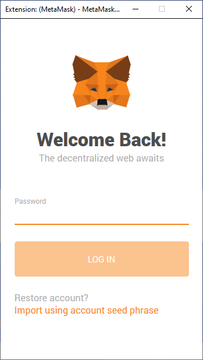

# Link a domain

Users can view your website by entering its content identifier (CID) into their address bar. But, much like IP addresses, CIDs aren't particularly user-friendly or nice to look at. To fix this, we can map a domain name to your CID, so when users visit `www.YourDomain.com` they'll be forwarded to your site hosted on IPFS. This guide shows you how to map a regular domain name through DNS and a decentralized domain through the Ethereum naming service.

This section is completely optional, but following it will give you a solid grasp on how to manage domain names with IPFS.

## Domain name service (DNS)

We're going to walk through mapping a domain name to a CID. It doesn't matter which domain name registrar you use since all the steps are the same, but the links and settings will be in different places.

### Things you'll need

Before we get started, you will need:

- A domain name, preferably one not already registered to a website.
- The CID of your website hosted on IPFS. If you've been following this tutorial series, you should already have a website and CID ready.

1. Access your registrar's control panel. You're looking for where you can manage the `CNAME` record and `TXT` records for your domain.
1. Create a `CNAME` record.
   a. Set the **Host** to `@`.
   b. Set the **Value** to `gateway.ipfs.io.` Notice the trailing dot `.` at the end of `gateway.ipfs.io.`.
1. Create a `TXT` record.
   a. Set the **Host** to `_dnslink`.
   b. Set the value to `dnslink=/ipfs/SITE_CID`, replacing `SITE_CID` with the CID of your website.
1. Save your changes.

DNS changes can take a while to propagate through the internet. Your domain should eventually point to your IPFS hosted site! Why not try doing the same thing with the [Ethereum naming service](#ethereum-naming-service)?

## Ethereum naming service (ENS)

The Ethereum naming service (ENS) is a decentralized way to address resources. Like DNS, which converts human-readable names to IP addresses, ENS converts human-readable names such as `randomplanetfacts.eth.link` to Ethereum addresses. These addresses can then be used to point to CIDs on IPFS. Without going into too much detail, ENS aims to fix some of DNS's problems, mainly man-in-the-middle attacks and scalability. For more information on why DNS is broken, [check out Cynthia Taylor's post on recompilermag.com](https://recompilermag.com/issues/issue-1/the-web-is-broken-how-dns-breaks-almost-every-design-principle-of-the-internet/).

### Before we get started

You need these things to get a domain name through ENS:

- The [Metamask](https://metamask.io/) browser extension installed.
- An Ethereum account with some `ETH` in it.
- A website hosted on IPFS. If you've been following this tutorial series, you should already have a website and CID ready.
- A cool idea for a domain name!

:::tip The price of domain names
The cost of your domain depends on a few things:

- Which domain you want to purchase.
- The current price of ETH.
- The gas fees associated with your transaction.
- How long you want the domain for. 

The more years you choose to prepay, the less you will spend on gas fees overall: `(1 year + 1 gas fee) < (10 years + 1 gas fee) < (10 * (1 year + 1 gas fee))`
:::

### Purchase an Ethereum domain name

1. Go to [app.ens.domains](https://app.ens.domains/).
2. Log in to MetaMask:

   

3. Search for the domain you want to use:

   

4. Click on the domain if it's available.
5. Click **Request To Register**:

   

6. In the MetaMask window that pops up, click **Confirm**. This action will cost you `ETH`.
7. Wait for the _Request to register_ transaction to complete. This process can take a couple of minutes:

   

8. ENS requires that you wait for around a minute once the transaction has been completed. This delay is to make sure there is no-one else attempting to purchase the same domain at the same time as you:

   

9. Click **Register**. Then click **Confirm** in the MetaMask window that pops up:

   

10. Wait for the transaction to be confirmed. This process can take a couple of minutes:

    

    You should now be able to see all the settings for your `.eth` domain:

    

### Link your IPFS content identifier (CID)

11. Click the plus `+` icon next to **Records**:

    

12. Select **Content** from the dropdown:

    

13. Set the **Content** text box as the CID of your website, prefixed with `ipfs://`:

    

14. Confirm this change by clicking **Confirm** in the MetaMask pop-up:

    

    This transaction can take a couple of minutes to complete.

In a few minutes, you'll be able to go to `Your_Domain.eth/` and view your website. Note the trailing slash `/`. Because `.eth` is not a registered DNS top-level domain, it is normally inaccessible through regular browsers.

[Eth.link](https://eth.link/) provides a way for any browser to access your website. Append `.link` to your domain `Your_Domain.eth.link`. There are no additional steps for this.

## Up next

In the next tutorial in this series, we'll take a look at a tool that will help make this whole process easier: [Fleek](/how-to/websites-on-ipfs/introducing-fleek).
