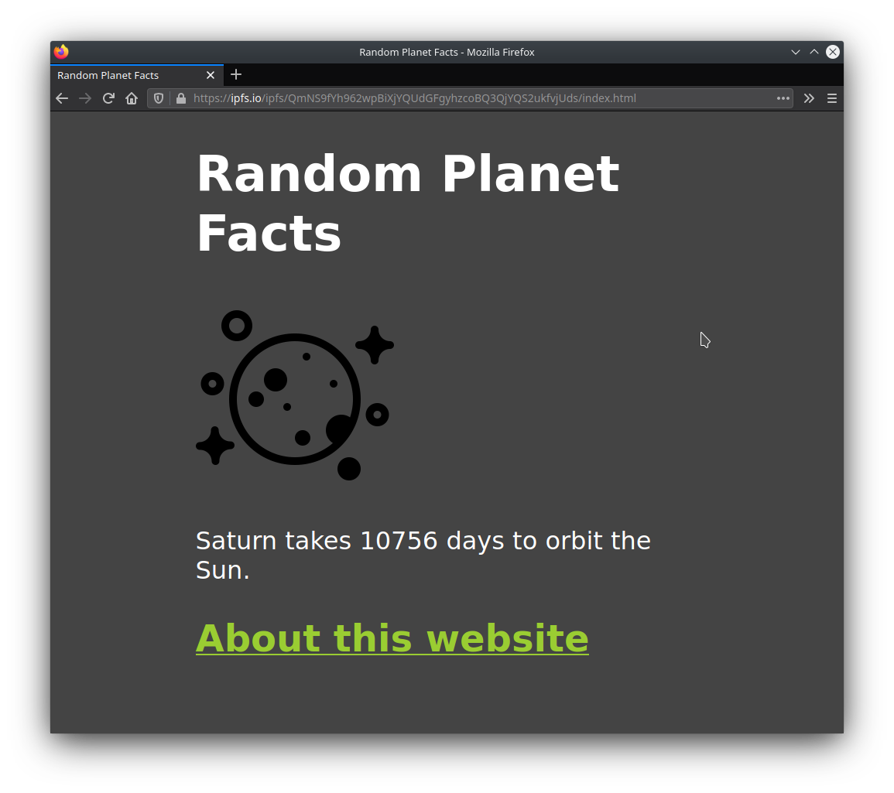

# Multi-page website

In this guide, you will learn how to host a website with multiple pages and external assets on IPFS. This tutorial is the second in a series of tutorials aimed at teaching web developers how to build websites and applications using IPFS. You don't need to have completed the previous tutorial to understand what's going on here, but if you're new to the IPFS ecosystem, it's a good idea to follow through the [single page website guide](../../how-to/websites-on-ipfs/single-page-website.md) before you start this one. It will give you a solid foundation to work off.

## Prerequisites

If you followed the previous tutorial, you would already have the IPFS Desktop application installed. If not, you can grab it from the [IPFS Shipyard](https://github.com/ipfs-shipyard/ipfs-desktop).

## Project set up

Before we dig into IPFS, let's first create the files we'll need for this mini-project.

1. Create a folder called `multi-page-first-step`.
1. Within this new folder, create a file called `index.html` and paste in the following code. We'll continue using the [Random Planet Facts](http://randomplanetfacts.xyz) website from the previous tutorial, with an added link to an _About_ page:

```html
<!DOCTYPE html>
<html lang="en">
  <head>
    <meta charset="utf-8" />
    <title>Random Planet Facts</title>
    <meta
      name="description"
      content="Get a random fact about a planet in our solar system."
    />
    <meta name="author" content="The IPFS Docs team." />
    <style>
      body {
        margin: 15px auto;
        max-width: 650px;
        line-height: 1.2;
        font-family: sans-serif;
        font-size: 2em;
        color: #fff;
        background: #444;
      }
      a {
        color: yellowgreen;
      }
    </style>
  </head>
  <body onload="main()">
    <h1>Random Planet Facts</h1>
    
    <p id="output_p"></p>
    <h2><a href="about.html">About this website</a></h2>
    <script>
      function main() {
        const facts = [
          'Mars is home to the tallest mountain in our solar system.',
          'Only 18 out of 40 missions to Mars have been successful.',
          'Pieces of Mars have fallen to Earth.',
          'One year on Mars is 687 Earth days.',
          'The temperature on Mars ranges from -153 to 20 °C.',
          'One year on Mercury is about 88 Earth days.',
          'The surface temperature of Mercury ranges from -173 to 427°C.',
          'Mercury was first discovered in 14th century by Assyrian astronomers.',
          'Your weight on Mercury would be 38% of your weight on Earth.',
          'A day on the surface of Mercury lasts 176 Earth days.',
          'The surface temperature of Venus is about 462 °C.',
          'It takes Venus 225 days to orbit the sun.',
          'Venus was first discovered by 17th century Babylonian astronomers.',
          'Venus is nearly as big as the Earth with a diameter of 12,104 km.',
          'The Earth\'s rotation is gradually slowing.',
          'There is only one natural satellite of the planet Earth, the moon.',
          'Earth is the only planet in our solar system not named after a god.',
          'The Earth is the densest planet in the solar system.',
          'A year on Jupiter lasts around 4333 earth days.',
          'The surface temperature of Jupiter is around -108°C.',
          'Jupiter was first discovered by 7th or 8th century Babylonian astronomers.',
          'Jupiter has 4 ring.',
          'A day on Jupiter lasts 9 hours and 55 minutes.',
          'Saturn was first discovered by 8th century Assyrians.',
          'Saturn takes 10756 days to orbit the Sun.',
          'Saturn can be seen with the naked eye.',
          'Saturn is the flattest planet.',
          'Saturn is made mostly of hydrogen.',
          'Four spacecraft have visited Saturn.',
          'Uranus was discovered by William Herschel in 1781.',
          'A year on Uranus takes 30687 earth days.',
          'Uranus turns on its axis once every 17 hours, 14 minutes.',
          'With minimum atmospheric temperature of -224°C Uranus is nearly coldest planet in the solar system.',
          'Only one spacecraft has flown by Uranus, the Voyager 2.',
          'Neptune was discovered in 1846 by Urbain Le Verrier and Johann Galle.',
          'Neptune has 14 moons.',
          'The average temperature of Neptune is about -201 °C.',
          'There is a 1:20 million scale model of the solar system in Sweden.',
          'The gap between the Earth and our moon is bigger than the diameters of all the planets combined.',
          'The first accurate calculation of the speed of light was using Jupiter\'s moons',
          'Jupiter\'s magnetic field is believed to be a result of rapidly spinning metallic hydrogen at the core, and is ~10x stronger than the Earth\'s.',
          'Venus spins backwards.',
          'Uranus spins sideways, relative to the ecliptic plane of the solar system.',
          'It is easier to reach Pluto or escape the solar system from Earth than being able to <i>land</i> on the Sun.'
        ]
        document.querySelector('#output_p').innerHTML =
          facts[Math.floor(Math.random() * facts.length)]
      }
    </script>
  </body>
</html>
```

1. Create another file, this time called `about.html` and paste in the following code:

```html
<!DOCTYPE html>
<html lang="en">
  <head>
    <meta charset="utf-8" />
    <title>About | Random Planet Facts</title>
    <meta
      name="description"
      content="Get a random fact about a planet in our solar system."
    />
    <meta name="author" content="The IPFS Docs team." />
    <style>
      body {
        margin: 15px auto;
        max-width: 650px;
        line-height: 1.2;
        font-family: sans-serif;
        font-size: 2em;
        color: #fff;
        background: #444;
      }
      a {
        color: yellowgreen;
      }
    </style>
  </head>
  <body>
    <h1>Random Planet Facts</h1>
    <p>
      This website gives you random facts about the <i>planets</i> our solar
      system! Refresh the homepage to see a new fact!
    </p>
    <h2><a href="index.html">Go back home</a></h2>
    <footer>
      <hr />
      Created by ___.
    </footer>
  </body>
</html>
```

1. Add your name to the `Created by ___.` line. If everyone reading this tutorial just copies and pastes the same code, then everyone will get the _exact same_ CID! While there's nothing wrong with this, it's more fun to use a CID that is unique to your project.
1. Finally, download this image and save it in the folder as `moon-logo.png`:

   

You should now have a folder that looks something like this:

```
  multi-page-first-step/
  ├── about.html
  ├── index.html
  └── moon-logo.png
```

## Add files to IPFS

Now that you've got the project ready, we can add things to IPFS using the IPFS Desktop application. Instead of adding the files individually, we can add the whole project folder, and the IPFS Desktop app will take care of the rest for us!

1. Open the IPFS Desktop application and select **Add** > **Folder**.
1. Select the `multi-page-website` folder. Once it's loaded, you should be able to see the folder within the application:

   

1. Click the triple dot menu to the right and select **Share link**.
1. Click **Copy** and paste the link in a browser. You should be able to see your website with the logo!

   

   Try clicking the link to the about page. You should be able to browse between the pages with no problem.

## Publish to IPNS

:::tip This step is optional
You don't have to complete this section. However, it offers some valuable insight into how IPNS and IPFS work together.
:::

Using CIDs to get content is great; it means that the user always gets the content that they want. But what if the user doesn't know _what_ they're looking for and just wants the _latest_ version of that content? This is where IPNS comes in handy.

Instead of sharing the CID of your website, you publish the root CID of your website to IPNS and then share the _key_ you get from IPNS.

1. Open a terminal window, and navigate to where your multi-page project is saved:

    ```shell
    cd ~/Code/multi-page-first-step
    ```

1. Double check that this project has been added to IPFS by running `ipfs add -r .`:

    ```shell
    ipfs add -r .

    > added QmP4KNjSaVCR3jTxi8nsMq3DDqGyVUXyc5vfij31J3B3vr multi-page-first-step/about.html
    > added QmYp2jy5t7knzwhkqPJ68amuAqLYJ3DG5vvxgJW6bFdQwN multi-page-first-step/index.html
    > added QmW8U3NEHx3p73Nj9645sGnGa8XzR43rQh3Kd52UKncWMo multi-page-first-step/moon-logo.png
    > added QmchJPQNLE5EUSYTzfzUsNFyPozXyANiZHFDSFKWdLNdRR multi-page-first-step
    > 12.65 KiB / 12.65 KiB [=====================================================] 100.00%
    ```

1. Copy the last CID `QmchJPQN...` from the output of the `ipfs add` command.
1. Publish your project to IPNS using `ipfs name publish /ipfs/QMchJPQN...`. Replace `QMchJPQN...` with the CID you got in the last step:

    ```shell
    ipfs name publish /ipfs/QmchJPQNLE5EUSYTzfzUsNFyPozXyANiZHFDSFKWdLNdRR

    > Published to k51qzi5uqu5dh9gnl66grpnpuhj245ha1xq9ajtmuf7swe847zovdg1t9a0xiz: /ipfs/QmchJPQNLE5EUSYTzfzUsNFyPozXyANiZHFDSFKWdLNdRR
    ```

    The `k51qzi...` is your IPFS installation's key! This is what you can use to point people to your content.

1. You should now be able to view your project by going to `https://gateway.ipfs.io/ipns/k51qzi...`. Replace `k51qzi...` with the output from the previous step.
1. Whenever you make any changes to your project, simply re-add your content to IPFS and publish it to IPNS:

    ```shell
    ipfs add -r .

    > ...
    > added QmchJPQNLE5EUSYTzfzUsNFyPozXyANiZHFDSFKWdLNdRR multi-page-first-step
    12.65 KiB / 12.65 KiB [=====================================================] 100.00%

    ipfs name publish QmchJPQNLE5EUSYTzfzUsNFyPozXyANiZHFDSFKWdLNdRR

    > Published to k51qzi5uqu5dh9gnl66grpnpuhj245ha1xq9ajtmuf7swe847zovdg1t9a0xiz: /ipfs/QmchJPQNLE5EUSYTzfzUsNFyPozXyANiZHFDSFKWdLNdRR
    ```

    Now, just head back to the `https://gateway.ipfs.io/ipns/k51qzi...` link to view your updates!

This is just the tip of the iceberg when it comes to IPNS. [Check out the IPNS page to learn more →](../../concepts/ipns.md)

## Up next

In the next tutorial, we'll look at [linking a domain name to your site!](../../how-to/websites-on-ipfs/link-a-domain.md)

