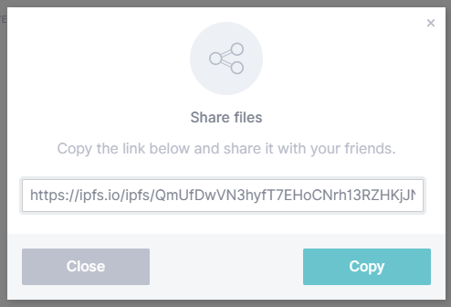

# Host a single-page website on IPFS

In this tutorial, we will host a simple one-page website on IPFS and link up a domain name. This is the first step is a series of tutorials to teach web developers on how to build websites and applications using IPFS.

::: callout
If you are looking for [single-page application (SPA)](https://en.wikipedia.org/wiki/Single-page_application) support, see [redirects and custom 404s](../../how-to/websites-on-ipfs/redirects-and-custom-404s.md) instead.
:::

## Install IPFS desktop

IPFS desktop application is the easiest way to get up and running quickly with IPFS. The installation steps for IPFS desktop differ between operating systems. Follow the instructions for your system.

| [Windows](#windows)                                                        | [macOS](#macos)                                                      | [Linux](#linux)                                                      |
| -------------------------------------------------------------------------- | -------------------------------------------------------------------- | -------------------------------------------------------------------- |
| [](#windows) | [](#macos) | [](#linux) |

Already downloaded? you can [Skip this step](#add-your-site)

### Windows

1. Download the latest available `.exe` file from the [IPFS desktop downloads page](https://github.com/ipfs/ipfs-desktop/releases):

   

2. Run the `.exe` file to start the installation.
3. Select whether you want to install the application for just yourself or all users on the computer. Click **Next**:

   

4. Select the install location for the application. The default location is usually fine. Click **Next**:

   

5. Wait for the installation to finish and click **Finish**:

   

6. You can now find an IPFS icon in the status bar:

   

The IPFS desktop application has finished installing. You can now start to [add your site](#add-your-site).

### MacOS

1. Download the latest available `.dmg` file from the [IPFS desktop downloads page](https://github.com/ipfs/ipfs-desktop/releases):

   

2. Open the `ipfs-desktop.dmg` file.
3. Drag the IPFS icon into the **Applications** folder:

   

4. Open your **Applications** folder and open the IPFS desktop application.
5. You may get a warning saying _IPFS Desktop.app can't be opened_. Click **Show in Finder**:

   

6. Find **IPFS Desktop.app** in your **Applications** folder.
7. Hold down the `control` key, click **IPFS Desktop.app**, and click **Open**:

   

8. Click **Open** in the new window:

   

9. You can now find an IPFS icon in the status bar:

   

The IPFS desktop application has finished installing. You can now start to [add your site](#add-your-site).

### Linux

1. Download the latest available `.deb` file from the [IPFS desktop downloads page](https://github.com/ipfs/ipfs-desktop/releases):
1. Open the `.deb` package in **Software Installer**:

   

1. Click **Install** and wait for the installation to finish:

   

1. Click **Applications** or press the Windows key on your keyboard.
1. Search for `IPFS` and select **IPFS Desktop**:

   

1. You can now find an IPFS icon in the status bar:

   

The IPFS desktop application has finished installing. You can now start to [add your site](#add-your-site).

## Add your site

The next step is to import your site into IPFS using the IPFS desktop app you just installed. The website we'll be using is incredibly simple. The purpose of it is to display random planet-related facts. Each time the page is refreshed, a new fact is displayed. The website is creatively called _Random Planet Facts_.

1. Create a file called `index.html` and paste in the following code:

   ```html
   <!DOCTYPE html>
   <html lang="en">
     <head>
       <meta charset="utf-8" />
       <title>Random Planet Facts</title>
       <meta
         name="description"
         content="Get a random fact about a planet in our solar system."
       />
       <meta name="author" content="The IPFS Docs team." />
       <style>
         body {
           margin: 15px auto;
           max-width: 650px;
           line-height: 1.2;
           font-family: sans-serif;
           font-size: 2em;
           color: #fff;
           background: #444;
         }
       </style>
     </head>
     <body onload="main()">
       <h1>Random Planet Facts</h1>
       <p id="output_p"></p>
       <script>
         function main() {
           const facts = [
             'Mars is home to the tallest mountain in our solar system.',
             'Only 18 out of 40 missions to Mars have been successful.',
             'Pieces of Mars have fallen to Earth.',
             'One year on Mars is 687 Earth days.',
             'The temperature on Mars ranges from -153 to 20 °C.',
             'One year on Mercury is about 88 Earth days.',
             'The surface temperature of Mercury ranges from -173 to 427°C.',
             'Mercury was first discovered in 14th century by Assyrian astronomers.',
             'Your weight on Mercury would be 38% of your weight on Earth.',
             'A day on the surface of Mercury lasts 176 Earth days.',
             'The surface temperature of Venus is about 462 °C.',
             'It takes Venus 225 days to orbit the sun.',
             'Venus was first discovered by 17th century Babylonian astronomers.',
             'Venus is nearly as big as the Earth with a diameter of 12,104 km.',
             "The Earth's rotation is gradually slowing.",
             'There is only one natural satellite of the planet Earth, the moon.',
             'Earth is the only planet in our solar system not named after a god.',
             'The Earth is the densest planet in the solar system.',
             'A year on Jupiter lasts around 4333 earth days.',
             'The surface temperature of Jupiter is around -108°C.',
             'Jupiter was first discovered by 7th or 8th century Babylonian astronomers.',
             'Jupiter has 4 rings.',
             'A day on Jupiter lasts 9 hours and 55 minutes.',
             'Saturn was first discovered by 8th century Assyrians.',
             'Saturn takes 10756 days to orbit the Sun.',
             'Saturn can be seen with the naked eye.',
             'Saturn is the flattest planet.',
             'Saturn is made mostly of hydrogen.',
             'Four spacecraft have visited Saturn.',
             'Uranus was discovered by William Herschel in 1781.',
             'A year on Uranus takes 30687 earth days.',
             'Uranus turns on its axis once every 17 hours, 14 minutes.',
             'With minimum atmospheric temperature of -224°C Uranus is nearly coldest planet in the solar system.',
             'Only one spacecraft has flown by Uranus, the Voyager 2.',
             'Neptune was discovered in 1846 by Urbain Le Verrier and Johann Galle.',
             'Neptune has 14 moons.',
             'The average temperature of Neptune is about -201 °C.',
             'There is a 1:20 million scale model of the solar system in Sweden.',
             'The gap between the Earth and our moon is bigger than the diameters of all the planets combined.',
             "The first accurate calculation of the speed of light was using Jupiter's moons",
             "Jupiter's magnetic field is believed to be a result of rapidly spinning metallic hydrogen at the core, and is ~10x stronger than the Earth's.",
             'Venus spins backwards.',
             'Uranus spins sideways, relative to the ecliptic plane of the solar system.',
             'It is easier to reach Pluto or escape the solar system from Earth than being able to <i>land</i> on the Sun.'
           ]
           document.querySelector('#output_p').innerHTML =
             facts[Math.floor(Math.random() * facts.length)]
         }
       </script>
     </body>
   </html>
   ```

2. Open IPFS desktop and go to the **Files** page.
3. Click **+Import** → **File**.
4. Navigate to your `index.html` file and select **Open**.

   

5. Click the triple dot menu on `index.html` and select **Share link**.
6. Click **Copy** to copy the file's URL to your clipboard.

   

7. Open a browser and paste in the URL you just copied.

Your browser should load the website in a few moments! This can take up to a few minutes the first time. You can move onto the next section while the site is loading.

## Pinning files

IPFS nodes treat the data they store like a cache, meaning that there is no guarantee the data will continue to be stored. _Pinning_ a file tells an IPFS node to treat the data as essential and not throw it away. You should _pin_ any content you consider important to ensure that data is retained over the long term. IPFS Desktop allows you to pin files straight from the _Files_ tab.


However, if you want your IPFS data to remain accessible when your local IPFS node goes offline, you might want to use another option like _collaborative clusters_ or a _pinning service_.

### Collaborative clusters

IPFS collaborative clusters are groups of IPFS nodes that collaboratively pin all content added to the IPFS Cluster by one or many trusted peers. You can learn more about collaborative clusters, including how to set up a cluster yourself, from [ipfscluster.io](https://ipfscluster.io/documentation/collaborative/setup/)

### Pinning services

An easy way to make sure important data is retained is to use a pinning service. These services run lots of IPFS nodes and will _pin_ your data for you! This way, you don't have to run and maintain your own IPFS node. Check out the [Persistence page](../../concepts/persistence.md) for more information on pinning services. In this tutorial, we're going to use [Pinata](https://pinata.cloud) since it gives new users 1GB of storage for free, and has a very simple interface:

1. Go to [Pinata.cloud](https://pinata.cloud) and sign up or log in.
2. Select **Upload** and click **Browse**.
3. Navigate to your `index.html` file and click **Open**.
4. Click **Upload**.
5. You should be able to see your `index.html` file pinned:

   

6. Click your `index.html` file to open your website through the Pinata gateway.

   

## Set up a domain

This section is completely optional.

If you have access to a domain name service like Namecheap, Google Domains, GoDaddy, or any other domain service, then you can follow along with these steps. If you don't have a domain name to assign, you can just read along this section. We will dive into using decentralized naming services like Ethereum Naming Service (ENS) in a later section.

We used Namecheap, but the process is very similar across all domain name services.

1. Log into your domain name provider.
2. Go to your domain management window and find the domain you want to assign to your website.
3. Find where to change the **Redirection Settings**.
4. In a new tab, open [Pinata](https://pinata.cloud/), log in, and copy the **IPFS Hash** for your website.
6. In your domain name providers **Redirection Settings** section, paste in the **IPFS Hash** link you just copied.

   

7. Save your changes.

Domain name services are fairly slow to update. You should be able to go to your domain and see the website you pinned in a few hours.


## Up next

This project was designed to get you up and running quickly, but there are many improvements we can make here.
 
If you're interested in building a more complex site using IPFS and securing it properly, [carry on with this tutorial series by hosting a multipage website on IPFS.](multipage-website.md)

