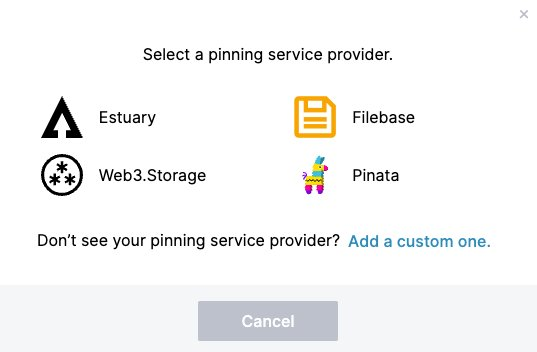

# Work with remote pinning services

**Pinning** in IPFS is a process that ensures that the pinned data is exempt from routine [garbage collection](../concepts/persistence.md#garbage-collection) and is therefore always available. In addition to [locally pinning files](../how-to/pin-files.md), you can use a **remote pinning service**, which abstracts this responsibility away from a local, individual node.
The appropriate solution depends on your particular use case.


1. Determine whether to [use an existing service](#when-to-use-a-remote-pinning-service) or [create your own](#when-to-create-your-own-service).
1. Follow the appropriate steps:
   - [Use an existing service](#use-a-third-party-pinning-service)
   - [Create your own service](#create-your-own-pinning-service)

## When to use a remote pinning service

If you have one local IPFS node that's always running, local pinning ensures that important data is persisted and never garbage collected. On the other hand, if your architecture is more complex, an existing or custom remote pinning service may be useful, especially if:

- Your local node isn't always online, but data must be consistently available.
- You require a persistent backup of your local node's files.
- Your local node does not have enough disk space.
- You run more than one IPFS node, and would like to use one or more of those nodes as your preferred location for permanent storage.

If you've decided that an existing service is right for you, learn [how to use an existing service](#use-a-third-party-pinning-service)

## When to create your own service 

If existing third-party pinning services don't meet your needs, you can create your own. Any remote pinning service compatible with the [IPFS Pinning Service API](https://ipfs.github.io/pinning-services-api-spec) can be added as a custom pinning service. This might be useful in circumstances like:

- Designating your own IPFS node(s) as the preferred location for permanent storage.
- Running a private pinning service for friends, as a business, as a public service, etc.

::: warning
Your service must use the [IPFS Pinning Service API](https://ipfs.github.io/pinning-services-api-spec) in order to be interoperable with clients using [`ipfs pin remote`](../reference/kubo/cli.md#ipfs-pin-remote) commands.
::: 

If you've decided that creating your own pinning service is right for you, learn [how to create your own pinning service](#create-your-own-pinning-service).

## Use a third-party pinning service

Third-party pinning services allow you to purchase pinning capacity for important data. Each service has its own approach to pinning data and managing pins, so users should do their research to ensure that the service meets their particular needs. Service providers include, but are not limited to:

- [Pinata](https://pinata.cloud/)
- [Functionland](https://fx.land/)
- [Filebase](https://filebase.com/)
- [Temporal](https://temporal.cloud/)
- [Crust](https://crust.network/)
- [Infura](https://infura.io/)
- [Scaleway](https://labs.scaleway.com/en/ipfs-pinning/)

::: callout 
As of June 2024, [Functionland](https://fx.land/), [Filebase](https://filebase.com) and [Pinata](https://pinata.cloud/) support the [IPFS Pinning Service API endpoint](https://github.com/ipfs/pinning-services-api-spec).
::: 

To add and use a remote pinning service directly in IPFS, you'll first need to have an account with that service.

The method by which you add a remote pinning service depends on the way in which you are using IPFS:

- [IPFS Desktop or IPFS Web UI](#ipfs-desktop-or-ipfs-web-ui)
- [IPFS Kubo](#ipfs-kubo)

### IPFS Desktop or IPFS Web UI

You can add your favorite pinning service(s) to [IPFS Desktop](../install/ipfs-desktop.md) or [Web UI](https://github.com/ipfs/ipfs-webui) directly, enabling you to pin and unpin items via a UI similar to how you would add or remove local pins.

First, [add the pinning service](#add-a-pinning-service-in-the-ui). Then, you can [use it](#use-a-pinning-service-in-the-ui). 

#### Add a pinning service in the UI

To add a new pinning service to IPFS Desktop or Web UI:

1. Start IPFS Desktop or Web UI
1. In **Settings** , navigate to **Pinning Services**.
1. Click the **Add Service** button.

   

1. In the pop up, select your chosen pinning service. 

   If the pinning service you'd like to use isn't listed in that modal, click **Add a custom one** to add any remote pinning service that supports the [IPFS Pinning Service API spec](https://github.com/ipfs/pinning-services-api-spec#adoption).

   

1. Next, enter the following information:

    - A **nickname** for this service. This can be helpful if, for example, you want to add two accounts from the same service.
    - Your service's **API endpoint URL**. This field only appears if you've selected a custom pinning service.
    - You **secret access token**, provided to you by the pinning service. See your specific pinning service documentation for more info.

    Example using Pinata and [pinata.cloud/keys](https://app.pinata.cloud/keys):
    

    Example using Filebase and [console.filebase.com/keys](https://console.filebase.com/keys):
    

    Comparison between an existing third-party service and a custom service:
    | Third-party service (e.g., Pinata)                                                    | Custom service                                                                                                 |
    | ----                                                                                           | ----                                                                                                           |
    |  |  |   

1. Click **Save**. Your new pinning service is added to the **Pinning Services** section of your **Settings** screen.

   

#### Use a pinning service in the UI

Once you've [added a pinning service](#add-a-pinning-service-in-the-ui), you can quickly pin or unpin files to your new pinning service directly from the UI.

To pin a file in the UI:
1. Navigate to the **Files** screen.
1. Right-click any file or click the **three dots** action icon in the files list
1. Select **Set pinning**:

   

### IPFS Kubo

IPFS Kubo provides the [`ipfs pin remote`](../reference/kubo/cli.md#ipfs-pin-remote) command to simplify remote pinning operations. The built-in pinning service API client executes all the necessary remote calls.

To use a remote pinning service with Kubo

#### Adding a new pinning service to Kubo

To add a new pinning service:

1. Open a terminal.
1. Use the [`pin remote service add`](https://docs.ipfs.tech/reference/kubo/cli/#ipfs-pin-remote-service-add) command to add the service:
    - Give the service a `<nickname>` For example, this can be helpful if you want to add two accounts from the same service.
    - Add an `<endpoint>`, which is supplied to you by the pinning service. Example: `https://my-pin-service.example.com/api-endpoint` 
    - Add an `<accessToken>`. This is the unique secret token provided to you by the pinning service. Check the service's documentation for more info.

    ```shell
    ipfs pin remote service add <nickname> <endpoint> <accessToken>
    ```

Success. You can now [use the pinning service](#use-a-pinning-service-in-kubo).

#### Use a pinning service in Kubo

The following section describes various commands that allow you to use an added pinning service in Kubo. In each example, replace `<nickname>` with the unique name you gave the pinning service when you added it.

To pin a CID under a human-readable name:

```shell
$ ipfs pin remote add --service=<nickname> --name=war-and-peace.txt bafybeib32tuqzs2wrc52rdt56cz73sqe3qu2deqdudssspnu4gbezmhig4
```

To list successful pins:

```shell
$ ipfs pin remote ls --service=nickname
```

To list pending pins:

```shell
$ ipfs pin remote ls --service=nickname --status=queued,pinning,failed
```

For more commands and general help:

```shell
$ ipfs pin remote --help
```

## Create your own pinning service

If you're interested in creating your own pinning service for personal or shared use, you have two options:

1. [Generate a client and server from the OpenAPI spec](https://github.com/ipfs/pinning-services-api-spec#code-generation)

1. [Reuse an existing solution](https://github.com/ipfs/pinning-services-api-spec#adoption) to reduce development time. 

Learn more about the [Pinning Service API Spec](https://github.com/ipfs/pinning-services-api-spec).


::: callout

**Make your pinning service available to the community**

If you'd like to make your custom pinning service available to all IPFS users, we welcome your submissions. 

First, make sure your service works correctly by running and passing [pinning-service-compliance](https://github.com/ipfs-shipyard/pinning-service-compliance) test suite.

Once you're ready to open the doors to the public, create a pull request against the [IPFS Web UI GitHub repository](https://github.com/ipfs-shipyard/ipfs-webui) in order to add it to the default list of pinning services that are displayed in the IPFS Desktop/Web UI Settings screen, and one of the core maintainers will be in touch.

:::


## Other options

Pinning services that implement the vendor-agnostic [IPFS Pinning Service API](https://ipfs.github.io/pinning-services-api-spec/) specification are supported directly in IPFS Kubo itself. To learn more, run the `ipfs pin remote --help` command.

