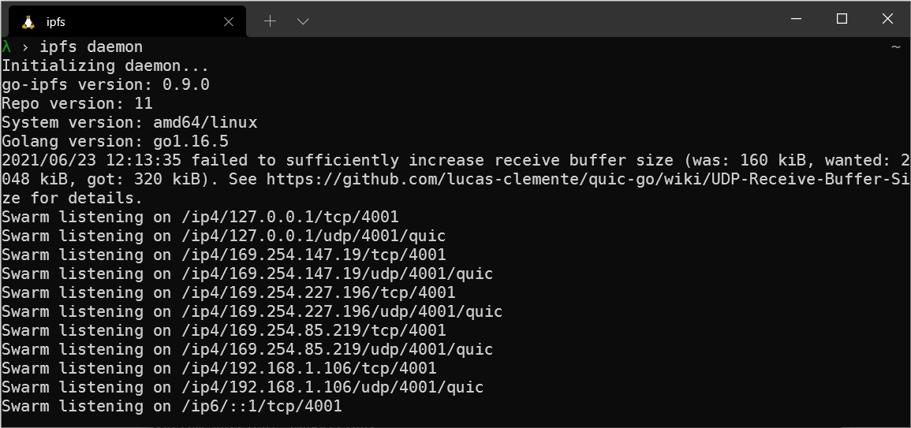

# Command-line

Installing IPFS through the command-line is handy if you plan on building applications and services on top of an IPFS node. This method is also useful if you're setting up a node without a user interface, usually the case with remote servers or virtual machines. Using IPFS through the command-line allows you to do everything that IPFS Desktop can do, but at a more granular level since you can specify which commands to run.



## System requirements

IPFS requires 512MiB of memory and can run an IPFS node on a Raspberry Pi. However, how much disk space your IPFS installation takes up depends on how much data you're sharing. A base installation takes up about 12MB of disk space. One can enable automatic garbage collection via [--enable-gc](/reference/cli/#ipfs-daemon) and adjust the [default maximum disk storage](https://github.com/ipfs/go-ipfs/blob/v0.12.2/docs/config.md#datastorestoragemax) for data retrieved from other peers.

## Official distributions

The IPFS team manages the [dist.ipfs.io website](https://dist.ipfs.io/) to help users quickly find the latest version of every IPFS package. As soon as a new release of an IPFS package comes out, it is automatically shown on `dist.ipfs.io`, so you can be sure you're getting the latest software. These steps detail how to download and install the latest `go-ipfs` from `dist.ipfs.io` using the command-line.

| [Windows](#windows)                                                          | [macOS](#macos)                                                        | [Linux](#linux)                                                        |
| ---------------------------------------------------------------------------- | ---------------------------------------------------------------------- | ---------------------------------------------------------------------- |
| [](#windows) | [](#macos) | [](#linux) |

### Windows

1. Download the Windows binary from [`dist.ipfs.io`](https://dist.ipfs.io/#go-ipfs).

   ```powershell
   cd ~\
   wget https://dist.ipfs.io/go-ipfs/v0.12.2/go-ipfs_v0.12.2_windows-amd64.zip -Outfile go-ipfs_v0.12.2.zip
   ```

1. Unzip the file and move it somewhere handy.

   ```powershell
   Expand-Archive -Path go-ipfs_v0.12.2.zip -DestinationPath ~\Apps\go-ipfs_v0.12.2
   ```

1. Move into the `go-ipfs_v0.12.2` folder and check that the `ipfs.exe` works:

   ```powershell
   cd ~\Apps\go-ipfs_v0.12.2\go-ipfs
   .\ipfs.exe --version

   > ipfs version 0.12.0
   ```

   While you can use IPFS right now, it's better to add `ipfs.exe` to your `PATH` by using the following steps.

1. Save the current working directory into a temporary variable:

   ```powershell
   $GO_IPFS_LOCATION = pwd
   ```

1. Create a powershell profile:

    ```powershell
    if (!(Test-Path -Path $PROFILE)) { New-Item -ItemType File -Path $PROFILE -Force }
    ```

    This command first checks to see if you have a profile set. If you do, it leaves it there and doesn't create a new one. You can view the contents of your profile by opening it in Notepad:

    ```powershell
    notepad $PROFILE
    ```

1. Add the location of your Go-IPFS daemon and add it to PowerShell's `PATH` by truncating it to the end of your PowerShell profile:

   ```powershell
   Add-Content $PROFILE "`n[System.Environment]::SetEnvironmentVariable('PATH',`$Env:PATH+';;$GO_IPFS_LOCATION')"
   ```

1. Load your `$PROFILE`:

    ```powershell
    & $profile   
    ```

6. Test that your IPFS path is set correctly by going to your home folder and asking IPFS for the version:

   ```powershell
   cd ~
   ipfs --version

   > ipfs version 0.12.0
   ```

### macOS

:::tip M1-based Macs
You can install IPFS on M1-based Macs by using the `darwin-arm64` binary instead of the `amd64` binary listed in these instructions.
:::

1. Download the macOS binary from [`dist.ipfs.io`](https://dist.ipfs.io/#go-ipfs).

   ```bash
   curl -O https://dist.ipfs.io/go-ipfs/v0.12.2/go-ipfs_v0.12.2_darwin-amd64.tar.gz
   ```

1. Unzip the file:

   ```bash
   tar -xvzf go-ipfs_v0.12.2_darwin-amd64.tar.gz

   > x go-ipfs/install.sh
   > x go-ipfs/ipfs
   > x go-ipfs/LICENSE
   > x go-ipfs/LICENSE-APACHE
   > x go-ipfs/LICENSE-MIT
   > x go-ipfs/README.md
   ```

1. Move into the `go-ipfs` folder and run the install script:

   ```bash
   cd go-ipfs
   bash install.sh

   > Moved ./ipfs to /usr/local/bin
   ```

1. Check that IPFS installed:

   ```bash
   ipfs --version

   > ipfs version 0.12.0
   ```

### Linux

1. Download the Linux binary from [`dist.ipfs.io`](https://dist.ipfs.io/#go-ipfs).

   ```bash
   wget https://dist.ipfs.io/go-ipfs/v0.12.2/go-ipfs_v0.12.2_linux-amd64.tar.gz
   ```

1. Unzip the file:

   ```bash
   tar -xvzf go-ipfs_v0.12.2_linux-amd64.tar.gz

   > x go-ipfs/install.sh
   > x go-ipfs/ipfs
   > x go-ipfs/LICENSE
   > x go-ipfs/LICENSE-APACHE
   > x go-ipfs/LICENSE-MIT
   > x go-ipfs/README.md
   ```

1. Move into the `go-ipfs` folder and run the install script:

   ```bash
   cd go-ipfs
   sudo bash install.sh

   > Moved ./ipfs to /usr/local/bin
   ```

1. Test that IPFS has installed correctly:

   ```bash
   ipfs --version

   > ipfs version 0.12.0
   ```

## Compile manually

Manually compiling IPFS is a fairly involved process that changes frequently. It can be handy if you'd like to build a specific branch or use the _bleeding-edge_ version of Go-IPFS. See the [`ipfs/go-ipfs` GitHub repository for details →](https://github.com/ipfs/go-ipfs)

## Which node should you use with the command line

The command line can detect and use any node that's running, unless it's configured to use an external binary file. Here's which node to use for the local daemon or a remote client:

### Local daemon

The local daemon process is automatically started in the CLI with the command `ipfs daemon`. It creates an `$IPFS_PATH/api` file with an [RPC API](./reference/http/api/#http-rpc-api-reference) address.

### Remote client

You can install the standalone IPFS CLI client independently and use it to talk to an IPFS Desktop node or a Brave node. Use the [RPC API](./reference/http/api/#http-rpc-api-reference) to talk to the `ipfs` daemon.

When an IPFS command is executed without parameters, the CLI client checks whether the `$IPFS_PATH/api` file exists and connects to the address listed there.

- If an `$IPFS_PATH` is in the default location (for example, `~/.ipfs` on Linux), then it works automatically and the IPFS CLI client talks to the locally running `ipfs` daemon without any additional configuration.

- If an `$IPFS_PATH` is not in the default location, use the `--api <rpc-api-addr>` command-line argument. Alternatively, you can set the environment variable to `IPFS_PATH`. `IPFS_PATH` will point to a directory with the api file with the existing `ipfs` daemon instance.

#### Most common examples

If you are an IPFS Desktop user, you can install CLI tools and an `.ipfs/api` file is automatically picked up.

If you're not running IPFS Desktop, specify a custom port with `ipfs --api /ip4/127.0.0.1/tcp/<port> id` in the CLI.

For example, Brave RPC API runs on port 45001, so the CLI can talk to the Brave daemon using `ipfs --api /ip4/127.0.0.1/tcp/45001 id`. You can use `mkdir -p ~/.ipfs && echo "/ip4/<ip>/tcp/<rpc-port>" > ~/.ipfs/api` to avoid passing `--api` every time.

## Next steps

Now that you've got an IPFS node installed, you can start building applications and services on top of the network! Check out the Command-line- quicks start guide and jump straight to the [Initialize the repository section](../how-to/command-line-quick-start.md#initialize-the-repository).
