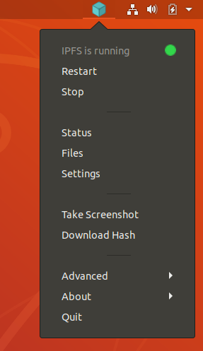

# IPFS desktop

The IPFS desktop application is the easiest way to get up and running quickly with IPFS. It allows you to run an IPFS Node on your machine _without_ having to bother with command-line tools or package management. It gives you the power of the [IPFS Web UI](https://github.com/ipfs-shipyard/ipfs-webui), plus a handful of useful shortcuts and settings.

The installation steps differ between operating systems, so follow the instructions for your system.

| [Windows](#windows)                                                 | [macOS](#macos)                                               | [Linux](#linux)                                               |
| ------------------------------------------------------------------- | ------------------------------------------------------------- | ------------------------------------------------------------- |
|  |  |  |

### Windows

1. Go to the [IPFS desktop downloads page](https://github.com/ipfs-shipyard/ipfs-desktop/releases).
2. Find the link ending in `.exe` for the latest version of IPFS desktop:

   

3. Run the `.exe` file to start the installation.
4. Select whether you want to install the application for just yourself, or all users on the computer. Click **Next**:

   

5. Select the install location for the application. The default location is usually fine. Click **Next**:

   

6. Wait for the installation to finish and click **Finish**:

   

7. You can now find an IPFS icon in the status bar:

   

The IPFS desktop application has finished installing. You can now start to [add your site](#add-your-site).

### MacOS

1. Download the latest available `.dmg` file from the `ipfs-shipyard/ipfs-desktop` GitHub repository:

   

2. Open the `ipfs-desktop.dmg` file.
3. Drag the IPFS icon into the **Applications** folder:

   

4. Open your **Applications** folder and open the IPFS desktop application.
5. You may get a warning saying _IPFS Desktop.app can't be opened_. Click **Show in Finder**:

   

6. Find **IPFS Desktop.app** in your **Applications** folder.
7. Hold down the `control` key, click **IPFS Desktop.app**, and click **Open**:

   

8. Click **Open** in the new window:

   

9. You can now find an IPFS icon in the status bar:

   

The IPFS desktop application has finished installing. You can now start to [add your site](#add-your-site).

### Linux

1. Download the `.deb` package:
1. Open the `.deb` package in **Software Installer**:

   

1. Click **Install** and wait for the installation to finish:

   

1. Click **Applications** or press the Windows key on your keyboard.
1. Search for `IPFS` and select **IPFS Desktop**:

   

1. You can now find an IPFS icon in the status bar:

   

The IPFS desktop application has finished installing. You can now start to [add your site](#add-your-site).
