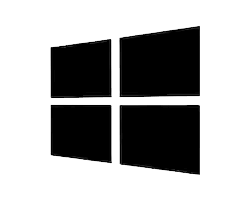

# Install the IPFS Desktop App

**IPFS Desktop bundles a Kubo IPFS node, file manager, peer manager, and content explorer into a single, easy-to-use application.**

Use IPFS Desktop to get acquainted with [Kubo](https://github.com/ipfs/kubo/), a popular  IPFS implementation without needing to touch the terminal — or, if you're already experienced, use the powerful menubar/taskbar shortcuts alongside the command line to make your IPFS workflow faster.

If you already have an IPFS node on your computer, IPFS Desktop will act as a control panel and file browser for that node. If you don't have a node, it'll install one for you. And either way, IPFS Desktop will automatically check for updates.


| Files screen                                                               | Explore screen                                                                 | Peers screen                                                               | Settings screen                                                                  | Menubar/taskbar                                                                      |
| -------------------------------------------------------------------------- | ------------------------------------------------------------------------------ | -------------------------------------------------------------------------- | -------------------------------------------------------------------------------- | ------------------------------------------------------------------------------------- |
|  |  |  |  |  |

### Feature highlights

- **Start your node at system startup (Mac/Windows) and control it from your OS** using the convenient menubar/system tray menu.
- **Quickly import files, folders, and screenshots to IPFS** in a variety of convenient ways, including drag-and-drop and (for Windows) right-clicking a file/folder's icon.
- **Easily manage the contents of your node** with a familiar file browser that offers quick shortcuts for renaming/moving/pinning files and folders, previewing many common file formats directly in IPFS Desktop, copying content IDs or shareable links to your clipboard, and more.
- **Quick download for CIDs, IPFS paths, and IPNS paths** — choose `Download...` by right-clicking the IPFS icon on your computer's menu bar, paste in a hash, and you're good to go.
- **Visualize your IPFS peers worldwide** on a map depicting what nodes you're connected to, where they are, the connections they're using, and more.
- **Explore the "Merkle Forest" of IPFS files** with a visualizer that lets you see firsthand how example datasets stored on IPFS — or your own IPFS files — are broken down into content-addressed pieces.
- **OS-wide support for IPFS files and links** (on Mac, Windows, and some Linux flavors) automatically hands off links starting with `ipfs://` and `ipns://` to be opened in IPFS Desktop.
- **CLI Tutor Mode** helps you learn IPFS commands as you go.

### Install instructions

To install IPFS Desktop, follow the specific instructions for your operating system. IPFS Desktop is built using the [Electron framework](https://www.electronjs.org), so the application should work wherever Electron works.

| [Windows](#windows)                                                 | [macOS](#macos)                                               | [Ubuntu](#ubuntu)                                                |
| ------------------------------------------------------------------- | ------------------------------------------------------------- | ---------------------------------------------------------------- |
| [](#windows) | [](#macos) | [](#ubuntu) |

Or, if you'd rather use a package manager, check this [list of third-party packages](#package-managers) maintained by the IPFS community.

## Windows

1. Go to the [IPFS Desktop downloads page](https://github.com/ipfs/ipfs-desktop/releases)
2. Find the link ending in `.exe` for the latest version of IPFS Desktop:

   

3. Run the `.exe` file to start the installation.
4. Select whether you want to install the application for just yourself or all users on the computer. Click **Next**:

   

5. Select the install location for the application. The default location is usually fine. Click **Next**:

   

6. Wait for the installation to finish and click **Finish**:

   

7. You can now find an IPFS icon in the status bar:

   

The IPFS Desktop application has finished installing. Now, [add your site](../how-to/websites-on-ipfs/single-page-website.md#add-your-site).

## macOS

1. Download the latest available `.dmg` file from the [ipfs/ipfs-desktop releases page](https://github.com/ipfs/ipfs-desktop/releases)

   

2. Open the `ipfs-desktop.dmg` file.
3. Drag the IPFS icon into the **Applications** folder:

   

4. Open your **Applications** folder and open the IPFS Desktop application.
5. You may get a warning saying _IPFS Desktop.app can't be opened_. Click **Show in Finder**:

   

6. Find **IPFS Desktop.app** in your **Applications** folder.
7. Hold down the `control` key, click **IPFS Desktop.app**, and click **Open**:

   

8. Click **Open** in the new window:

   

9. You can now find an IPFS icon in the status bar:

   

The IPFS Desktop application has finished installing. Now, [add your site](../how-to/websites-on-ipfs/single-page-website.md#add-your-site).

## Ubuntu

While these instructions are specific to Ubuntu, they will likely work with most Ubuntu-related Linux distributions. For non-Ubuntu Linux distributions, check out the [IPFS Desktop GitHub repository](https://github.com/ipfs/ipfs-desktop#install) for install instructions.

### Install with `.deb`

1. Download the latest `.deb` installer from the [IPFS Desktop GitHub repository](https://github.com/ipfs/ipfs-desktop#linuxfreebsd).
2. Double click to install the package with Ubuntu Software, or move into where you downloaded the installer and install from the command-line:

    ```shell
    sudo dpkg -i ./ipfs-desktop-[version]-amd64.deb
    ```

    Replace `[version]` with the version number of the IPFS package you just downloaded.

### Install using AppImage

:::warning
When installing IPFS Desktop using an AppImage executable, you will not have access to the command-line `ipfs` commands. This limitation is due to how AppImages work and how they containerize their processes.

If you are certain that you do not need to use the command-line `ipfs` commands, then go ahead and install the AppImage. Otherwise, consider using the [deb installer ↑](#install-with-deb)
:::

1. Download the latest `.AppImage` package from the [IPFS Desktop GitHub repository](https://github.com/ipfs/ipfs-desktop#linuxfreebsd).
2. Move into where you downloaded the `.AppImage` file, and make it executable:

   ```shell
   cd Downloads
   chmod a+x ./ipfs-desktop-linux.AppImage
   ```

3. Open the `.AppImage` by calling `./ipfs-desktop-linux.AppImage` from the command-line:

   ```shell
   ./ipfs-desktop-linux.AppImage
   ```

   You can also run the `.AppImage` file by double-clicking on it in your file manager.

## Package Managers

| Package Manager                                                                                                    | Command                      |
| ------------------------------------------------------------------------------------------------------------------ | ---------------------------- |
| [Homebrew](https://formulae.brew.sh/formula/ipfs#default)                                                                    | `brew install ipfs --cask`     |
| [Chocolatey](https://community.chocolatey.org/packages/ipfs-desktop)                                                         | `choco install ipfs-desktop` |
| [Scoop](https://github.com/ScoopInstaller/Extras/blob/master/bucket/ipfs-desktop.json) maintained by [@NatoBoram](https://github.com/NatoBoram) | `scoop bucket add extras && scoop install ipfs-desktop` |
| [AUR](https://aur.archlinux.org/packages/ipfs-desktop/) maintained by [@alexhenrie](https://github.com/alexhenrie) | `ipfs-desktop`               |

## Next steps

Now that you've got IPFS Desktop installed, you can start sharing files and interacting with other nodes on the network! Check out how to [host a website using IPFS →](../how-to/websites-on-ipfs/single-page-website.md)
