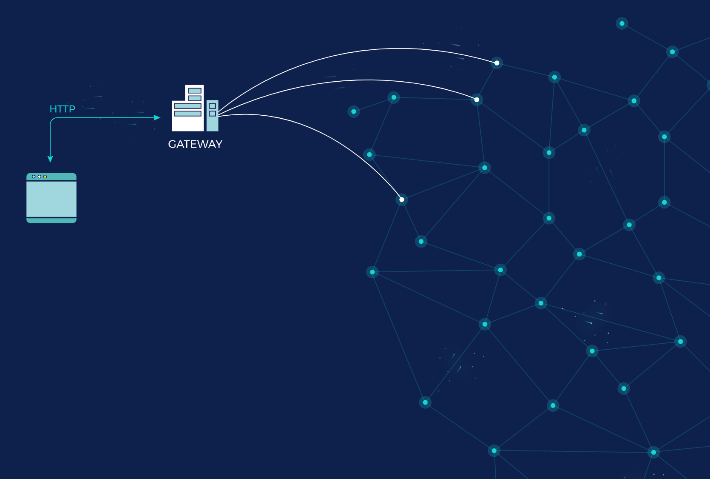

# Retrieving a CID with IPFS

In this quickstart guide, you will learn the different approaches to retrieving CIDs from the IPFS network and how to pick the most appropriate method for your specific needs.

You will fetch the image that was pinned in the [publishing with a pinning service quickstart guide](./publish.md) which has the following CID: `bafybeicn7i3soqdgr7dwnrwytgq4zxy7a5jpkizrvhm5mv6bgjd32wm3q4`.

:::callout
The CID you will retrieve is actually a folder containing a single image file. The reason for this that when files are added to IPFS, the filename is not stored by default. To retain the filename, it's a common practice to wrap the file in a directory. In such instances, you end up with two CIDs - one for the file and another for the directory containing the file.
:::

## Contents <!-- omit from toc -->

- [IPFS retrieval methods](#ipfs-retrieval-methods)
- [Verified vs. trusted CID retrieval](#verified-vs-trusted-cid-retrieval)
- [Fetching the CID with Kubo](#fetching-the-cid-with-kubo)
- [Fetching the CID with an IPFS Gateway](#fetching-the-cid-with-an-ipfs-gateway)
- [Summary and next steps](#summary-and-next-steps)

## IPFS retrieval methods

There are two primary ways to retrieve files and directories published to IPFS:

- Use an [**IPFS node**](../concepts/nodes.md) by installing one of the IPFS implementations, e.g. [Kubo](../concepts/nodes.md#kubo) on your computer. This allows you to fetch and verify CIDs from other nodes in the IPFS network.
- Use an [**IPFS Gateway**](../concepts/ipfs-gateway.md), an HTTP interface with the IPFS network that allows you to fetch data from IPFS using HTTP. Pinning services typically offer an IPFS gateway as a way to easily retrieve your CIDs.

The **node** option allows you access to the full suite of IPFS protocols. The **Gateway** option serves as a bridge in situations where you might be constrained to using HTTP, such as in web apps where your app users may not be running an IPFS node.

IPFS Gateways, in their most basic form, are typically IPFS nodes that are hosted by someone else and expose an HTTP interface to fetch CIDs, as shown in the diagram below:



## Verified vs. trusted CID retrieval

Another thing to consider when deciding between the two approaches is _verification_. By default, an IPFS node hashes each block and ensures that, when the file is constructed from the blocks (into a Merkle DAG), it results in the CID you requested. However, with IPFS Gateways, verification is optional.

Non-verified retrieval is also commonly referred to as _trusted retrieval_ because you're trusting the gateway to return the correct response without calculating the hash.

While verification is almost always recommended, in reality, there are situations where trusted retrieval is the pragmatic choice, such as when embedding images on a website.

## Fetching the CID with Kubo

To fetch the CID with [Kubo](../install/command-line.md), complete the steps below:

1. Ensure that the Kubo daemon is installed and running:

   ```bash
   $ ipfs daemon
   ```

2. To fetch the file, run the [`ipfs get [CID]`](../reference/kubo/cli.md#ipfs-get) command:

   ```bash
   $ ipfs get bafybeicn7i3soqdgr7dwnrwytgq4zxy7a5jpkizrvhm5mv6bgjd32wm3q4
   ```

   The output should look as follows:

   ```bash
   Saving file(s) to bafybeicn7i3soqdgr7dwnrwytgq4zxy7a5jpkizrvhm5mv6bgjd32wm3q4
   647.61 KiB / 647.61 KiB [========================================================================================================================] 100.00% 0s
   ```

   A new folder with the same name as the CID was created:

   ```bash
   $ ls bafybeicn7i3soqdgr7dwnrwytgq4zxy7a5jpkizrvhm5mv6bgjd32wm3q4/
   welcome-to-IPFS.jpg
   ```

Congratulations, you have successfully fetched the CID.

## Fetching the CID with an IPFS Gateway

To fetch the CID using an IPFS gateway is as simple as loading one of the following URLs:

- [https://ipfs.io/ipfs/bafybeicn7i3soqdgr7dwnrwytgq4zxy7a5jpkizrvhm5mv6bgjd32wm3q4](https://ipfs.io/ipfs/bafybeicn7i3soqdgr7dwnrwytgq4zxy7a5jpkizrvhm5mv6bgjd32wm3q4)
- [https://cloudflare-ipfs.com/ipfs/bafybeicn7i3soqdgr7dwnrwytgq4zxy7a5jpkizrvhm5mv6bgjd32wm3q4](https://cloudflare-ipfs.com/ipfs/bafybeicn7i3soqdgr7dwnrwytgq4zxy7a5jpkizrvhm5mv6bgjd32wm3q4)
- [https://gateway.pinata.cloud/ipfs/bafybeicn7i3soqdgr7dwnrwytgq4zxy7a5jpkizrvhm5mv6bgjd32wm3q4](https://gateway.pinata.cloud/ipfs/bafybeicn7i3soqdgr7dwnrwytgq4zxy7a5jpkizrvhm5mv6bgjd32wm3q4)

## Summary and next steps

In this quickstart guide, you learned the different approaches to retrieving CIDs from the IPFS network and how to pick the most appropriate method for your specific needs.

You then fetched the image that was pinned in the [publishing with a pinning service quickstart guide](./publish.md) using an IPFS Kubo node and an IPFS Gateway.

Possible next steps include:

- Learn more about [how IPFS works](../concepts/how-ipfs-works.md) and [the lifecycle of data in IPFS](../concepts/lifecycle.md).
