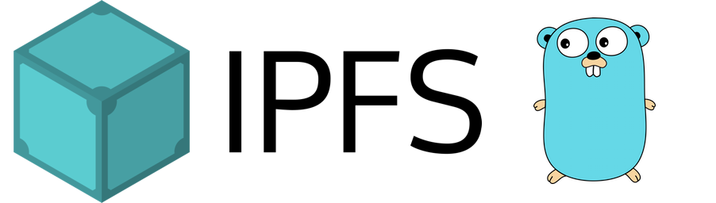

# Go-IPFS 0.5

It's been a while since the last Go-IPFS release, and with good reason. We've packed an incredible amount of bug fixes, improvements, and features into this build; it's the biggest Go-IPFS release since the project first started!

## Features

There are plenty of features packed into this release. The DHS implementation is vastly improved, we refactored Bitswap to improve speed and reliability, the subdomain gateway is much easier to use, Badger has gained more support and is sufficiently stable enough for daily use, and the RSA minimum key size is now 2048. These are just some of the features available in this release. [Take a closer look →](features)

## Fixes

On top of all the features that have been added into this release, we've plugged a few holes along the way. Some notable fixes are:

- abc
- def
- ghi

[Check out all the fixes added into this release →](fixes)

## Known issues

IPFS 0.5 is a substantial step forward in terms of performance and reliability. Inevitably, such a large release will cause some breakages:

### Using IPFS as a Library

You will need to upgrade to the new interfaces for IPFS to connect to your various APIs.

### Small key test set up

If you have a testing setup using small RSA keys (less than 2048 bits), you need to either start using large keys or set an environment variable.

### JS-IPFS node incompatibility

JS-IPFS nodes will no longer be able to read Go-IPFS datastores. Avoid pointing two nodes at the same datastore. If your Go-IPFS node reads a JS-IPFS datastore, it will upgrade it and no longer be compatible with JS-IPFS.

### IPFS-Lite

Ipfs-Lite still needs to be updated to the latest 0.5 features.

### New QUIC protocol

If you have enabled the QUIC experiment and are trying to connect to new nodes, it won't work. This is the final breaking change before QUIC is stabilized and becomes the default.

### HTTP API will disallow `GET` requests

Go-IPFS-cmds and the commands HTTP API Handler will now only allow `POST`/`OPTIONS`, disallowing `GET` and others in the handling of command requests in the IPFS HTTP API to enforce _origin isolation_. This means any applications making `GET` requests on the HTTP API will need to change to `POST` requests.

## Changelog

The changelog is available in the [`ipfs/go-ipfs` repository on GitHub](https://github.com/ipfs/go-ipfs/issues/7109).
