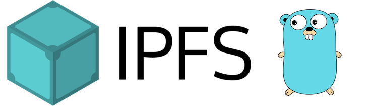

# Go-IPFS 0.6

This is a relatively small release in terms of code changes, but it contains some significant changes to the IPFS protocol.

## Features

There are plenty of features packed into this release:

- QUIC by default.
- Libp2p Noise as a new security transport.
- Custom 404 pages and base36 support.
- Gossipsub upgrade.
- New peering subsystem.

## Breaking changes

There are no breaking changes in this release. However, there is a migration that will run, and the QUIC transport has changed protocol versions. The migration will:

- Normalize multiaddrs in the bootstrap list to use the `/p2p/Qm...` syntax for multiaddrs instead of the `/ipfs/Qm...` syntax.
- Add QUIC addresses for the default bootstrapers, as necessary. If you've removed the default bootstrappers from your bootstrap config, the migration won't add them back.
- Add a QUIC listener address to mirror any TCP addresses present in your config. For example, if you're listening on `/ip4/0.0.0.0/tcp/1234`, this migration will add a listen address for `/ip4/0.0.0.0/udp/1234/quic`.

## Changelog

You can find the changelog on the [Go-IPFS 0.6 GitHub release page](https://github.com/ipfs/go-ipfs/releases/tag/v0.6.0).
