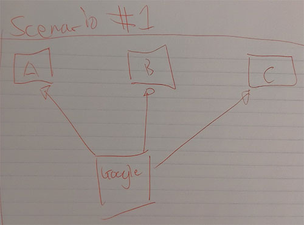
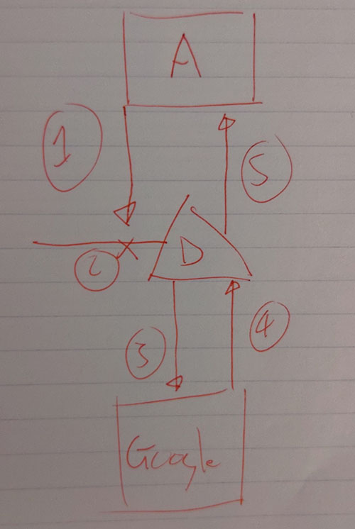

# The problems

To understand the purpose of IPFS we should take a look at how most networks currently deal with data and sharing files.

```text
|---|   --- Do you have "cat.jpg"? -->   |---|
| A |                                    | B |
|---|   <----- Yes, here it is. *-----   |---|
```

In the example above computer `A` is asking computer `B` if they have a file called `cat.jpg`. While this seems simple enough, there are a few problems with this approach:

1. There's no built in way to confirm or validate that computer `A` will receive the correct file.
2. Computer `A` needs to know _exactly_ what the file is called before requesting it.
3. It's an inefficent way of sharing files.
4. If computer `B` breaks or goes offline, there's no way for computer `A` to get the file.

Let's take a dive into these problems and explain them a bit further.

## Built-in validation

Currently the most popular methods for transferring data over the internet do not provide any way way to ensure that the file you're requestion is the file that you're getting. While this isn't a massive problem when sharing pictures of cats, it becomes an issue when dealing with programs, applications, or anbything else that executes code on a computer.



In the above scenario there are three computers (`A`, `B`, and `C`) requesting a file called `script.js` from `D`. Each of them sends their request to `D` independently, without any knowledge that the other computers are also sending a request.

How can we be sure that all three computers received the same file from computer `D` _without_ the computers having to do any further processing or communicate with each other? We can't be sure. We just have to trust that computer `D` is playing fair and giving computers `A`, `B`, and `C` the same `script.js` file.

Even if computer `D` was playing fair, there's a way that a hacker could interfer with this process.



The above scenario shows a simplifed man-in-the-middle attack. This is when an attacker places themself inbetween a target and the server they are requesting data from. In this case, attacker `B` intercepts computer `A`'s request for `script.js`. Attacker `B` then sends a request to computer `C` for the `script.js` file, modifies it, and then sends it back to computer `A`. [Learn more about man-in-the-middle attacks at CloudFlare.com →](https://www.cloudflare.com/learning/security/threats/man-in-the-middle-attack/).

## Trusting your neighbour

Trust is for neighbours, not electronics.

## Efficency

Hundreds of thousands of computers requesting the same file from one server. Why not just get it from your mate?

